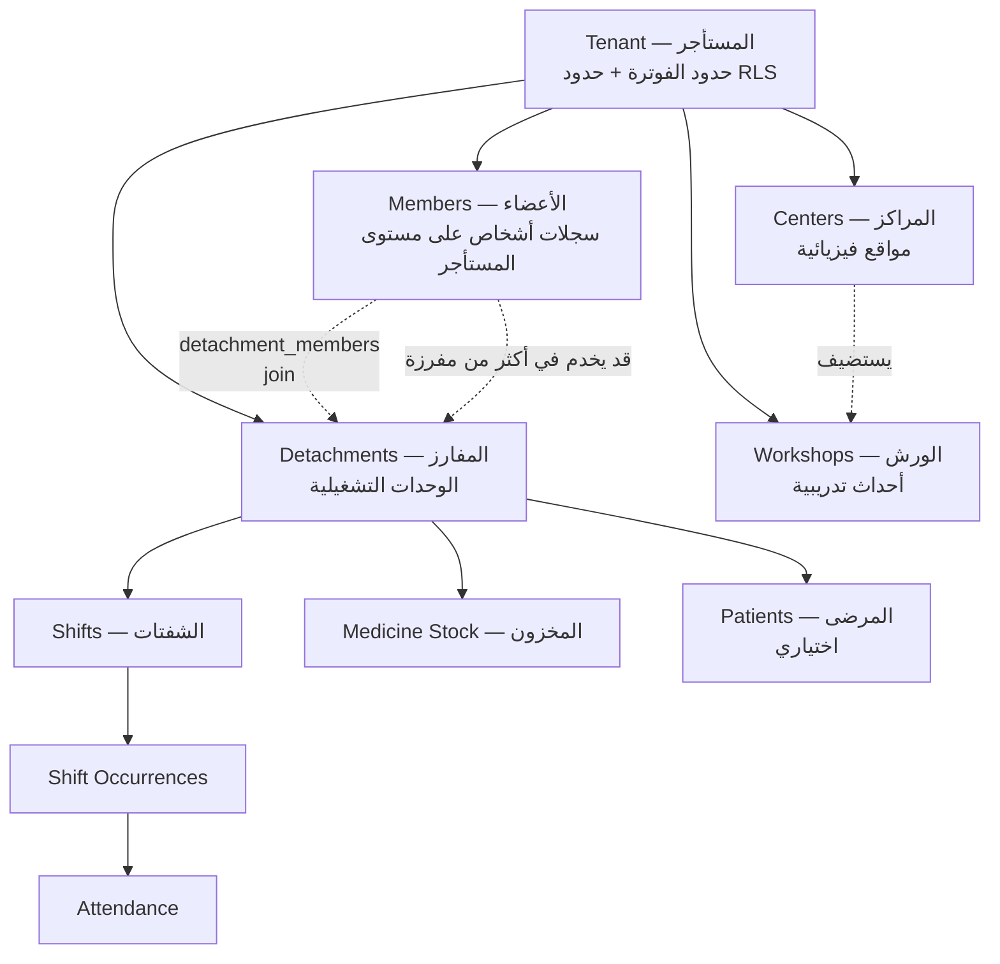
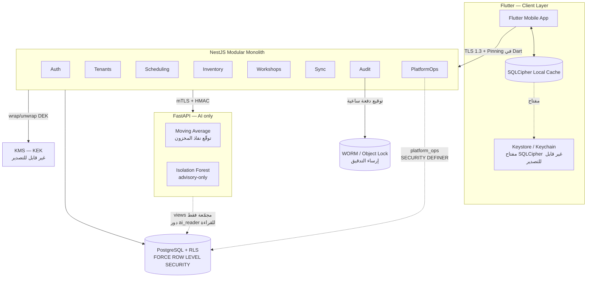

# MTM — الخارطة الموحّدة النهائية المطوّرة
## Unified Upgraded Roadmap — Architecture, Modules, Security & Execution

**الإصدار:** Rev 4.0 — النسخة الموحّدة الشاملة، بعد حزمة الإغلاق والحسم النهائي
**التاريخ:** 24 أغسطس 2026 · **مُحدَّث:** 25 أغسطس 2026
**يحل محل:** `MTM-Master-Blueprint-Final.md` (Rev 2.0، 20 أغسطس 2026) + `MTM-Detachments-Module-Foundation.md` + `MTM-Workshops-Module-Spec.md` + `MTM-Blueprint-Analysis.md` — كل هذه الوثائق مدمجة هنا بالكامل، وهذه الوثيقة هي **المرجع الوحيد** من الآن فصاعدا.
**السياق الأكاديمي:** بحث تخرج في الأمن السيبراني بإشراف د. دلال (Prof. Dalal) — STRIDE + OWASP MASVS v2.1.0
**المصدر التكليفي:** البرومت التحليلي الكامل في **الملحق أ**؛ برومت البحث الخارجي في **الملحق ب**؛ المراجع المتحقّقة في **الملحق ج**.

> ### ⚠️ ما تغيّر في Rev 4.0 — يُقرأ قبل أي اقتباس من هذه الوثيقة
>
> Rev 4.0 ليست إضافة أقسام، بل **حسم ونقض**. ثلاثة أشياء جرت في **25 أغسطس 2026** ويجب أن تُقرأ معا:
>
> 1. **خمسة قرارات معماريّة كانت مفتوحة صارت مقفلة** (`CO-D1`–`CO-D5`)، **وستّة أعلام تحقّق أُجيبت** (`FLAG-1`–`FLAG-6`). التفصيل الكامل في `close-out/12-FINAL-DECISIONS-AND-WEB-ADMIN.md`، وسجل القرارات في §20 أدناه.
> 2. **قرار «لا لوحة تحكّم Web» نُقض صراحة.** تُشحن **لوحة Flutter Web لمالك المنصّة حصرا** على `admin.<domain>` في **المرحلة 1.5** الجديدة. المواضع المتأثّرة: §0.5، §0.6، §5.5، §7.1، §7.2، §7.3، **§7.5 الجديد**، §15.2، §16.2، §16.4، §17، §18، §19، §20.
> 3. **ثمن ذلك مكتوب لا مُخبَّأ:** خطر متبقٍّ جديد **`R4`** — بوّابة إدارية عامة على الإنترنت. لم يُدمج في قائمة الضوابط ولم يُعلن محلولا.
>
> **وقاعدة قراءة هذه الوثيقة بعد Rev 4.0:** حيث تجد قرارا منقوضا، ستجد **النصّ القديم مشطوبا لا محذوفا**، ومعه تاريخ النقض وسببه. الحذف يُنتج وثيقة تبدو كأنها كانت صائبة دائما؛ والشطب يُنتج وثيقة **يمكن تدقيق تحوّلها** — وهذا هو الفرق الذي يُسأل عنه في مناقشة رسالة تخرج.

---

# القسم 0 — ملخّص التغييرات والتنفيذ (اقرأ هذا أولا)

> هذا القسم يقوم مقام الـ changelog report المنفصل المطلوب في البرومت. أُدمج داخل الملف الواحد بناء على طلب صريح: "أريد النتيجة النهائية ملفا واحدا".

## 0.1 حالة التحقق من المصادر — إفصاح ضروري قبل أي شيء

البرومت التكليفي طلب **بحثا حيّا (live web research)** في منتجات مشغّلة فعليا. الوضع الفعلي:

| نطاق البحث | الحالة | الأثر على هذه الوثيقة |
|---|---|---|
| **الأمان والمعايير** (MASVS، NIST، PostgreSQL، KMS، Play Integrity، App Attest، Flutter، RFCs) | ✅ **تم التحقق حيّا** من الصفحات الرسمية بتاريخ 23–24 أغسطس 2026 | القسم 16 والقسم 13 والقسم 6 مبنية على مصادر متحقّقة، مع URLs في الملحق ج |
| **GS1 / الباركود** (سؤال البناء/عدم البناء) | ⚠️ **جزئي** — FMD وDelegated Regulation 2016/161 متحقّقان؛ أرقام AI الدقيقة وانتشار DataMatrix الفعلي **غير متحقّقة** | القسم 10.7 يعتمد قرارا **مشروطا** باختبار ميداني، لا على ثقة وثائقية |
| **منتجات جدولة الطوارئ** (Aladtec، Vector، TeleStaff) | ❌ **لم يُنفّذ** — أدوات البحث محجوبة (fetch متاح، search محجوب؛ صفحات الـ vendors غير قابلة للتخمين) | القسم 9.6 مبني على **معرفة مجالية غير متحقّقة**، موسومة صراحة `[غير متحقّق]` |
| **منصات التطوّع متعددة المنظمات** (Rosterfy، Resgrid، D4H) | ❌ **لم يُنفّذ** — نفس السبب | القسم 5.2 و2.2 مبنيان على استنتاج معماري، موسوم `[غير متحقّق]` |

**القاعدة المطبّقة في كل الوثيقة:** كل ادعاء عن منتج خارجي لم يُتحقّق منه حيّا موسوم `[غير متحقّق]`. لم أكتب اسم منتج ولا سلوكا تفصيليا لمنتج من الذاكرة وأقدّمه كأنه بحث. **هذا مهم للبحث الأكاديمي تحديدا:** ادعاء غير مُسند في رسالة تخرج أخطر من فجوة معلنة.

**ما يلزم لإغلاق الفجوة:** برومت البحث في **الملحق ب** جاهز وself-contained. شغّله على أي AI عنده web search فعّال (أو أعطِ الـ URLs مباشرة لأي أداة fetch)، وسأدمج النتائج في القسمين 9.6 و5.2 دون إعادة كتابة الوثيقة.

**تحديث 25 أغسطس 2026 — الفجوات صارت نهائية لا مؤقّتة (`FLAG-4`).** في جلسة الحسم كان **كل خروج شبكي محجوبا**: خمسة مضيفات جُرِّبت وردّت جميعا `cowork-egress-blocked`، والمضيف الوحيد المسموح لا يحمل أي مواصفة. السجل الحرفي في `close-out/07-VERIFICATION-LOG.md`. وأثر ذلك على الجدول أعلاه محدَّد:

- **الصفّ الأول يبقى كما هو ولا يُمسّ** — تحقّق 23–24 أغسطس وقع فعلا، وروابطه في الملحق ج. لا يُشطب لأن حجب اليوم لا يُبطل قراءة الأمس.
- **الصفّان الثالث والرابع (`G1`) يُقرآن «غير قابل للتحقّق»** لا «لم يُنفّذ بعد»، و**الصفّ الثاني (`G2`) يبقى PARTIAL نهائيا**. ⇒ **تُشطب كل جملة موضعة تنافسية من الرسالة** ويُعلَن أن المقارنة السوقية خارج النطاق، بدل تعليقها على حدث قد لا يقع.
- **ولم يُضَف رابط واحد إلى الملحق ج في Rev 4.0.** صفر مرجع خارجي جديد — وهذا مقصود ومُعلن: خمسة قرارات وستّة أعلام حُسمت بلا إنتاج سطر واحد من معرفة عن صفحة لم تُفتح. **سلطة البتّ في التصميم ليست سلطة تحقّق من مصدر، والخلط بينهما هو بالضبط ما يُنتج استشهادا مُلفَّقا.**
- **وضمانة `G2` سلوكية لا ببليوغرافية:** مُحلِّل الباركود fail-closed يرفض أي AI لا يعرفه (`REJ-1`…`REJ-9` في `close-out/05`)، **فرقم غير متحقَّق لا يمكن أن يصير قراءة خاطئة صامتة**. صفحة المواصفة تُثبت الرقم؛ المُحلِّل يمنع سوء استعماله — والثاني أقوى.

## 0.2 تصحيحات جوهرية فرضها البحث المتحقّق

أربعة أخطاء كانت ستدخل الوثيقة (وبعضها كان في البرومت نفسه) — صُحّحت. **وأُضيف خامس في 25 أغسطس 2026** مصدره جرد المستندات لا الشبكة:

| # | الاعتقاد السابق | التصحيح المتحقّق | الأثر |
|---|---|---|---|
| 1 | `NIST SP 800-88 Rev. 1` هو مرجع الـ cryptographic erase | **Rev. 1 مسحوب (WITHDRAWN) بتاريخ 26 سبتمبر 2025**، واستُبدل بـ **Rev. 2** (نهائي 26 سبتمبر 2025) | الاقتباس القديم **ميت**؛ ممتحن يتحقّق منه سيجد إشعار سحب. القسم 13.6 يستعمل Rev. 2 |
| 2 | تدوير الـ KEK يُعيد تغليف الـ DEKs (re-wrap) تلقائيا | **خطأ.** AWS KMS نصّا: "Key rotation has no effect on the data that the KMS key protects... It does not rotate the data keys". يحفظ **كل** إصدارات المادة ويختار عند الفكّ. إعادة التغليف عملية **منفصلة ومتعمّدة** (`ReEncrypt`) | القسم 13.3 يضيف job صريحا لإعادة التغليف لو أردنا سياسة "لا DEK مغلّف بمادة متقاعدة" |
| 3 | نكتب "MASVS L2" لمستوى التحقق | **مصطلح غير صحيح الآن.** v2.0.0 **أزال المستويات من MASVS**؛ صارت **MAS Profiles** (MAS-L1/L2/R + MAS-P الجديد للخصوصية) على مستوى **اختبارات MASTG** | القسم 16 يستعمل التسمية الصحيحة — نقطة يلتقطها الممتحن فورا |
| 4 | Apple App Attest يعطي إشارة jailbreak | **خطأ.** مرجع `DCAppAttestService` الرسمي **لا يذكر** jailbreak/root/tampering إطلاقا. يثبت *شرعية نسخة التطبيق* و*أصالة عتاد Apple* فقط — والجهاز المكسور حماية يبقى عتاد Apple أصليا | القسم 6.7: **قصة الصلابة على iOS لا يمكن أن تكون متناظرة مع Android**. Play Integrity يعطي إشارة تجذير؛ App Attest لا يعطي مقابلا |
| **5** | **«D‑16» رقم منقول عن مستند مصدر، فيُحفظ كما هو** | **خطأ، وكُشف بجرد المستندات لا بالشبكة** (25 أغسطس 2026): **لا مستند من الثلاثة يُعرِّف ما يعنيه الرقم 16.** ملف المفرزة §3 يذكر «1h grace, permission override» فقط، والـ Blueprint لا يذكر `D‑16` إطلاقا (صفر تطابق)، وقراءة «16 يوما» موجودة في **§9.7 من هذه الوثيقة وحدها** ومعلنة في §0.7 بند 6 **كافتراض لا كنقل** | §9.7: **الرقم أُلغي ولم يُترجَم.** الضابط اسمه `attendance_lock` بثلاث طبقات صريحة. التفصيل في §9.7 و`close-out/00` القسم د |

**وهذا الصفّ الخامس مصدره مختلف عن الأربعة قبله، وذلك مقصود التسمية.** الأربعة الأولى فرضها **بحث خارجي متحقّق**؛ والخامس فرضه **جرد داخلي للمستندات** — `grep` على ثلاثة ملفات مصدر. ولذلك هو التصحيح الوحيد في هذا الجدول الذي **بقي ممكنا بعد حجب الشبكة بالكامل**: العنوان يقول «فرضها البحث المتحقّق»، ونوع التحقّق في الصفّ الخامس هو قراءة ما بحوزتي — وهي أرخص أنواع التحقّق وأكثرها إهمالا.

**والدرس فيه أقوى من الرقم:** لو كان مستند واحد يُعرِّف «16»، لوجب حفظه كما هو حتى لو بدا غريبا (القاعدة: لا يُعاد تصميم قرار مقفل). **ولأن لا مستند يُعرِّفه، صار حفظه هو الخطأ** — رقم لا يُعرف أصله يُبنى عليه سلوك تشغيلي هو دَين تصميمي بلا مالك. و**7 أيام** البديلة مشتقّة من إيقاع المنتج (دورة الجدول الأسبوعي الواحدة)، وهذا اشتقاق **قابل للنقد**؛ والرقم الموروث لم يكن قابلا حتى للنقد.

## 0.3 ما تغيّر معماريا مقابل Rev 2.0

| التغيير | من (Rev 2.0) | إلى (Rev 3.0) | السبب |
|---|---|---|---|
| **الهرمية** | "كل فريق طبي (Mafraza) = مستأجر" (§4) | **Tenant يحوي عدة Detachments + Centers + Workshops** | ملف المفرزة أثبت أن المستأجر يملك عدة مفارز self-service؛ المعادلة القديمة **مُبطلة** (القسم 2) |
| **عمود العزل** | `center_id` / غير موحّد؛ الورش تستعمل `team_id` | **`tenant_id` موحّد في كل جدول** (`team_id ≡ tenant_id`) | تعارض تسمية حقيقي بين الملفين كان سيولّد سياسات RLS متضاربة |
| **سجل الأعضاء** | `detachment_members` فقط (عضو مربوط بمفرزة) | **`members` (على مستوى المستأجر) + `detachment_members` (join)** | بدون هذا **يستحيل كشف تعارض الشفتات عبر المفارز** — الشخص الواحد قد يخدم في مفرزتين (القسم 9.3) |
| **المفاتيح** | HKDF من مفتاح رئيسي واحد | **Envelope Encryption (KEK/DEK)** — يُبطل كل لغة HKDF-only | HKDF لا يدعم crypto-shredding: المفتاح المشتق قابل لإعادة الاشتقاق من الرئيسي، فتدميره لا يحقّق شيئا (القسم 13) |
| **كشف تعارض الشفتات** | غير موجود | **Exclusion Constraint على مستوى DB** (`btree_gist`, `tstzrange`) | يلتقط التداخل الجزئي تلقائيا وعبر المفارز — لا يمكن لخطأ تطبيقي تجاوزه (القسم 9.3) |
| **حذف السجلات** | hard delete في الورش | **soft delete + tombstones معمّمة + purge بعد 90 يوما** | يسدّ فجوة repudiation ويخدم المزامنة (العميل offline يجب أن يعرف بالحذف) |
| **المخزون** | ثنائي المستوى (وحدات/كراتين) فقط | **+ lot/expiry + FEFO مفروض + PAR levels + idempotency keys** | مخزون أدوية حقيقي بلا تتبّع صلاحية ودفعة ناقص وظيفيا وخطر تشغيلي |
| **الوصول عبر المستأجرين** | غير محدّد | **`platform_ops` role + `ops` schema + SECURITY DEFINER + break-glass مدقّق** | كان أهم فراغ أمني: Super Admin يحتاج رؤية عابرة، وRLS يمنعها بحق (القسم 7.3) |
| **سجل التدقيق** | "غير قابل للتعديل" بلا آلية | **hash chain لكل صف + توقيع دفعة ساعية بـ KMS + إرساء WORM** | "غير قابل للتعديل" بلا آلية ادعاء لا يصمد؛ صار مفصّلا وقابلا للدفاع أكاديميا (القسم 6.4) |
| **الاختبار والرصد** | اختبار عزل + pentest فقط | **هرم اختبار كامل + OpenTelemetry + SAST/DAST/SBOM** | كانت أضعف منطقة في التحليل (القسم 14) |
| **عقود الـ API** | غير محدّدة | **REST + OpenAPI + versioning + RFC 9457 + idempotency + بروتوكول delta sync محدّد** | كانت أضعف منطقة توثيقا (القسم 8) |

## 0.4 ما اعتُمد جديدا ولماذا (رؤوس أقلام — التفصيل في الأقسام)

**تشغيليا:**
- **طلبات التبديل والتغطية** (`shift_cover_requests`): swap / giveaway / cover بمسار request→claim→approve، مع قواعد تمنع التبديل (تعارض، `attendance_lock`، حدّ الراحة) — القسم 9.4
- **FEFO مفروض بحجب مدقّق**: الخادم يحسب الدفعة الصحيحة ويرفض الصرف من دفعة أبعد صلاحية إلا بصلاحية `overrideFefo` مع سبب مسجّل — القسم 10.4
- **PAR levels لكل دواء لكل مفرزة** + تنبيه، متكاملة مع توقّع Moving Average — القسم 10.5
- **نقل مخزون بين المفارز** بسجل حركة مدقّق — القسم 10.6
- **الحدّ الأدنى للتغطية** (min staffing) كتنبيه لا حجب — القسم 9.5

**أمنيا:**
- `FORCE ROW LEVEL SECURITY` على كل جدول + عدم اتصال التطبيق كـ owner — القسم 4.3
- `ENABLE ALWAYS TRIGGER` على جداول التدقيق والإصدارات — القسم 6.4 (فخّ حقيقي: الـ trigger العادي **لا يعمل** عند `session_replication_role='replica'`)
- `UNIQUE(tenant_id, email)` بدل `UNIQUE(email)` — قيود التكامل **تتجاوز RLS دائما** فتصنع قناة تسريب — القسم 4.5
- `row_security = off` في wrapper النسخ الاحتياطي كـ **tripwire** (يُفشل الـ dump بدل إصداره ناقصا صامتا) — القسم 13.2
- **Remote wipe واقعي**: crypto-shred محلي + رفض تجديد التوكن + **TTL self-shred** — بدل ادعاء remote wipe غير موجود أصلا لتطبيق غير MDM — القسم 6.8
- **Version trigger بكود خطأ مخصّص** (لا `40001`) حتى لا يعيد العميل المحاولة عمياء على تعارض غير عابر — القسم 8.5
- WebAuthn/Passkeys كمسار ترقية معلن لـ Super Admin — القسم 5.5

## 0.5 ما قُيّم ورُفض صراحة ولماذا

| المرفوض | السبب |
|---|---|
| **OCR لملصقات الأدوية** | مرفوض نهائيا بقرار سابق، ولا يُعاد طرحه بأي صياغة. **ملاحظة تصنيفية:** فكّ ترميز GS1 DataMatrix **ليس OCR** — الأول يقرأ payload منظّما بـ checksum، الثاني تعرّف ضوئي احتمالي على نص. التقنيتان غير مرتبطتين، والقيد لا يمتدّ منطقيا للثانية (القسم 10.7) |
| **Redis / Kafka / RabbitMQ / Kubernetes** | خارج النطاق بقرار سابق. البديل للمهام الثقيلة: `@nestjs/schedule` + جدول jobs في Postgres — كافٍ تماما عند ≤1,000 مستأجر × 5–8 مستخدمين |
| **WebSockets / SSE** | مُلغاة. push + polling + offline-sync تغطّي كل حالة استخدام فعلية |
| ~~**لوحة تحكم Web**~~ | ~~مؤجّلة. القرار يبقى، **لكن** القسم 7.2 يسجّل الثمن التشغيلي صراحة (إدارة منصة كاملة من الهاتف) ويقترح تخفيفا لا يفتح سطح هجوم ويب~~ → **نُقض 25 أغسطس 2026.** تُشحن **لوحة Flutter Web لمالك المنصّة حصرا** في المرحلة 1.5 — التفصيل في **§7.5**، وثمنها `R4` في §19. **وسبب الشطب لا الحذف:** أصعب سؤال في مناقشة الرسالة هو «ألم يكن القرار الأمني ضدّ اللوحة؟»، وجوابه الوحيد القابل للدفاع هو «بلى، ونُقض صراحة وسُجِّل ثمنه» |
| **لوحة تحكّم Web للمستأجرين** | **مرفوضة، والرفض هذا لم يُنقض.** ما شُحن في 1.5 هو لوحة **مالك المنصّة** حصرا: صفر حساب مستأجر عليها، وصفر مسار تسجيل، وصفر PHI. **والفرق ليس في الواجهة بل في سطح الهجوم**: لوحة المستأجرين تعني آلاف حسابات لا أُدير أجهزتها ولا أفرض عليها passkey — وهذا سطح لا يملك مطوّر منفرد ضبطه. إدارة المستأجر تبقى في التطبيق (Android/iOS) |
| ~~**Flutter Desktop كتخفيف**~~ | ~~مقترح في 7.2 كبديل عن الويب~~ → **أُسقط 25 أغسطس 2026:** اللوحة على الويب تحلّ المشكلة نفسها (لوحة مفاتيح وشاشة كبيرة) **وتُدار من أي جهاز بلا تثبيت ولا توزيع ولا تحديث يدوي**. الإبقاء عليه يعني حمل هدف بُنيته الحقيقية سقطت — تأجيل ميت |
| **`IP allowlist` على الوصول الإداري** | **أُلغي قبل أن يُبنى.** كان مقترحا في 7.2 لتقييد SSH. سبب الإلغاء: **نفس نمط فشل الـ pin الخاطئ** (§19 خطر 4) — قفل ذاتي كامل خارج الشبكة المسموحة، عند مطوّر منفرد لا يملك مَن يفتح له الباب. والبديل القائم أقوى: passkey مربوط بالأصل + جلسة قصيرة + تدقيق كل طلب |
| **تغيير الستاك (Go/Rust/Django/Supabase)** | **NestJS + PostgreSQL يبقى القرار الصحيح.** الحكم الكامل ومبرراته في القسم 3.1 |
| **`xmin` كعمود إصدار** | لا يصمد: يتغيّر مع كل UPDATE، ينكسر عند dump/restore والـ logical replication، وXID يلتفّ (wraparound). البديل: `version bigint` صريح (القسم 8.5) |
| **`40001` لتعارض الكتابة القديمة** | 40001 تعني "عابر، أعد المحاولة"، ومنطق إعادة المحاولة العام سيدور عبثا على تعارض غير عابر. كود مخصّص بدلا منه (القسم 8.5) |
| **الاعتماد على root/jailbreak detection كضابط** | غير موثوق بنيويا (Magisk DenyList، Zygisk، Frida). يُستعمل كإشارة تُجمّع على الخادم، لا كحجب محلي (القسم 6.7) |
| **الاعتماد على obfuscation كحماية** | وثائق Flutter نصّا: "does *not* encrypt resources nor does it protect against reverse engineering. It only renames symbols" — يُصنّف friction لا control (القسم 6.7) |
| **BYPASSRLS على دور التطبيق** | تجاوز كامل غير مشروط، و`FORCE ROW LEVEL SECURITY` **لا يؤثّر عليه**. محصور بدور `platform_ops` للقراءة فقط (القسم 7.3) |

## 0.6 ما بقي كما هو (مؤكَّد، لا يُعاد فتحه)

Self-Controlled Hybrid • NestJS Modular Monolith + FastAPI معزولة للـ AI فقط • PostgreSQL + RLS • إلغاء طبقة الوقت الحقيقي • JWT قصيرة + refresh tokens قابلة للإلغاء في DB + device binding • MFA إلزامي لـ Super/Main واختياري لـ Admin + 10 رموز استرداد + step-up + تسلسل استعادة هرمي بانتظار 24 ساعة • ~~لا لوحة Web~~ **(نُقض 25 أغسطس 2026 — §7.5)** • Argon2id • SQLCipher • TLS 1.3 + Pinning • Guards بمبدأ fail-closed • Honeypot/Canary tokens • تسلسل Super→Main→Admin والأعضاء بلا حسابات دخول • Trial 3 أيام • خطط الاشتراك ($10/$20/$30/$50) والدفع اليدوي • تسلسل الـ AI (Moving Average ثم Isolation Forest، advisory-only) • نمط template/occurrence/attendance للشفتات • ~~قفل D‑16 (1h grace + permission override)~~ **(الرقم أُلغي 25 أغسطس 2026؛ الآلية بقيت واسمها `attendance_lock` — §9.7)** • آلية السعة المخفية في الورش (`capacity` + `capacity_buffer`) • enum أدوار الورش المستقل • الرسوم الموحّدة وpayment tri-state • Atomic increment/decrement لكميات المخزون — **محفوظ، وصار مُنفَّذا عبر trigger على سجلّ حركات append-only بدل UPDATE مباشر من التطبيق** (القسم 10.2).

> **بندان نُقضا من قائمة «لا يُعاد فتحه»، والباقي — وهو الأكثر — لم يتحرّك بحرف.** وهذا هو المقياس الصحيح لقراءة Rev 4.0: القائمة أعلاه فيها **اثنان وعشرون بندا**، نُقض منها **اثنان**، وأحد الاثنين (`D‑16`) لم يُنقض مضمونه بل **رقم لم يكن له مصدر**. **ولماذا يُقال هذا صراحة:** وثيقة تعلن «لا يُعاد فتحه» ثم تفتح، تفقد قيمة الإعلان **إن لم تُحصِ ما فتحته**. الإحصاء هو ما يفرّق بين نقض مُنضبط وانزلاق نطاق.
>
> **والبندان نُقضا بسببين مختلفين تماما، ولا يجوز خلطهما:** «لا لوحة Web» نُقض **بقرار مالك المنصّة** — تغيّرت الأولوية لا المعطيات، وثمنه خطر معلَن (`R4`). و«D‑16» نُقض **بمعطى جديد** — جرد كشف أن الرقم بلا أصل، ولا ثمن له لأنه لم يكن أصلا مُلزِما. **الأول تراجع، والثاني تصحيح.** والوثيقة التي تسمّي الاثنين «تحديثا» تُخفي الفرق الذي يُسأل عنه.

## 0.7 الافتراضات التي بنيت عليها (راجعها)

> **حالة هذا القسم بعد 25 أغسطس 2026: لم تبقَ فيه مراجعة معلّقة.** الافتراضات 1 و4 و5 و6 **صارت قرارات مقفلة** (`CO-D5`، `CO-D2`، `CO-D1`، `CO-D4`)، و2 و3 لم يُنازعهما أحد. **والفرق بين «افتراض» و«قرار» ليس لفظيا:** الافتراض يُبطله سؤال، والقرار يُبطله قرار مضادّ مكتوب بثمنه. ما بقي مكتوبا أدناه هو **الحال المقفلة**، ونصّ الافتراض القديم مشطوب فوقها.

1. ~~**Super Admin = مالك المنصة (أنت) فقط**، ومن يسجّل يصبح **Main Admin** لمستأجره … لو أردت العكس فهو تغيير سطر واحد في مسار التسجيل.~~
   → **قرار مقفل (`CO-D5`‑أ، 25 أغسطس 2026): Super Admin = مالك المنصّة حصرا، ولا نظير له على مستوى المستأجر.** أعلى دور داخل المستأجر هو **Main Admin**، ومَن يسجّل يصيره. **و«تغيير سطر واحد» سقط كوصف:** الفصل صار مفروضا بـ **ستّة أدوار Postgres** (§7.3) وبـ**لوحة على أصل منفصل** (§7.5) — عكسه اليوم إعادة تصميم لا تعديل مسار تسجيل. **وهذا بعينه هو المكسب:** افتراض يُنقض بسطر ليس حدّ أمان، والحدّ الذي يكلف نقضه هو الحدّ الحقيقي.
2. **`team_id` في ملف الورش هو نفسه `tenant_id`** وليس كيانا ثالثا. وحّدتُ الاسم إلى `tenant_id`. **(لم يُنازَع — قائم.)**
3. **`center_id` يبقى منفصلا عن `tenant_id`** (كما نصّ ملف الورش)، ويُعاد استخدامه كمفهوم "موقع فيزيائي" مشترك بين الورش والمخزون. **(لم يُنازَع — قائم.)**
4. ~~**الاستضافة على VM واحد مع مزوّد سحابي يقدّم KMS مُدارا**. تصميم القسم 13 يفترض KMS مُدارا؛ لو كانت الاستضافة لا توفّره فالبديل موصوف في 13.7.~~
   → **قرار مقفل (`CO-D2`‑أ): KMS مُدار، ويُقبل بستّة شروط قبول لا بتسمية مزوّد.** الشروط في `close-out/12`، ومنها ما يُختبر مرّة واحدة قبل إغلاق بوّابة المرحلة 0: **`ReEncrypt` مُنفَّذ فعليا على مفتاح اختبار** (لأن تدوير الـ KEK لا يُعيد تغليف الـ DEKs — §0.2 بند 2). **ولم يُسمَّ مزوّد في أي ملف، والسبب معلَن:** كل صفحة شروط كانت محجوبة (`FLAG-4`)، وتسمية مزوّد لم أقرأ شروطه هي الاستشهاد المُلفَّق بعينه. الاسم يُملأ في `MTM_KMS_PROVIDER` عند البوّابة، وواجهة `KeyProvider` (§13.7) تجعله **تغييرا بلا كلفة معمارية**.
5. ~~**قناة التطبيق (Play Store أم توزيع مباشر) لم تُحسم بعد** — وهي **تقرّر تصميم الـ attestation**.~~
   → **قرار مقفل (`CO-D1`): Play Store وApp Store معا، وكلا المنصّتين في v1.** التوزيع المباشر خارج المتجر **ليس مسار إطلاق** — لأنه يُثبِّت `UNRECOGNIZED_VERSION` و`UNLICENSED` دائما ويُلغي تقييم app-access-risk، فيُسقط ثلاث إشارات من أربع ويُبقي `deviceIntegrity` وحده (§6.7). **وiOS في v1 لا بعده**، ومعه القيد المُعلَن: **App Attest لا يعطي إشارة تجذير** («غير معلن»)، فقصّة الصلابة **غير متناظرة بين المنصّتين ولا يُدَّعى تناظرها**.
6. ~~**"D‑16"** أفهمه كقاعدة قفل الحضور بمهلة سماح ساعة + تجاوز بصلاحية. حفظته كما هو دون إعادة تصميم.~~
   → **قرار مقفل (`CO-D4`): الرقم أُلغي ولم يُترجَم.** الضابط اسمه **`attendance_lock`** بثلاث طبقات: **ساعة** مهلة ذاتية (الرقم الوحيد المنقول حرفيا عن مستند مصدر) · **7 أيام** نافذة تعديل بحمل صلاحية `recordAttendance` · ثم **`attendance_corrections` append-only**. وسقف منصّة **30 يوما** يُرفض ما فوقه بخطأ صريح **ولا يُقصّ صامتا**. التفصيل في §9.7.

---

# القسم 1 — الرؤية والمبادئ الحاكمة

MTM منتج SaaS متعدد المستأجرين لإدارة الفرق الطبية التطوعية. ثلاث غايات متزامنة بترتيب أولوية **لا يتغيّر**:

1. **منتج SaaS** — 20 مستأجرا عند الإطلاق، توسّعا نحو 1,000، بمعدّل 5–8 أعضاء لكل مفرزة
2. **أداة تشغيلية فعلية** — تُستخدم يوميا لإدارة المفارز الطبية ميدانيا
3. **بحث تخرج في الأمن السيبراني** — STRIDE + OWASP MASVS v2.1.0، بإشراف د. دلال

المبدأ التصميمي الحاكم لكل قرار:

> **التعقيد يُدار مرة واحدة أثناء الهندسة، ولا يجب أن يظهر أبدا كخطوات يدوية متكررة على أي أدمن.**

مبادئ تابعة:

- **البساطة للمستخدم غير التقني:** أغلب الـ Main Admins قادة فرق تطوعية، ليسوا تقنيين. المعيار العملي: التعقيد المعماري مسموح ومطلوب، لكن **لا يُسرَّب إلى الواجهة**. نموذج الـ template/occurrence/attendance مثال تطبيقي: ثلاثة جداول في الخلف، سطح واحد "الجدول الأسبوعي" في المقدّمة.
- **الأمان لا يُساوَم عليه من أجل السرعة:** كل طبقة حماية جزء من التصميم الأساسي لا إضافة لاحقة.
- **العزل يُفرض في أعمق طبقة ممكنة:** إن أمكن فرض قاعدة في الـ DB (RLS، exclusion constraint، trigger) فلا تُترك للتطبيق. خطأ برمجي في طبقة التطبيق يجب ألا يكسر العزل ولا التكامل.
- **القابلية الحقيقية للتوسع:** كل قرار يُختبر بسؤال "هل يعمل بنفس الجهد لـ 1,000 مستأجر كما لواحد؟"
- **القابلية للصيانة الفردية:** مطوّر واحد بمساعدة AI. ستاك أقوى نظريا لا يستطيع صيانته منفردا **ليس** تحسينا. هذا معيار قبول لا تنازل.
- **الفصل الصريح بين المؤكّد والمؤجّل والمرفوض:** لمنع أي التباس لاحق.

---

# القسم 2 — الهرمية والمصطلحات الموحّدة

> **هذا القسم يحلّ أخطر تعارض في الوثائق الثلاث.** الـ Blueprint §4 كان يساوي المفرزة بالمستأجر؛ ملف المفرزة يجعل المستأجر يحوي عدة مفارز؛ ملف الورش يستعمل `team_id` كحدود عزل مع `center_id` منفصل. ثلاث لغات مختلفة كانت ستولّد سياسات RLS متضاربة ومخططا غير متّسق.

## 2.1 الهرمية المعتمدة نهائيا



| المصطلح | التعريف الحاسم | هل هو حدود عزل؟ |
|---|---|---|
| **Tenant** (مستأجر) | العميل الدافع. الكيان الذي يُنشأ عند التسجيل. **حدود الفوترة وحدود RLS وحدود مفتاح التشفير (DEK)** | ✅ **نعم — الوحيد** |
| **Detachment** (مفرزة) | وحدة تشغيلية ميدانية داخل المستأجر: لها أعضاء، شفتات، مخزون، مرضى. المستأجر يملك عددا غير محدود منها | ❌ لا — نطاق صلاحيات فقط |
| **Center** (مركز) | موقع فيزيائي داخل المستأجر. يستضيف الورش، ويصلح كنطاق تخزين مخزون | ❌ لا |
| **Workshop** (ورشة) | حدث تدريبي ليوم واحد، ينتمي لمستأجر ويُستضاف في مركز | ❌ لا |
| **Member** (عضو) | **سجل شخص على مستوى المستأجر.** بلا حساب دخول. قد ينتسب لأكثر من مفرزة عبر join | ❌ لا |

## 2.2 القرارات الثلاثة التي حسمت التعارض

**القرار 2.2.1 — `tenant_id` هو عمود العزل الموحّد في كل جدول.**
`team_id` في ملف الورش ≡ `tenant_id`. يُعاد تسميته. مُنِع نهائيا وجود اسمين لنفس المفهوم.
*السبب:* سياسة RLS واحدة بشكل `USING (tenant_id = current_tenant())` تُطبَّق على كل جدول بشكل متطابق. اسمان يعنيان مراجعة سياستين مختلفتين وفرصة خطأ مضاعفة.
*مبدأ محفوظ من ملف الورش:* `tenant_id` **مُنزَّل (denormalized) على الأبناء أيضا**، لا على الجذر فقط — يعطي سياسات RLS رخيصة على كل جدول بدل فحوص join. هذا القرار صحيح ويُعمَّم على كل الوحدات.

**القرار 2.2.2 — المفرزة ليست المستأجر.**
معادلة الـ Blueprint §4 ("كل فريق طبي (Mafraza) = مستأجر") **مُبطلة**. المستأجر يحوي عدة مفارز تُنشأ self-service من داخل التطبيق.
*السبب:* هذا ما أثبته ملف المفرزة كنموذج مؤكّد، وهو الأصحّ تجاريا (فريق طبي واحد يدفع اشتراكا واحدا ويشغّل عدة مفارز في مواقع مختلفة) وتشغيليا.
*[غير متحقّق]* الفصل بين "حدود الحساب/الفوترة" و"حدود الوحدة التشغيلية" هو النمط الذي أتوقّعه سائدا في منصات التطوّع متعددة الفروع، لكنني **لم أتحقّق** منه من Rosterfy/Resgrid/D4H. الملحق ب يغلق هذه الفجوة.

**القرار 2.2.3 — `members` يُرفع إلى مستوى المستأجر.**
هذا **تغيير مخطط لازم**، وليس تجميلا:

```sql
-- الشخص: على مستوى المستأجر
CREATE TABLE members (
  id           uuid PRIMARY KEY DEFAULT gen_random_uuid(),
  tenant_id    uuid NOT NULL REFERENCES tenants(id),
  full_name    text NOT NULL,
  phone        text,
  national_id_enc bytea,          -- مشفّر على مستوى العمود
  is_active    boolean NOT NULL DEFAULT true,
  version      bigint  NOT NULL DEFAULT 1,
  created_at   timestamptz NOT NULL DEFAULT now(),
  updated_at   timestamptz NOT NULL DEFAULT now(),
  deleted_at   timestamptz,
  UNIQUE (tenant_id, phone)        -- مُقيَّد بالمستأجر: انظر 4.5
);

-- الانتساب: عضو ↔ مفرزة (many-to-many)
CREATE TABLE detachment_members (
  id             uuid PRIMARY KEY DEFAULT gen_random_uuid(),
  tenant_id      uuid NOT NULL REFERENCES tenants(id),   -- denormalized لـ RLS
  detachment_id  uuid NOT NULL REFERENCES detachments(id) ON DELETE CASCADE,
  member_id      uuid NOT NULL REFERENCES members(id),
  role           detachment_member_role NOT NULL,
  joined_at      timestamptz NOT NULL DEFAULT now(),
  left_at        timestamptz,
  version        bigint NOT NULL DEFAULT 1,
  UNIQUE (detachment_id, member_id)
);
```

*السبب الحاسم:* **بدون هذا يستحيل كشف تعارض الشفتات عبر المفارز.** إذا كان العضو سجلا داخل المفرزة، فالشخص الذي يخدم في مفرزتين هو صفّان مختلفان بمعرّفين مختلفين، ولا توجد أي وسيلة لمعرفة أنه نفس الإنسان — فيُجدول في شفتين متزامنتين في مفرزتين، ولا يكتشف النظام شيئا. البرومت طلب "cross-Mafraza conflict detection" صراحة، وهذا شرطه المسبق. التفصيل في 9.3.

## 2.3 إنشاء المستأجر والمفرزة — self-service داخل التطبيق

بلا console خلفي ولا provisioning يدوي:

1. **التسجيل** — إنشاء حساب تحت نموذج الـ auth المقفل (email/phone + password، ثم إعداد MFA إلزامي)
2. **تسمية المستأجر** — حقل واحد. `POST /api/v1/tenants { name }`
3. **المسجّل يصبح Main Admin** لهذا المستأجر (وليس Super Admin — انظر 0.7 البند 1، والقسم 5.1)
4. **مساحة عمل فارغة** → "أنشئ مفرزتك الأولى" — `name` فقط (+`location` اختياري له افتراضي). قابل للتكرار بلا حدّ. `POST /api/v1/detachments`
5. **RLS يعزل المستأجر الجديد لحظة وجود الصفّ** — لا خطوة إعداد أمني يدوية. خاصية "اكتب مرة واحدة، تحمي كل مستأجر جديد".

**الفصل عن الفوترة:** التسجيل وإنشاء المستأجر والمفارز فوري، حتى لو بقي تفعيل الاشتراك خطوة يدوية. الاثنان لا يحجب أحدهما الآخر (يتكامل مع Trial 3 أيام، القسم 15).

---

# القسم 3 — البنية المعمارية العامة

## 3.1 حكم الباكيند — NestJS + PostgreSQL يبقى القرار الصحيح ✅

البرومت طلب حكما صريحا: هل يبقى الستاك أم يفوز بديل؟ **الحكم: يبقى، ولا يوجد بديل يفوز عند هذا الحجم وهذا القيد.** لن أصنّع تغييرا لأجل التغيير.

**الحجم الفعلي المطلوب خدمته:** 1,000 مستأجر × 5–8 مستخدمين = **5,000–8,000 مستخدم كحدّ أقصى**، أغلبهم غير متزامنين (فرق تطوعية تعمل بنوبات، لا استخدام مستمر 24/7). الحمل الواقعي: عشرات الطلبات في الثانية في الذروة، لا آلاف. **هذا حمل متوسط، ليس hyperscale.** أي حديث عن ستاك "أسرع" يحلّ مشكلة غير موجودة.

| البديل | الحكم | السبب |
|---|---|---|
| **Go (Fiber/Echo/Gin)** | ❌ يخسر | أداء خام أعلى بلا حاجة فعلية له. الثمن: خبرة المطوّر الوحيد ليست في Go، والـ ecosystem أقلّ اصطلاحية في ORM/validation/DI/OpenAPI؛ ستُكتب كودا أكثر بيدك لنفس النتيجة. مساعدة الـ AI أضعف في أنماط Go المعمارية منها في NestJS الاصطلاحي جدا |
| **Rust (Axum)** | ❌ يخسر بوضوح | أعلى أمان ذاكرة وأداء، وأعلى تكلفة إدراكية بفارق كبير. مطوّر منفرد بخبرة backend محدودة + منحنى ملكية Rust = خطر تسليم حقيقي. الأمان الذي نحتاجه هنا (عزل مستأجرين، authz، تشفير) **لا يأتي من أمان الذاكرة** |
| **Django / FastAPI للكل** | ❌ يخسر | FastAPI موجود أصلا للـ AI، وتوحيد اللغة مغرٍ. لكن Django ORM + async غير مريح، وTypeScript يعطي **type safety من الـ DB حتى Flutter** عبر توليد الأنواع من OpenAPI — ميزة كبيرة لمطوّر منفرد. الأهم: الـ modular monolith في NestJS (Guards، Interceptors، DI، `nestjs-cls`) يعطي بنية جاهزة لفرض سياق المستأجر بشكل موحّد؛ في Python ستبنيها يدويا |
| **Supabase / BaaS** | ❌ مرفوض بقرار قائم | يعاكس Self-Controlled Hybrid ويسلب ملكية منطق الأمان — وهو **جوهر البحث الأكاديمي**. بحث تخرج عن STRIDE فوق منصة تملك هي طبقة الـ auth بحث ضعيف |
| **PostgreSQL → MySQL/Mongo** | ❌ يخسر بوضوح | **RLS هو حجر الأساس** ولا مقابل حقيقي له في MySQL؛ وMongo بلا معاملات ناضجة عبر الوثائق ولا RLS ولا `tstzrange`/exclusion constraints. الميزات التي نعتمد عليها في القسمين 9 و10 (`tstzrange`، `btree_gist`، `EXCLUDE`، الـ triggers، `pgcrypto`) **حصرية لـ Postgres عمليا** |

**الخلاصة:** الستاك الحالي يفوز على **معيارين معا** — الملاءمة التقنية للحجم، والقابلية للصيانة الفردية بمساعدة AI. القرار الأصلي (اختيار NestJS تحديدا لأن الخبرة ليست backend-عميقة) **يبقى ساريا وصحيحا**، وقد ازداد صحّة بعد أن اعتمدنا ميزات Postgres متقدّمة تعمّق الاعتماد عليه.

## 3.2 النموذج: Self-Controlled Hybrid

ملكية كاملة للكود والمخطط ومنطق المصادقة ومنطق الأمان. الاستضافة المُدارة للـ VM والنسخ الاحتياطي والشهادات و**KMS** فقط — ليست BaaS ولا استضافة ذاتية بحتة.

## 3.3 الـ Backend: Modular Monolith

| Module | المسؤولية | جديد في Rev 3.0؟ |
|---|---|---|
| `AuthModule` | JWT، refresh tokens، device binding، MFA، step-up | |
| `TenantsModule` | المستأجرون، سياق RLS، إنشاء self-service | |
| `AdminModule` | تسلسل Super/Main/Admin، المنح الدقيقة | |
| `DetachmentsModule` | المفارز، الأعضاء، الانتسابات | 🔄 مُعاد تسميته من `MafrazaModule` |
| `SchedulingModule` | الشفتات، occurrences، الحضور، التبديل/التغطية | ➕ **مفصول** من المفرزة (حجمه يبرّر ذلك) |
| `InventoryModule` | الأدوية، الدفعات، الحركات، PAR، النقل | ➕ **مفصول** |
| `PatientsModule` | واجهة المرضى الاختيارية | ➕ مفصول (بيانات صحية = عزل منطقي أنقى) |
| `WorkshopsModule` | الورش، الأقسام، المشاركون، الطاقم | |
| `BillingModule` | الاشتراكات، Trial، الدفع اليدوي | |
| `NotificationsModule` | Push + polling + دعم المزامنة | |
| `SyncModule` | بروتوكول delta sync، idempotency، tombstones | ➕ **جديد** — كان ضمنيا |
| `ExportModule` | PDF/Excel بالعلامة التجارية، RTL | |
| `AuditModule` | سجل التدقيق، hash chain، Honeypot/Canary | |
| `PlatformOpsModule` | استعلامات Super Admin العابرة، break-glass | ➕ **جديد** (القسم 7.3) |
| `SettingsModule` | الإعدادات حسب الدور، feature flags | |

**قرارات تقنية كانت غائبة وتُحسم الآن:**

| البند | القرار | السبب |
|---|---|---|
| **ORM** | **Drizzle ORM** | SQL-first: يكتب SQL قريبا من الأصل، لا يخفي RLS ولا `SET LOCAL`، ولا يقاتلك على الميزات المتقدّمة (`tstzrange`، `EXCLUDE`، triggers). Prisma يجرّد أكثر ويصعّب توجيه الاتصال/السياق؛ TypeORM أقل انتظاما. Drizzle يعطي أنواعا من المخطط مع بقاء الـ SQL مرئيا — الأنسب لمخطط يعتمد على ميزات Postgres عميقة |
| **الهجرات** | ملفات SQL صريحة (drizzle-kit تولّد، **أنت تراجع**) | سياسات RLS وtriggers وexclusion constraints لا يجب أن تُولّد بصمت. كل هجرة تُقرأ قبل التطبيق |
| **نمط الـ API** | **REST + OpenAPI 3.1** | القسم 8.1 |
| **التحقق** | **Zod** + `nestjs-zod` | مصدر حقيقة واحد للأنواع والتحقق وتوليد OpenAPI |
| **توقيع الـ JWT** | **EdDSA (Ed25519)**، مفتاح خاص في KMS | غير متماثل: خدمة الـ AI والـ ops تتحقّق بالمفتاح العام دون امتلاك قدرة الإصدار. HS256 المتماثل يعني أن كل من يتحقّق يستطيع الإصدار — غير مقبول مع وجود خدمة ثانية |
| **سياق المستأجر** | `nestjs-cls` (AsyncLocalStorage) + `SET LOCAL` داخل معاملة | القرار المقفل لتسريب RLS تحت الـ pooling. التفصيل 4.4 |
| **المهام المجدولة** | `@nestjs/schedule` + جدول `jobs` في Postgres | بلا Redis. توليد occurrences، purge الـ tombstones، تنبيهات PAR، توقيع دفعات التدقيق |

## 3.4 خدمة الـ AI (FastAPI) وقناتها الداخلية

Python + FastAPI، **الاستثناء الوحيد** كخدمة منفصلة، للذكاء الاصطناعي حصرا. غير مكشوفة للإنترنت العام إطلاقا، ولا تقع على مسار auth حرج (قرار مقفل).

**"القناة الداخلية الموقّعة" — كانت غامضة، تُحسم الآن:**

| الطبقة | الآلية |
|---|---|
| الشبكة | ربط على loopback/شبكة خاصة فقط، لا منفذ عام، firewall يرفض كل ما عدا الباكيند |
| الهوية | **mTLS** — شهادتان داخليتان من CA خاص؛ كل طرف يتحقّق من الآخر |
| سلامة الطلب | **HMAC-SHA256** على (method + path + body-hash + timestamp + nonce) بمفتاح مشترك من KMS |
| منع الإعادة | نافذة timestamp ±60 ثانية + `nonce` مخزّن قصير الأجل يُرفض تكراره |
| البيانات | **إشارات مجمّعة فقط** من views مخصّصة (القسم 7.4) — لا PII، لا `patients.condition`، لا أسماء |

## 3.5 المخطط المعماري



## 3.6 طبقة الوقت الحقيقي: مُلغاة بالكامل

لا WebSockets ولا SSE. البديل: push notifications + polling دوري + مزامنة offline (القسم 8). القرار مقفل ولا يُعاد فتحه.

---

# القسم 4 — تعدد المستأجرين والعزل

## 4.1 المبدأ

كل مستأجر معزول منطقيا داخل نفس قاعدة البيانات. العزل عبر **RLS على مستوى كل استعلام** — لا يستطيع مستأجر رؤية بيانات آخر **حتى مع وجود خطأ برمجي في طبقة التطبيق**. هذا Defense in Depth حقيقي لا منطق تطبيقي.

## 4.2 السياسة القياسية

كل جدول يحمل `tenant_id NOT NULL` (منزَّل على الأبناء أيضا)، وكل جدول يحصل على:

```sql
ALTER TABLE <t> ENABLE  ROW LEVEL SECURITY;
ALTER TABLE <t> FORCE   ROW LEVEL SECURITY;   -- حاسم، انظر 4.3

CREATE POLICY tenant_isolation ON <t>
  FOR ALL TO app_role
  USING      (tenant_id = current_setting('app.tenant_id', true)::uuid)
  WITH CHECK (tenant_id = current_setting('app.tenant_id', true)::uuid);
```

`WITH CHECK` بقدر أهمية `USING`: بدونه يمكن **كتابة** صفّ بـ `tenant_id` مستأجر آخر. وثائق Postgres: عند تمكين RLS **"If no policy exists for the table, a default-deny policy is used"** — أي أن جدولا جديدا مُمكَّنا بلا سياسة يُرفض بالكامل، وهو fail-closed مطلوب.

## 4.3 `FORCE ROW LEVEL SECURITY` — أهم سطر في نشر RLS ⚠️

وثائق PostgreSQL 18 نصّا:

> "Superusers and roles with the `BYPASSRLS` attribute always bypass the row security system when accessing a table. **Table owners normally bypass row security as well**, though a table owner can choose to be subject to row security with `ALTER TABLE ... FORCE ROW LEVEL SECURITY`."

**الفخّ:** لو اتصل pool الـ NestJS بحساب **مالك الجداول**، فسياسات RLS **معطّلة بصمت** — بلا خطأ، بلا تحذير، والاختبارات "تنجح" لأن كل شيء مرئي. عزل المستأجرين يصبح وهما كاملا.

**الإجراء الإلزامي — طبقتان:**
1. التطبيق يتصل بدور **غير مالك** (`app_role`) لا يملك أي جدول
2. **و** `FORCE ROW LEVEL SECURITY` على كل جدول كشبكة أمان ثانية

مع ملاحظة أن `FORCE` **لا يؤثّر على `BYPASSRLS`** ولا على superuser — لذلك لا يُمنح `BYPASSRLS` لدور التطبيق أبدا (القسم 7.3).

**اختبار CI إلزامي:** فحص يتأكّد أن `current_user` ليس مالك أي جدول، وأن كل جدول عليه `relforcerowsecurity = true`. يفشل الـ build إن لم يتحقّق.

## 4.4 تسريب متغيّر الجلسة تحت الـ pooling — الحلّ المقفل

المشكلة المعروفة: `SET` على مستوى الجلسة يبقى في الاتصال بعد إعادته للـ pool، فيرث الطلب التالي سياق مستأجر آخر.

**الحل (مقفل):** `SET LOCAL` **داخل معاملة**، وسياق المستأجر محفوظ في `AsyncLocalStorage` عبر `nestjs-cls`:

```typescript
// Interceptor يلفّ كل طلب مصادَق في معاملة واحدة
await db.transaction(async (tx) => {
  await tx.execute(sql`SELECT set_config('app.tenant_id', ${tenantId}, true)`);
  //                                     is_local = true ─────────┘
  return handler(tx);
});
```

`is_local = true` يقصر المفعول على المعاملة، فينتهي حتما عند COMMIT/ROLLBACK. **قاعدة صارمة:** لا استعلام مصادَق خارج معاملة. Guard يرفض أي repository call بلا سياق CLS (fail-closed).

**مصدر `tenantId`:** من الـ JWT المتحقّق على الخادم **فقط**. لا يُقرأ من header ولا body ولا query — وإلا صار تجاوز العزل بتعديل طلب.

## 4.5 قيود التكامل تتجاوز RLS — قناة تسريب حقيقية ⚠️

اكتشاف يستحق دخول نموذج التهديد. وثائق PostgreSQL نصّا:

> "Referential integrity checks, such as unique or primary key constraints and foreign key references, **always bypass row security** to ensure that data integrity is maintained. Care must be taken when developing schemas and row level policies to avoid **'covert channel' leaks** of information through such referential integrity checks."

**الاستغلال الملموس في MTM:** لو كان على `members` قيد `UNIQUE(phone)` عام، يستطيع المستأجر A إدخال رقم هاتف؛ فإن جاء خطأ `23505` فقد **أكّد أن هذا الرقم مسجّل عند مستأجر آخر** — تسريب عبر قناة خفية دون أي وصول للصفّ.

**الإجراءات الإلزامية:**
1. **كل قيد تفرّد يُقيَّد بالمستأجر:** `UNIQUE (tenant_id, phone)` لا `UNIQUE (phone)`. ينطبق على كل قيود التفرّد في كل الوحدات
2. **استثناء واعٍ:** `users.email` (حسابات الدخول) يبقى **عاما** بالضرورة — لأن الدخول يحدث قبل معرفة المستأجر. التخفيف: رسائل موحّدة في التسجيل/الاستعادة (لا تكشف وجود بريد)، وrate limiting، وتوقيت ثابت
3. **لا يُسرَّب `23505` خام للعميل** أبدا — يُترجم لرسالة عامة (يتكامل مع صيغة الأخطاء 8.3)
4. مفاتيح أجنبية عابرة للمستأجرين **ممنوعة بنيويا**؛ اختبار CI يفحص أن كل FK بين جدولين يحملان `tenant_id` مصحوب بقيد يضمن التساوي

## 4.6 مصائد RLS الأخرى

| الفخّ | الحقيقة | الإجراء |
|---|---|---|
| `TRUNCATE` لا يخضع لـ RLS | نصّا: "Operations that apply to the whole table, such as `TRUNCATE` and `REFERENCES`, are not subject to row security" | `REVOKE TRUNCATE` صريحا عن `app_role` |
| `DISABLE ROW LEVEL SECURITY` تجاوز صامت | تعطيل RLS **لا يحذف السياسات** — "they are simply ignored". يبقى المخطط يبدو مطمئنا والعزل معطّل | مراقبة `pg_class.relrowsecurity`؛ تنبيه فوري عند أي تغيير؛ فحص في CI |
| تمكين/تعطيل RLS حقّ المالك وحده | "always the privilege of the table owner only" | فصل دور المالك عن دور التطبيق (4.3) يجعل هذا حماية إضافية |
| `row_security = off` ليس تجاوزا | "does not in itself bypass row security; what it does is throw an error if any query's results would get filtered" | يُستعمل كـ **tripwire** في النسخ الاحتياطي (13.2) |

## 4.7 اختبارات العزل في CI — إلزامية قبل أي نشر

| الاختبار | ما يثبته |
|---|---|
| قراءة عابرة | مستأجر A لا يرى أي صفّ لـ B، في **كل** جدول (مولَّد آليا من قائمة الجداول لا مكتوب يدويا) |
| كتابة عابرة | محاولة INSERT/UPDATE بـ `tenant_id` آخر تُرفض بـ `WITH CHECK` |
| دور التطبيق ليس مالكا | `app_role` لا يملك أي جدول، وبلا `BYPASSRLS` |
| `FORCE` مفعّل | كل جدول `relforcerowsecurity = true` |
| تسريب الـ pooling | تنفيذ متوازٍ لطلبات مستأجرين مختلفين على نفس الـ pool؛ لا تسريب سياق |
| القناة الخفية | كل قيود التفرّد مُقيَّدة بالمستأجر (عدا الاستثناء المعلن) |
| السياق مفقود | استعلام بلا `app.tenant_id` يُرجع صفرا (default-deny) لا كل الصفوف |

---

# القسم 5 — الهوية وإدارة الوصول (IAM)

## 5.1 تسلسل الصلاحيات

| الدور | النطاق | MFA |
|---|---|---|
| **Super Admin** | **مالك المنصة (أنت) — عابر للمستأجرين.** إدارة المستأجرين، صحة المنصة، خطط الاشتراك | **إلزامي** |
| **Main Admin** | أعلى صلاحية **داخل مستأجر واحد**. يُنشأ عند تسجيل المستأجر | **إلزامي** |
| **Admin** | مشرف فرعي داخل نفس المستأجر، **مُقيَّد بمفرزة/مفارز أو ورشة** بمنح دقيقة | اختياري مع تذكير |
| **الأعضاء** | **لا حسابات دخول إطلاقا** — سجلات بيانات فقط | — |

**حسم الغموض:** ملف المفرزة §1 طرح احتمال أن يصبح المسجّل Super Admin. **القرار: لا.** Super Admin دور منصّي حصرا (متوافق مع Blueprint §5)، والمسجّل يصبح **Main Admin**. السبب: لو صار كل مسجّل Super Admin لفقد الدور معناه كحدود ثقة عابرة للمستأجرين، وانهار تصميم القسم 7.3 بأكمله.

## 5.2 المنح الدقيقة (granular grants)

المنح الخمس من ملف المفرزة تُحفظ كما هي، مُقيَّدة بمفرزة:

`recordAttendance` • `registerPatients` • `managePeople` • `manageStructure` • `viewStats`

ومن ملف الورش، مُقيَّدة بورشة:

`recordPayment` • `recordAttendance` • `managePeople` • `manageStructure` • `viewStats`

**التمثيل:**

```sql
CREATE TABLE access_grants (
  id            uuid PRIMARY KEY DEFAULT gen_random_uuid(),
  tenant_id     uuid NOT NULL REFERENCES tenants(id),
  user_id       uuid NOT NULL REFERENCES users(id),
  scope_type    grant_scope_type NOT NULL,   -- 'tenant' | 'detachment' | 'workshop'
  scope_id      uuid,                        -- NULL فقط عند scope_type='tenant'
  capabilities  text[] NOT NULL,             -- المنح الدقيقة
  expires_at    timestamptz,                 -- NULL = دائم؛ قيمة = time-boxed
  revoked_at    timestamptz,
  issued_by     uuid NOT NULL REFERENCES users(id),
  version       bigint NOT NULL DEFAULT 1,
  CHECK ((scope_type = 'tenant') = (scope_id IS NULL))
);
```

**قواعد الفرض:**
- تُفرض **server-side لكل endpoint**، ومُرآة في RLS حيث ينطبق. لا يُوثق بـ `workshop_id`/`detachment_id` من العميل أبدا
- `recordCapabilitiesProvider` في Flutter يبقى كما هو — يحلّ فقط مقابل هذا المصدر الجديد
- الجدول هو مصدر الحقيقة، **لا claims داخل الـ JWT** — لأن الإلغاء يجب أن يكون فوريا (يتكامل مع 5.4)
- **منح الورش المؤقتة** (temp-account القديم) = صفّ بـ `scope_type='workshop'` و`expires_at` — نفس الآلية، لا مكانيزم منفصل. هذا يحقّق ما طلبه ملف الورش (الحفاظ على النمط ومدّه على نموذج الـ auth الجديد)

*[غير متحقّق]* أتوقّع أن نمط "أدوار جاهزة + منح دقيقة معا" هو السائد في منصات التطوّع، وأن "شخص بأدوار مختلفة في وحدات مختلفة" مدعوم فيها — لكن هذا **استنتاج معماري لا بحث**. الملحق ب يغلقه.

## 5.3 المصادقة الأساسية

JWT قصيرة الأجل (access، 15 دقيقة) + **refresh tokens كسجلات قابلة للإلغاء في DB** (لا JWT) مع rotation وdevice binding. يتيح إلغاء جلسة جهاز محدّد فوريا + شاشة "الأجهزة النشطة".

```sql
CREATE TABLE refresh_tokens (
  id            uuid PRIMARY KEY DEFAULT gen_random_uuid(),
  tenant_id     uuid REFERENCES tenants(id),        -- NULL لـ Super Admin
  user_id       uuid NOT NULL REFERENCES users(id),
  token_hash    bytea NOT NULL,                     -- Argon2id، لا التوكن نفسه
  device_id     text NOT NULL,
  device_label  text,
  family_id     uuid NOT NULL,                      -- كشف إعادة الاستخدام
  issued_at     timestamptz NOT NULL DEFAULT now(),
  expires_at    timestamptz NOT NULL,
  revoked_at    timestamptz,
  revoked_reason text,
  last_seen_at  timestamptz,
  UNIQUE (token_hash)
);
```

**كشف إعادة الاستخدام (reuse detection):** إن استُعمل توكن مُدوَّر سابقا، تُلغى **كل عائلة `family_id`** فورا ويُسجّل حادث أمني — إشارة سرقة توكن.

## 5.4 نموذج الإلغاء ثلاثي الطبقات (مقفل)

القرار المقفل: RBAC revocation أثناء المزامنة offline يُعالج بثلاث حالات متمايزة، **لا بإفراغ الطابور بشكل موحّد** (الذي يفقد عمل الميدان):

| الرمز | المعنى | سلوك العميل |
|---|---|---|
| **401** | الجلسة/التوكن غير صالح | حاول التجديد؛ إن فشل → شاشة دخول، **مع الحفاظ على الطابور المحلي** |
| **403 على مستوى الحساب** | الحساب مُعلَّق/مطرود | **wipe + crypto-shred** (6.8). الطابور يُتلف — لم يبق حقّ في البيانات |
| **403 على مستوى السجل** | صلاحية سُحبت لهذا النطاق فقط | ضع العملية في "مرفوضة، تحتاج مراجعة"، **أكمل بقية الطابور**، أبلغ المستخدم بالمرفوض تحديدا |

هذا يمنع أسوأ حالتين: فقد ساعات عمل ميداني بسبب سحب صلاحية جزئية، وبقاء بيانات على جهاز عضو مطرود.

## 5.5 MFA — النطاق النهائي ✅ (محفوظ) + مسار الترقية

**محفوظ كما هو:** إلزامي كامل لـ Super/Main Admin (لا تخطّي، لا وصول قبل الإتمام) • اختياري مع تذكير غير مزعج لـ Admin • **TOTP (RFC 6238)** • 10 رموز استرداد تُعرض مرة واحدة + تنبيه عند تبقّي رمزين • step-up authentication لعمليات حساسة (تعديل إعدادات الأمان، تصدير جماعي، عرض audit log) حتى داخل جلسة سارية.

**تسلسل الاستعادة (محفوظ):**
1. Admin يفقد جهازه → Main Admin يعيد التفعيل من التطبيق (audit log + إشعار فوري لصاحب الحساب)
2. Main Admin يفقد الجهاز والرموز → تصعيد لـ Super Admin، تحقّق بالبريد المسجّل + **انتظار إلزامي 24 ساعة**
3. Super Admin → الرموز الاحتياطية أساسا + بريد استرداد ثانوي + نفس فترة الانتظار

**➕ إضافة Rev 3.0 — WebAuthn/Passkeys كمسار معلن:**
TOTP **قابل للتصيّد (phishable)**: من يخدع المستخدم على صفحة مزيفة يحصل على الرمز ويستعمله في ثوانٍ. WebAuthn مقاوم للتصيّد بنيويا (مرتبط بالأصل/origin).

**القرار المتدرّج:** TOTP يبقى الأساس في v1 (بسيط، لا يحتاج عتادا، يعمل لكل مستخدم). ~~**WebAuthn يُضاف لـ Super Admin في المرحلة 7**~~ → **نُقل إلى المرحلة 1.5** (25 أغسطس 2026) لأن اللوحة تُشحن فيها. ثم يُتاح اختياريا لـ Main Admin.
**فائدة بحثية:** يعطي فصلا مقارنا حقيقيا (TOTP قابل للتصيّد مقابل WebAuthn المقاوم) — مادة قوية تحت `MASVS-AUTH`.

**ولماذا النقل من 7 إلى 1.5 ليس تعجيلا اختياريا بل شرط بناء.** المرحلة 7 هي «التصليب الأمني»، ومعناها الضمني أن ما فيها **تحسين يُضاف على سطح قائم**. لكن اللوحة تُشحن في 1.5، **فبقاء WebAuthn في 7 يعني تشغيل بوّابة إدارية عامة على TOTP وحده لخمس مراحل** — وTOTP قابل للتصيّد بنصّ الفقرة أعلاه. صفحة تصيّد واحدة تُقنع مالك المنصّة، ورمز واحد يُعاد استعماله في ثوانٍ ⇒ **سيطرة كاملة على المنصّة**. ضابط يُوصف بأنه «مقاوم للتصيّد بنيويا» **ويُؤجَّل خلف السطح الذي يحميه** هو ضابط مكتوب لا مُنفَّذ.

**وشكله النهائي على اللوحة، محدَّدا:**

| البند | القرار |
|---|---|
| **الوسيلة** | **passkey مربوط بالأصل** حصرا على `admin.<domain>`، بـ `userVerification: required` |
| **التسجيل** | **مفتاحان على جهازين مختلفين** — لا مفتاح واحد |
| **الاسترداد** | **10 رموز** تُعرض مرّة واحدة، وتُحفظ خارج الجهازين |
| **TOTP على اللوحة** | **لا يُقبل، ولا كمسار احتياطي** — قبوله يُعيد سطح التصيّد كاملا ويجعل الـ passkey تزيينا |
| **العلاقة بالتطبيق** | TOTP **يبقى** كما هو للتطبيق (Android/iOS)، ولا يُمسّ. الفرق أن التطبيق **ليس أصلا ويبّيا** فسطح التصيّد فيه مختلف |

**والسبب في «مفتاحان لا واحد» هو نفس السبب الذي أسقط `IP allowlist`:** مطوّر منفرد لا يملك مَن يفتح له الباب. مفتاح واحد مفقود = قفل ذاتي كامل خارج المنصّة، وهو **نفس نمط فشل الـ pin الخاطئ** (§19 خطر 4). **والرموز العشرة لا تُغني عن الجهاز الثاني:** الرمز يمرّ بقناة واحدة قابلة للاختراق، والجهاز الثاني حدّ مادي مستقلّ — والاثنان معا لأن كلفتهما ساعة إعداد لمرّة واحدة.

## 5.6 فجوات auth تُسدّ الآن

| الفجوة | القرار |
|---|---|
| لا سياسة قفل حساب | تأخير تدريجي (exponential backoff) لكل (حساب + IP)، ثم قفل مؤقت 15 دقيقة بعد 10 محاولات، مع تسجيل تدقيقي. **لا قفل دائم** (يصبح DoS على الحساب) |
| لا حماية bot على Trial | **rate limiting لكل IP/subnet + إثبات عمل خفيف (proof-of-work) على التسجيل الذاتي**، لا CAPTCHA تجارية (تعاكس الخصوصية والاعتماد الخارجي). Trial محدود أيضا بـ 3 أيام وبتفعيل يدوي للاشتراك، فسطح الإساءة ضيّق أصلا |
| لا سياسة كلمة مرور | حدّ أدنى 12 محرفا، لا قواعد تعقيد إجبارية (تنتج أنماطا متوقّعة)، + **فحص التسريب عبر HaveIBeenPwned بـ k-anonymity** (يُرسل 5 محارف من هاش SHA-1 فقط، لا كلمة المرور) |
| RBAC خشن | جدول `access_grants` (5.2) + تقييم منح على مستوى القدرة. **لا محرك سياسات خارجي (OPA/Cedar)** — مبالغة عند هذا الحجم وتكلفة صيانة على مطوّر منفرد. القرار: منح صريحة في DB + Guards، ويُعاد النظر فقط لو ظهرت حاجة لـ ABAC حقيقي |
| تخزين المفاتيح على الجهاز | `flutter_secure_storage` فوق Android Keystore / iOS Keychain، ومفتاح SQLCipher **غير قابل للتصدير** (6.8) |

---

# القسم 6 — طبقات الحماية الدفاعية المتعددة

## 6.1 الجدول الأساسي (مُحدَّث)

| الطبقة | الآلية | تغيّر؟ |
|---|---|---|
| تجزئة كلمات المرور | **Argon2id** | |
| مفاتيح التشفير | **Envelope Encryption (KEK/DEK)** — KEK في KMS، DEK لكل مستأجر مغلّف | 🔄 **يُبطل HKDF-only** |
| التخزين المحلي | **SQLCipher**، مفتاحه في Keystore/Keychain غير قابل للتصدير | 🔄 مُصلَّب |
| التخزين على الخادم | تشفير قرص + **تشفير أعمدة محدَّدة بالاسم** (6.3) | 🔄 محدَّد |
| النقل | **TLS 1.3 + Certificate Pinning في Dart** (لا NSC — 6.7) | 🔄 تصحيح جوهري |
| التفويض | NestJS Guards بمبدأ **fail-closed** + منح دقيقة + RLS مرآة | |
| العزل | **RLS + FORCE + قيود تفرّد مُقيَّدة بالمستأجر** | 🔄 مُصلَّب |
| التدقيق | **hash chain لكل صفّ + توقيع دفعة ساعية بـ KMS + إرساء WORM** | 🔄 صار آلية حقيقية |
| التزامن | **version trigger بـ ENABLE ALWAYS** | ➕ |
| CI/CD | اختبارات عزل + **SAST + DAST + SBOM + dependency scanning** | 🔄 موسَّع |
| الخداع الدفاعي | Honeypot / Canary tokens | |
| صلابة الموبايل | **obfuscation + Play Integrity + App Attest + كشف تجذير كإشارة** | ➕ |
| الرصد | **OpenTelemetry + تنبيهات أمنية** (القسم 14) | ➕ |
| الاستجابة للحوادث | خطة موثّقة ومختبرة | |

## 6.2 تشفير الأعمدة — تحديد صريح

كان "تشفير على مستوى الأعمدة" بلا تحديد. القرار: **تشفير في طبقة التطبيق** (AES-256-GCM بـ DEK المستأجر) لا `pgcrypto`.
*السبب:* `pgcrypto` يعني وصول المفتاح إلى الـ DB، فتسريب dump أو وصول قراءة للـ DB يكفي لفكّ التشفير. التشفير في التطبيق يُبقي المفتاح خارج الـ DB تماما — ciphertext في القرص والنسخ عديم القيمة بلا KMS.

| الجدول.العمود | مشفّر؟ | قابل للبحث؟ |
|---|---|---|
| `patients.condition` | ✅ **نعم** (مطلب من ملف المفرزة) | ❌ لا — لا بحث نصّي عليه إطلاقا |
| `patients.name` | ✅ نعم | بحث بمطابقة تامة عبر **blind index** (HMAC بمفتاح منفصل) |
| `members.national_id_enc` | ✅ نعم | blind index للمطابقة التامة |
| `members.full_name`, `phone` | ❌ لا | مطلوبان للبحث والفرز؛ محميان بـ RLS + تشفير القرص |
| `workshop_participants.name` | ❌ لا | نفس السبب |
| `users.email` | ❌ لا | مطلوب للدخول |

**قاعدة معلنة:** تشفير العمود **يكسر الفهرسة والبحث**. لذلك يُقصر على ما لا يُبحث فيه، ويُستعمل blind index حيث تلزم مطابقة تامة. لا وعود بـ range queries على أعمدة مشفّرة.

## 6.3 Argon2id — معاملات محدّدة

`memoryCost = 64 MiB` • `timeCost = 3` • `parallelism = 4` • `saltLength = 16` • `hashLength = 32`. تُراجَع سنويا مقابل زمن الاستجابة الفعلي على الـ VM.

## 6.4 سجل التدقيق المقاوم للعبث — الآلية الكاملة

كان الادعاء "غير قابل للتعديل بأثر رجعي" بلا آلية. هذه أقوى فرصة بحثية في المشروع، وهذه آليتها.

**الطبقة 1 — hash chain لكل صفّ:**

```sql
CREATE TABLE audit_log (
  seq         bigserial PRIMARY KEY,
  tenant_id   uuid,                       -- NULL لأحداث المنصة
  actor_id    uuid,
  action      text NOT NULL,
  entity      text NOT NULL,
  entity_id   uuid,
  payload     jsonb NOT NULL,
  occurred_at timestamptz NOT NULL DEFAULT now(),
  prev_hash   bytea NOT NULL,
  row_hash    bytea NOT NULL              -- SHA-256(prev_hash || canonical(row))
);
```

**الطبقة 2 — الضعف المعروف، ويجب الاعتراف به:** hash chain وحده يكشف عبث **من لا يستطيع إعادة الحساب**. مالك السجل (أو superuser على الـ DB) يملك كل المدخلات، فيستطيع تعديل صفّ قديم و**إعادة حساب السلسلة كلها** فتعود متّسقة داخليا. أي أن hash chain يعطي **tamper-evidence ضد الخارج فقط، لا ضد المشغّل** — وهذا بالضبط الخصم الذي سيسأل عنه الممتحن في SaaS يديره شخص واحد.

**الطبقة 3 — التخفيف المتدرّج:**

| المستوى | الآلية | ما يمنعه |
|---|---|---|
| 1 | **مفتاح MAC متطوّر (forward-secure)**: `K_{i+1} = H(K_i)` والقديم يُدمَّر (بناء Schneier–Kelsey) | من يستولي على الجهاز في زمن *t* لا يستطيع تزوير مدخلات ما قبل *t* |
| 2 | **توقيع رأس السلسلة بمفتاح لا يبلغه دور الـ DB** (KMS) | الـ DB تستطيع الإضافة، لا إعادة توقيع التاريخ |
| 3 | **إرساء خارجي** — RFC 3161 timestamping على جذر Merkle دوري | إثبات وجود (proof-of-existence) قبل لحظة معيّنة، من طرف ثالث |
| 4 | **WORM** — Object Lock في **compliance mode** | نصّا: "can't be overwritten or deleted by **any user, including the root user**"، و"The only way to delete an object under the compliance mode before its retention date expires is to delete the associated AWS account" |

**النمط المعتمد (مستوحى من CloudTrail، كتصميم مرجعي متحقّق):** hash لكل صفّ، لكن **توقيع لكل دفعة**. CloudTrail يُصدر كل ساعة digest يشير للدفعة السابقة وهاشاتها، و"Each digest file also contains the digital signature of the previous digest file if one exists" — سلسلة دفعات موقّعة لا سلسلة صفوف موقّعة. توقيع كل صفّ مكلف وبلا فائدة إضافية.

**التنفيذ في MTM:**
1. hash chain لكل صفّ داخل `audit_log`
2. job ساعي (`@nestjs/schedule`) يحسب جذر Merkle للساعة، يوقّعه بـ **KMS**، ويخزّن الـ digest في bucket **منفصل** عن السجلات (سياسة IAM مختلفة — درس من CloudTrail)
3. الـ digest في **Object Lock compliance mode**
4. تحقّق دوري (أسبوعي) يعيد حساب السلسلة ويقارن بالـ digests الموقّعة؛ أي انحراف = حادث أمني فوري

**الطبقة 4 — فرض على مستوى Postgres، وفخّان حقيقيان:**

```sql
REVOKE UPDATE, DELETE, TRUNCATE ON audit_log FROM app_role;   -- TRUNCATE صريحا: RLS لا يحميه
GRANT  INSERT, SELECT            ON audit_log TO   app_role;

CREATE FUNCTION audit_no_mutate() RETURNS trigger AS $$
BEGIN
  RAISE EXCEPTION 'audit_log is append-only (attempted %)', TG_OP;
END $$ LANGUAGE plpgsql;

CREATE TRIGGER trg_audit_immutable
  BEFORE UPDATE OR DELETE ON audit_log
  FOR EACH ROW EXECUTE FUNCTION audit_no_mutate();

-- ⚠️ الفخّ الحقيقي:
ALTER TABLE audit_log ENABLE ALWAYS TRIGGER trg_audit_immutable;
```

**الفخّ الثاني مفصّلا** — وثائق Postgres نصّا: "Simply enabled triggers (the default) will fire when the replication role is 'origin' or 'local'. Triggers configured as `ENABLE REPLICA` will only fire if the session is in 'replica' mode, and triggers configured as **`ENABLE ALWAYS` will fire regardless of the current replication role**."
أي أن **أي جلسة تستطيع `SET session_replication_role = 'replica'` تمرّ من أمام trigger التدقيق الافتراضي وتحذف/تعدّل بحرية.** `ENABLE ALWAYS` يسدّها. هذا ينطبق أيضا على version triggers (8.5).

**الحدّ الذي يجب الاعتراف به صراحة في الرسالة:** مالك الجدول يستطيع `DROP TRIGGER`/`DISABLE TRIGGER`/`TRUNCATE`/`DROP TABLE`؛ وsuperuser يضيف تجاوز RLS؛ والوصول لنظام الملفات/WAL يتجاوز SQL كليا. **PostgreSQL لا يوفّر WORM أصلا.** لذلك: (أ) دور التطبيق **لا يملك** `audit_log` والإدراج عبر `SECURITY DEFINER`، (ب) **مرساة الثقة تقع خارج العنقود** — digests موقّعة بـ KMS في WORM على حساب/سياسة مختلفة.

## 6.5 إدارة الأسرار

| السرّ | المكان |
|---|---|
| KEK | **KMS، غير قابل للتصدير، لا يخرج أبدا** |
| مفتاح توقيع الـ JWT (Ed25519) | KMS (عمليات توقيع فقط) |
| مفتاح توقيع digests التدقيق | KMS، **دور منفصل** لا يبلغه دور التطبيق |
| بيانات اتصال الـ DB، مفتاح HMAC الداخلي | secrets manager للمزوّد، تُحمَّل كمتغيّرات بيئة عند الإقلاع |
| مفتاح SQLCipher | Android Keystore / iOS Keychain — **يُولَّد على الجهاز، لا يُرسل ولا يُنسخ احتياطيا** |
| — | **لا سرّ في مستودع الكود.** فحص secret scanning في CI يفشل الـ build |

## 6.6 Rate limiting — تفصيل

| النطاق | الحدّ |
|---|---|
| تسجيل الدخول | 10/15 دقيقة لكل (حساب+IP)، backoff تدريجي |
| التسجيل الذاتي/Trial | 3/ساعة لكل IP، 10/يوم لكل subnet |
| رفع المزامنة (sync push) | 60/دقيقة لكل جهاز |
| تسجيل مشاركي الورش | 30/دقيقة لكل ورشة (يمنع DoS على السعة — من STRIDE الورش) |
| التصدير (PDF/XLSX) | 5/دقيقة لكل مستخدم (عمليات ثقيلة) |
| عام لكل مستأجر | سقف مرن يمنع مستأجرا واحدا من إشباع الخدمة |

## 6.7 صلابة الموبايل — بناء على مصادر متحقّقة

**Obfuscation — التأطير الصادق.** وثائق Flutter نصّا: **"It is a poor security practice to store secrets in an app. Obfuscating your code does *not* encrypt resources nor does it protect against reverse engineering. It only renames symbols with more obscure names."** ويعمل **في release build فقط**.

الأمر: `flutter build <target> --obfuscate --split-debug-info=/<symbols-dir>`

**مصيدتان ستؤثّران على MTM فعليا:**
- "Code that relies on matching specific class, function, or library names will fail" → يجب تدقيق أي `runtimeType.toString()` أو serializer يستنتج المفاتيح من أسماء الأنواع **قبل** الشحن مع obfuscation
- **"Enum names are not obfuscated currently"** → أسماء `workshop_member_role` و`detachment_member_role` ستبقى مقروءة. لا أثر أمني حرج، لكن يُذكر في الرسالة كحدّ معروف

**إلزامي تشغيليا:** حفظ ملف SYMBOLS **لكل إصدار ولكل معمارية** (crash على arm64 يحتاج `app.android-arm64.symbols`)، وفكّ الترميز بـ `flutter symbolize`. بلا هذا تصبح تقارير الأعطال بلا قيمة.

**التصنيف النهائي:** obfuscation = **friction تحت MASVS-RESILIENCE، لا control**. لا يُذكر في الرسالة كضابط حماية.

**Certificate Pinning — تصحيح جوهري ⚠️**
Android Network Security Config يحكم **stack الـ TLS للمنصّة** (HttpsURLConnection، SSLSocket، WebView، وOkHttp/Retrofit فوقها). ووثائق Android تنصّ على أنه **لا يغطّي** "Bundled TLS stacks — native/NDK code or SDKs that link their own BoringSSL/OpenSSL and ship their own root store; they never consult your trust-anchors, pins, or CT settings."

`dart:io` HttpClient في Flutter **هو تحديدا هذه الحالة** — يربط BoringSSL خاصا به.

**النتيجة:** `<pin-set>` في `network_security_config.xml` **لا ينطبق على حركة Flutter**، والتثبيت **يجب أن يُنفّذ في Dart** (`SecurityContext` / `badCertificateCallback` / حزمة تثبيت). ومراجع أمني يرى pins في XML ويستنتج أن التطبيق مثبَّت **مخطئ**.
*[الجزء الخاص بـ Dart استنتاج من تصريح فئوي موثّق من Android، لا اقتباس من وثائق Flutter — يُتحقّق قبل تثبيته في الرسالة، لكن الأثر الهندسي واحد في الحالتين.]*

**سياسة التدوير (منعا للتعطيل الكامل):**
- تثبيت **هاش SPKI بـ base64/SHA-256، لا الشهادة الطرفية** — فيصمد الـ pin عند تجديد الشهادة على نفس المفتاح
- **"Always include a backup pin"** — يُولَّد زوج المفاتيح التالي **الآن** ويُثبَّت هاشه ويُحفظ المفتاح offline
- **الخطر الحقيقي لـ MTM:** مطوّر منفرد يدوّر مفتاح الخادم بلا backup pin مشحون مسبقا **يقطع كل الفرق الميدانية دفعة واحدة، وهي offline في وسط انتشار.** القاعدة: pins تُشحن **إصدارا واحدا على الأقل قبل** أي تغيير مفتاح، مع kill switch على الخادم
- pins expiry يمنع التعطيل لكن وثائق Android تنبّه أنه "may enable attackers to bypass your pinned certificates" — مفاضلة تُوثَّق وتُقرَّر واعيا

**Play Integrity — والقرار الذي يجب حسمه أولا.**
الحقول: `requestDetails` (يُتحقّق **أولا**؛ `requestPackageName` نفسه "might be spoofed in the middle of the request" فيُفحص الهاش والنافذة الزمنية) • `appIntegrity.appRecognitionVerdict` (`PLAY_RECOGNIZED` / `UNRECOGNIZED_VERSION` / `UNEVALUATED`) • `accountDetails.appLicensingVerdict` (`LICENSED`/`UNLICENSED`/`UNEVALUATED`) • `deviceIntegrity.deviceRecognitionVerdict` (**مصفوفة**، وتُحذف كليا إن لم يتحقّق شيء؛ `MEETS_DEVICE_INTEGRITY`، وفارغة = علامات هجوم/تجذير/غير جهاز فيزيائي) • `environmentDetails.appAccessRiskVerdict` • `playProtectVerdict`.

**الفخّ:** `MEETS_STRONG_INTEGRITY` على **Android 12 وأقدم لا يشترط تحديث أمان حديثا** — فيُقرأ `deviceAttributes.sdkVersion` بدل افتراض أن STRONG تعني "مُحدَّث".
**`UNEVALUATED` ليست فشلا** — تعني تعذّر الحساب. تُعامل كـ "غير معروف" وتُقرَّر حسب تحمّل المخاطر، **لا كنجاح**.

**الأهمّ لـ MTM:** `appAccessRiskVerdict` هو الحكم الوحيد الذي يقابل تهديدا سريريا فعليا — تطبيق overlay أو تسجيل شاشة أثناء إدخال بيانات مريض.
**والقيد الذي يقرّر التصميم:** **خارج Play Store** سيكون `appRecognitionVerdict = UNRECOGNIZED_VERSION` و`appLicensingVerdict = UNLICENSED` **دائما**، ولن يُقيَّم app-access-risk إطلاقا، فيبقى `deviceIntegrity` وحده قابلا للفرض. **⇒ قناة التوزيع تُحسم قبل تصميم الـ attestation، ويُوثَّق القيد في الرسالة.**

**App Attest — عدم تناظر يجب الاعتراف به.**
مرجع `DCAppAttestService` الرسمي: "A service that you use to validate the instance of your app running on a device"، عبر `generateKey` → `attestKey` → `generateAssertion`، والمفتاح في **Secure Enclave**. و`isSupported` فحص قدرة لا حكم.
**ولا يوجد في المرجع أي ذكر لـ jailbreak أو root أو tampering.** الاستنتاج: App Attest يثبت **شرعية نسخة التطبيق وأصالة عتاد Apple**، ولا يعطي إشارة jailbreak — والجهاز المكسور حماية **يبقى عتاد Apple أصليا**.
**⇒ قصة الصلابة على iOS لا يمكن أن تكون متناظرة مع Android.** Play Integrity يعطي إشارة تجذير (verdict فارغ)؛ App Attest **لا يعطي مقابلا**. هذه نقطة تُذكر صراحة في الرسالة، وهي تصحيح لادعاء شائع.
(DeviceCheck منتج مختلف في نفس الإطار: حالة جهاز ببتّين، لا إثبات سلامة.)

**كشف التجذير:** غير موثوق بنيويا (Magisk DenyList، Zygisk، Shamiko، Frida). MASVS-RESILIENCE يؤطّرها كـ defense-in-depth ترفع التكلفة، لا كضابط يوقف خصما مصمّما على جهازه. **الموقف الصحيح: تجميع الإشارات على الخادم، لا حجب محلي صارم.**

**منع لقطات الشاشة** للشاشات الحساسة (بيانات المرضى): `FLAG_SECURE` على Android، وطبقة إخفاء على iOS. يخدم MASVS-PLATFORM ويقابل MASWE-0038.

## 6.8 المحو عن بُعد (remote wipe) — تصميم واقعي

**الحقيقة الأساسية أولا:** **لا يوجد API محو عن بُعد لتطبيق غير MDM.** على Android الأوليّات هي `DevicePolicyManager.wipeData()` وتتطلب device/profile owner (Android Enterprise)، أو محو المستخدم عبر Find My Device — والاثنان على مستوى الجهاز/الملف الشخصي ولا يستدعيهما تطبيق عادي. وثائق Keystore لا تقدّم أي آلية لحذف مدخل عن بُعد.
*[موقف iOS — أن المحو حصر MDM ولا API للتطبيق — **«غير معلن»**: لم أفتح صفحة رسمية تقوله، ولا أستنتجه. **والوسم نهائي لا مؤقّت** (`FLAG-4`، 25 أغسطس 2026): `close-out/07` القسم ب يسجّل أن `developer.apple.com` محجوب على مستوى الشبكة في هذه البيئة، فلا يُوعَد بتحقّق قد لا يقع. **ولا شيء في التصميم موقوف على هذا:** الآليات الثلاث أدناه تعاونية بالكامل، والضمانة النهائية تشفيرية أملكها (crypto-shredding + TTL)، فتعمل أيا كان سلوك المنصّة — وهذا هو `G3` بعينه.]*

**⇒ كل التصاميم القابلة للتنفيذ تعاونية (app-cooperative). الترتيب بالقوة:**

| # | الآلية | الموثوقية |
|---|---|---|
| **1** | **crypto-shred محلي** — حذف alias مفتاح SQLCipher من Keystore/Keychain ثم حذف ملف الـ DB | **الأقوى — الوحيد النهائي تشفيريا.** مفتاح Keystore غير قابل للتصدير ومربوط بالعتاد، فتدمير الـ alias يجعل الكاش غير قابل للاستعادة حتى لو استُخرج الملف من الجهاز لاحقا |
| **2** | **رفض تجديد التوكن ← محو عند الإقلاع التالي** + **TTL self-shred** | **الأعلى قيمة عمليا:** لا يعتمد على push، ويسلك مسارا يجب أن ينفّذه التطبيق أصلا. وإن لم ينجح تجديد خلال N يوما، يمحو نفسه بلا أمر — يحوّل "جهاز غير قابل للوصول" من ثقب مفتوح إلى ثقب محدود زمنيا |
| **3** | **أمر محو عبر Push** | الأسرع عند وصوله، الأقل موثوقية: FCM/APNs أفضل-جهد؛ جهاز force-stopped أو تحت Doze أو offline لا يستلمه |

**قيود Keystore التي تُشكّل التصميم:** أذونات استخدام المفتاح **"can never be changed"** بعد التوليد؛ والعتاد الآمن **لا يفرض عادة الصلاحية الزمنية** لأنه "normally doesn't have an independent, secure real-time clock" ⇒ **لا يُبنى self-wipe الزمني على نافذة صلاحية مفتاح**. يُبنى على `elapsedRealtime` أحاديّ الاتجاه + طوابع زمنية موقّعة من الخادم، لا على ساعة الحائط التي يتحكّم بها المهاجم.
كذلك: يُتحقّق من `KeyInfo.getSecurityLevel()` (`TRUSTED_ENVIRONMENT`/`STRONGBOX`) ولا يُفترض — لأن عدم دعم العتاد لتوليفة الخوارزمية يُنتج مفتاحا برمجيا بصمت. وStrongBox غير ضروري هنا ("For most apps, StrongBox is not necessary") ويُتعامل مع `StrongBoxUnavailableException` بإعادة المحاولة بدونه.
*[استثناء iOS Keychain — **يُفصَل فيه ما أملكه عمّا لا أملكه، لأن خلطهما هو الادّعاء الزائف بعينه.** ما أملكه وأفرضه: مدخل مفتاح SQLCipher يُكتب بـ `kSecAttrAccessibleWhenUnlockedThisDeviceOnly` **حصرا**، ويُثبَّت باختبار يقرأ سمة المدخل بعد كتابته ويُفشل البناء إن عاد بغيرها — فحص على شيفرتي، قاطع. وما لا أملكه: **أن نظام التشغيل يستثني ذلك المدخل فعلا من النسخ الاحتياطي والترحيل — «غير معلن»**: لم أفتح صفحة رسمية تقوله. **والوسم نهائي لا مؤقّت** (`FLAG-4`، 25 أغسطس 2026)، فلا يُوعَد بتحقّق قد لا يقع في هذه البيئة. **والأثر يُعلَن ولا يُذوَّب:** الآلية **1** في الجدول أعلاه — «نهائي تشفيريا» — مُسنَدة على Android إلى مفتاح Keystore مربوط بالعتاد وغير قابل للتصدير، **وعلى iOS تبقى «غير معلن»**؛ وهي عين **اللامتناظرية المُعلَنة** في `close-out/04` §4.4 بند 8، لا استثناء جديد. والضوابط المعاوضة لا تمرّ من هنا أصلا: **TTL self-shred** و**تقليل نطاق الكاش** يعملان أيا كان سلوك النسخ الاحتياطي، وهما ما يُدرَج في الحدّ الأصيل أدناه.]*

**الحدّ الأصيل، يُقال صراحة في الرسالة:** جهاز لا يعود للاتصال أبدا لا تبلغه أي من الثلاث. **لا شيء على الخادم يحلّ هذا.** الضوابط المعاوضة كلها محلية ووقائية: تشفير at-rest، مفاتيح مربوطة بالعتاد غير قابلة للتصدير، **تقليل نطاق الكاش المحلي**، وTTL self-shred. **لا يُدرَج remote wipe كتخفيف مؤكّد**، بل تُسجّل المخاطرة المتبقية (residual risk) تحت `MASVS-STORAGE` وصفّ Information Disclosure في STRIDE.

**الربط بالطرد:** عند طرد عضو/إلغاء صلاحية Admin → إلغاء كل `refresh_tokens` لعائلته + وسم الحساب؛ فيتلقّى الجهاز **403 على مستوى الحساب** (5.4) ويُنفّذ crypto-shred. وإن كان offline، فـ TTL يتولّى الأمر.

---

# القسم 7 — الإدارة: التطبيق للمستأجرين، ولوحة الويب لمالك المنصّة

## 7.1 ~~القرار محفوظ ✅~~ **القرار منقوض — 25 أغسطس 2026**

> ~~**لا لوحة تحكم Web.** كل صلاحيات Super/Main/Admin تُدار من داخل Flutter. الأسباب: تقليل سطح الهجوم (حجّة أمنية حقيقية تخدم البحث)، ملاءمة للمستخدم غير التقني، وFlutter تترجم لـ Web لاحقا دون إعادة بناء.~~

**النصّ النافذ:** إدارة **المستأجر** (Main Admin وAdmin) تبقى **داخل التطبيق حصرا** — Android وiOS. وإدارة **المنصّة** (Super Admin) تنتقل إلى **لوحة Flutter Web على `admin.<domain>`**، تُشحن في **المرحلة 1.5**. التصميم الكامل في **§7.5**.

**والجملة الأخيرة من النصّ المشطوب هي التي صمدت وحدها:** «Flutter تترجم لـ Web لاحقا دون إعادة بناء» — وهي التي جعلت النقض يكلّف **15.5 يوما-مطوّر** لا إعادة بناء. أما «تقليل سطح الهجوم» فقد **دُفع ثمنه** لا أُلغي: السطح زاد، والزيادة مُسجَّلة في §19 كخطر **`R4`**.

**وحدّ النقض، حتى لا يُقرأ أوسع مما هو:** ما نُقض هو «لا لوحة **لمالك المنصّة**». ولوحة **للمستأجرين** تبقى **مرفوضة** (§0.5) — آلاف حسابات لا أُدير أجهزتها ولا أفرض عليها passkey، وهو سطح لا يملك مطوّر منفرد ضبطه.

## 7.2 الثمن التشغيلي — ~~يُسجّل بصدق~~ **دُفع، لا سُجِّل**

إدارة منصة كاملة من الهاتف مؤلمة لـ **Super Admin تحديدا**: عمليات جماعية، تحليل سجلات، استجابة حوادث. البساطة التي تخدم Main Admin تضرّ Super Admin.

**وهذا التشخيص كان صحيحا، والخطأ كان في العلاج.** التخفيفات الثلاثة أدناه كانت تُدار حول القيد بدل رفعه — وهذا مقبول ما دام القيد يستحقّ. وقد قرّر مالك المنصّة في 25 أغسطس 2026 أنه لا يستحقّ.

1. ~~**أدوات CLI مباشرة على الخادم** عبر SSH لعمليات المنصة الثقيلة … SSH بمفتاح + IP allowlist سطح هجوم أصغر بكثير من لوحة ويب عامة، ويناسب خبرتك التقنية~~
   → **CLI يبقى، ويسقط كسطح إدارة يومي.** يبقى لـ**عمليات الحزم والهجرات والطوارئ** — ما لا يُبنى له واجهة لأنه يُنفَّذ مرّات معدودة. ويسقط كمسار للعمل اليومي، لأن ذلك هو ما تفعله اللوحة أفضل منه.
   → **و`IP allowlist` أُلغي قبل أن يُبنى.** السبب: **نفس نمط فشل الـ pin الخاطئ** (§19 خطر 4) — قفل ذاتي كامل خارج الشبكة المسموحة، عند مطوّر منفرد لا يملك مَن يفتح له الباب. **والملاحظة الأهمّ منهجيا:** الوثيقة كانت تعدّه ضابطا مخفِّفا وتعدّ الـ pin خطرا، **وهما نفس الآلية** — قيد صارم يُنفَّذ من طرف واحد بلا مسار تعافٍ. اتّساق سجل المخاطر هو الذي كشف ذلك، لا مراجعة أمنية منفصلة.
2. **تصدير تقارير المنصة** (PDF/XLSX) للقراءة على أي شاشة. **يبقى بلا تغيير** — ولم يعد تخفيفا بل ميزة قائمة بذاتها.
3. ~~**Flutter Desktop** (نفس قاعدة الكود، بلا سطح ويب عام) كخيار لاحق لو صار الألم حقيقيا — أرخص من لوحة ويب وأقلّ خطرا~~
   → **أُسقط نهائيا.** اللوحة على الويب تحلّ المشكلة نفسها (لوحة مفاتيح وشاشة كبيرة) **وتُدار من أي جهاز بلا تثبيت ولا توزيع ولا مسار تحديث ثانٍ**. الإبقاء عليه = تأجيل ميت: هدف بقي في الوثيقة بعد سقوط الحاجة التي بُني لها. **وهذا هو الفرق بين تأجيل وتأجيل ميت** — الأول له مُشغِّل، والثاني له عنوان فقط.

**وكلفة النقض صافيةً:** **15.5** يوما-مطوّر للوحة، **ناقص 3.5** يوما ساقطة من نطاق كان مُخطَّطا (Flutter Desktop + تصليب SSH + `IP allowlist`) ⇒ **صافي ≈ +12 يوما**. **وكلفة نقض النقض: مكلف** — أصل عام ومُصادِق ودور قاعدة بيانات تصير في الإنتاج.

## 7.3 استعلامات Super Admin العابرة للمستأجرين — الفراغ الأكبر، يُحسم الآن

**المشكلة:** RLS يعزل المستأجرين بحقّ، وSuper Admin يحتاج رؤية عابرة مشروعة (صحة المنصة، الدعم، الفوترة). بلا تصميم صريح ستُحلّ بـ `BYPASSRLS` على دور التطبيق — وهو انهيار كامل للعزل.

**الحل — أربع طبقات:**

**(أ) فصل الأدوار في Postgres:**

| الدور | الخصائص | الاستخدام |
|---|---|---|
| `app_owner` | يملك الجداول. **لا يُستعمل للاتصال من التطبيق إطلاقا** | الهجرات فقط |
| `app_role` | لا يملك شيئا، لا `BYPASSRLS`، `FORCE RLS` مطبَّق | كل حركة التطبيق |
| `platform_ops` | **`BYPASSRLS`** + **قراءة فقط** + `default_transaction_read_only = on` | استعلامات Super Admin العابرة |
| `ai_reader` | قراءة فقط، **على views مجمّعة حصرا**، بلا وصول للجداول الأساسية | خدمة الـ AI |
| `backup_role` | `BYPASSRLS` + `row_security = off` (tripwire) | النسخ الاحتياطي (13.2) |
| **`platform_writer`** ➕ | **لا `BYPASSRLS`**، ولا يملك جدولا. منح على **خمسة جداول مُعدَّدة حصرا**: `tenants`، `subscriptions`، `plan_limits`، `feature_flags`، `platform_access_grants`. **ولا منح واحد على أي جدول يحمل `tenant_id` تشغيليا** | كتابات لوحة الإدارة (§7.5) |

**➕ الدور السادس أُضيف في 25 أغسطس 2026، وسببه فخّ يستحقّ الشرح.** اللوحة **تكتب** (تفعيل اشتراك، رفع حدّ خطة، قلب علم ميزة)، و`platform_ops` عليه `default_transaction_read_only = on`. **فالطريق الأسهل كان رفع القراءة-فقط عنه — وهو تحويل أقوى ضابط في هذا القسم إلى دور كتابة بـ`BYPASSRLS`**: صلاحية كتابة غير مشروطة على **كل** جدول في كل مستأجر، من أجل تحديث صفّ اشتراك واحد.

**فالقرار: دور سادس منفصل، بمنح مُعدَّدة صراحة لا بنمط.** ولا `GRANT ... ON ALL TABLES IN SCHEMA` ولا `ALTER DEFAULT PRIVILEGES` له — **لأن كليهما يمنح تلقائيا على جداول لم تُكتب بعد**. الجداول الخمسة تُسمّى واحدا واحدا في الهجرة، **فأي جدول جديد يبدأ بصفر صلاحية لهذا الدور**، والتوسّع يصير قرارا مكتوبا بتاريخ لا أثرا جانبيا لهجرة.

**والقاعدة العامة المستخلصة، وهي أهمّ من الدور نفسه:** حين تُضاف قدرة جديدة، **الطريق الأرخص هو غالبا توسيع دور قائم، وهو غالبا الطريق الذي يهدم الفصل**. الفصل بين الأدوار لا ينهار بهجوم؛ ينهار بـ`GRANT` واحد يبدو معقولا لأنه يحلّ مشكلة اليوم. **وكلفة الدور السادس نصف يوم-مطوّر، وكلفة `BYPASSRLS` على مسار كتابة هي كلّ الحجّة الأمنية في هذا البحث.**

**(ب) الافتراضي: تجميعي فقط.** كل ما يحتاجه Super Admin روتينيا (عدد المستأجرين، الاستخدام، صحة المنصة، حالة الاشتراكات) يُخدَم من **views في schema `ops`** تُرجع **مجاميع لا صفوفا**:

```sql
CREATE FUNCTION ops.tenant_health()
RETURNS TABLE (tenant_id uuid, tenant_name text, active_users int,
               detachments int, last_activity timestamptz, storage_mb numeric)
LANGUAGE sql SECURITY DEFINER
SET search_path = ops, app, pg_temp      -- ⚠️ pg_temp أخيرا، ومذكور صراحة
AS $$ SELECT ... FROM app.tenants t ... GROUP BY ... $$;
```

**تصليب `SECURITY DEFINER` — بنصّ الوثائق:**
> "For security, `search_path` should be set to exclude any schemas writable by untrusted users... Particularly important in this regard is the temporary-table schema, which is searched first by default, and is normally writable by anyone."
> "A secure arrangement can be obtained by forcing the temporary schema to be searched last. To do this, write `pg_temp` as the last entry."

ودقّة تستحقّ الذكر: **حذف `pg_temp` كليا غير آمن أيضا**، لأنه يعود للبحث أولا افتراضيا. ويُنشأ ويُقيَّد في **نفس المعاملة** حتى لا توجد نافذة تعرّض:

```sql
BEGIN;
  CREATE FUNCTION ops.tenant_health() ... SECURITY DEFINER SET search_path = ops, app, pg_temp;
  REVOKE ALL ON FUNCTION ops.tenant_health() FROM PUBLIC;   -- PUBLIC يحصل على EXECUTE افتراضيا
  GRANT EXECUTE ON FUNCTION ops.tenant_health() TO platform_ops;
COMMIT;
```

**(ج) الوصول لصفوف مستأجر = break-glass مدقّق.** لا يحدث ضمنا أبدا:

```sql
CREATE TABLE platform_access_grants (
  id           uuid PRIMARY KEY DEFAULT gen_random_uuid(),
  super_admin_id uuid NOT NULL REFERENCES users(id),
  tenant_id    uuid NOT NULL REFERENCES tenants(id),
  justification text NOT NULL,              -- إلزامي، حرّ، يُراجع
  ticket_ref   text,
  granted_at   timestamptz NOT NULL DEFAULT now(),
  expires_at   timestamptz NOT NULL,        -- افتراضي ساعة واحدة
  revoked_at   timestamptz,
  CHECK (expires_at > granted_at)
);
```

الشروط مجتمعة: **step-up MFA** + **سبب مكتوب إلزامي** + **نافذة زمنية قصيرة** + **قراءة فقط** + **تسجيل تدقيقي لكل استعلام** (لا للمنح فقط) + **إشعار لـ Main Admin للمستأجر المعني** (شفافية تمنع إساءة صامتة وتخدم عدم الإنكار).

**(د) الأعمدة المشفّرة تبقى مشفّرة.** `platform_ops` يرى ciphertext فقط — لا يملك DEK المستأجر. أي أن **`patients.condition` لا يُقرأ عبر break-glass أبدا**؛ حاجز تشفيري لا سياسة قابلة للنسيان.

## 7.4 تراكب مسار الـ AI مع مسار Super Admin — يُحسم

البرومت طلب حسم هذا التراكب. **القرار: آلية واحدة، مستويان من الصلاحية.**

| | Super Admin (`platform_ops`) | خدمة الـ AI (`ai_reader`) |
|---|---|---|
| المصدر | views في `ops` | **نفس** مبدأ views المفحوصة، في schema `analytics` |
| الحبيبية | مجاميع افتراضيا | **مجاميع حصرا، بلا استثناء** |
| صفوف مستأجر | ✅ ممكن عبر break-glass مدقّق | ❌ **مستحيل بنيويا** — لا صلاحية على الجداول الأساسية |
| PII | لا يُفكّ تشفيره أبدا | **لا يصل حتى كـ ciphertext** |
| التدقيق | كل استعلام | كل استدعاء (عبر القناة الموقّعة) |

**Views الـ AI مقيَّدة بالتصميم:** للتوقّع (`Moving Average`) تكفي **سلاسل كميات زمنية** (`medicine_id`, `detachment_id`, `date`, `qty_delta`) — بلا أسماء مرضى ولا حالات ولا أسماء أعضاء. ولكشف الشذوذ تكفي **إشارات سلوكية مجهولة** (`user_hash`, `event_type`, `hour_bucket`, `count`) بمعرّف مُهشَّم بمفتاح منفصل لا يستطيع الـ AI عكسه.
**النتيجة:** الشرط المقفل ("تقرأ فقط إشارات مجمّعة دون بيانات حساسة كاملة") يصبح **مفروضا بالصلاحيات وبالمخطط**، لا وعدا في وثيقة.

## 7.5 ➕ لوحة إدارة المنصّة على الويب — التصميم النافذ (25 أغسطس 2026)

**القرار:** **لوحة Flutter Web لمالك المنصّة حصرا**، على أصل منفصل `admin.<domain>`، تُشحن في **المرحلة 1.5**. الكلفة **15.5 يوما-مطوّر**. التفصيل الكامل والقرارات الفرعية في `close-out/12-FINAL-DECISIONS-AND-WEB-ADMIN.md` §12.3.

### 7.5.1 هدف البناء: ملف تنفيذي ثانٍ، لا مشروع ثانٍ

`lib/main_admin.dart` كنقطة دخول ثانية في **نفس المستودع**، تُبنى بـ `flutter build web -t lib/main_admin.dart`. النماذج والتحقّق وعميل الشبكة **مشتركة**، والواجهات منفصلة. **والسبب ليس توفير وقت:** مشروعان يعنيان **نسختين من نموذج البيانات تتباعدان** — وأول تباعد صامت في نموذج صلاحيات هو ثغرة تصعيد. الاشتراك في الكود يجعل التباعد **خطأ ترجمة** لا مفاجأة إنتاج.

### 7.5.2 الجلسة والمصادقة — لأن هذا هو السطح الجديد كلّه

| البند | القرار | لماذا هذا تحديدا |
|---|---|---|
| **المصادقة** | **passkey مربوط بالأصل** + `userVerification: required`. **مفتاحان على جهازين** + **10 رموز استرداد** | TOTP قابل للتصيّد (§5.5)، وبوّابة إدارية عامة على ضابط قابل للتصيّد = سيطرة كاملة برمز واحد |
| **TOTP على اللوحة** | **مرفوض، ولا كمسار احتياطي** | مسار احتياطي قابل للتصيّد **هو** سطح الهجوم؛ وجوده يجعل الـ passkey تزيينا |
| **رمز الوصول** | **في الذاكرة فقط، 10 دقائق** — لا `localStorage` ولا `sessionStorage` | أي تخزين يقرأه JS يقرأه XSS. الذاكرة تموت مع التبويب |
| **رمز التحديث** | كوكي `__Host-mtm_admin_rt` بـ `HttpOnly; Secure; SameSite=Strict` | بادئة `__Host-` تفرض `Secure` + مسار `/` + **لا `Domain`** ⇒ نطاق فرعي مخترق لا يستطيع كتابة الكوكي |
| **الجلسة** | **8 ساعات مطلقة، و15 دقيقة خمول** | حدّان لأنهما يمنعان فشلين مختلفين: جلسة منسيّة مفتوحة، وجهاز مهجور غير مقفل |
| **CSRF** | double-submit + تحقّق `Origin` | `SameSite=Strict` وحده ليس ضمانا كافيا؛ والتحقّق من `Origin` رفض في الخادم لا اعتماد على المتصفّح |
| **التنبيه** | **أي إخفاق مصادقة واحد = تنبيه فوري** | مستعمِل واحد بـ passkey ⇒ معدّل الإخفاق الطبيعي **صفر**. أي عتبة أعلى من واحد نافذة تُمنح مجانا |

### 7.5.3 رؤوس الاستجابة — تُفرض في الخادم لا في البناء

`Content-Security-Policy` **بلا أي `unsafe-*`** · `frame-ancestors 'none'` · `base-uri 'none'` · `object-src 'none'` · `Cross-Origin-Opener-Policy: same-origin` · `Strict-Transport-Security: max-age=63072000; includeSubDomains` · `Referrer-Policy: no-referrer` · `Permissions-Policy` يُغلق الكاميرا والميكروفون والموقع.

**والمعمار الذي يُلغي CORS أصلا:** الـ API **مُوكَّل عكسيا same-origin** تحت `admin.<domain>/api/`. فلا preflight ولا `Access-Control-Allow-*` ولا استثناء أصل — **وكل رأس CORS غير موجود هو رأس لا يُخطأ في ضبطه**. ومسارات الإدارة **غير مُركَّبة إطلاقا** على `api.<domain>`: الطلب عليها يعيد **404** لا 403، فلا يُثبت وجودها.

### 7.5.4 ما تراه اللوحة وما لا تراه — بحاجز تشفيري لا بحاجز واجهة

**تراه:** المستأجرون والاشتراكات وحدود الخطط وأعلام الميزات وصحّة المنصّة ومنح break-glass — **مجاميع من `ops`** (§7.3 ب).
**لا تراه:** **صفر PHI وصفر صفّ مستأجر تشغيلي**. الأعمدة الحساسة تصل الدور المُخدِّم **ciphertext**، لأن `platform_ops` و`platform_writer` **لا يملكان DEK أي مستأجر** (§7.3 د).

**والفرق بين الحاجزين هو أهمّ سطر في هذا القسم:** حاجز الواجهة يُنقَض بخطأ برمجة واحد — استعلام يُضاف، حقل يُمرَّر، `include` ينسى. **والحاجز التشفيري لا يُنقَض بخطأ برمجة**، لأن الخطأ يُنتج ciphertext لا بيانات. **ولذلك تُقاس هذه اللوحة بما لا تملكه، لا بما تمنعه.**

**والوصول لصفوف مستأجر يبقى break-glass بضوابطه الستّة** (§7.3 ج): سبب مكتوب، نافذة ساعة، قراءة فقط، تدقيق كل استعلام، إشعار Main Admin، step-up. **واللوحة لم تُضف مسارا سابعا** — أضافت واجهة أنظف للمسار نفسه، وهذا مقصود: واجهة أسهل لمسار مدقَّق أفضل من واجهة صعبة تدفع لتجاوزه بـ `psql`.

### 7.5.5 حدود الخطة عبر اللوحة — «الدفع إشارة، والسحب حقيقة»

رفع حدّ خطة من اللوحة **يسري على عملية الإنشاء التالية فقط، ولا يُطبَّق بأثر رجعي**. وخفض الحدّ **لا يحذف ولا يُعطّل ما هو قائم** — يمنع الإضافة فقط، ويعيد `402` أو `403` بجسم `RFC 9457` يسمّي الحدّ والقيمة الحالية.

**والقاعدة الحاكمة: «الدفع إشارة، والسحب حقيقة».** رفع الحدّ **إشارة** تسمح بالمزيد؛ وخفضه **حقيقة** تمنع الجديد ولا تُتلف القديم. **ولماذا:** الأثر الرجعي في نظام طبي يعني أن خفض حدّ يمكن أن يُخفي شفتات مجدولة أو مفارز عاملة — أي أن **خطأ فوترة يصير حادثا تشغيليا**. حدود الخطة تحكم النموّ، لا تُلغي ما بُني.

### 7.5.6 شروط قبول قابلة للفحص آليا — لا «تمّ التصليب»

| # | الشرط | كيف يُفحص |
|---|---|---|
| **`V-WEB-1`** | لا `unsafe-inline` ولا `unsafe-eval` في CSP المُخدَّمة فعلا | طلب على الإنتاج + فحص الرأس نصّا. أي تطابق ⇒ **فشل البناء** |
| **`V-WEB-2`** | مسارات الإدارة تعيد **404** على `api.<domain>` | طلب آلي على ثلاثة مسارات إدارية؛ أي **200 أو 403** ⇒ فشل |
| **`V-WEB-3`** | `platform_writer` لا يملك صلاحية على أي جدول خارج الخمسة | استعلام على `information_schema.role_table_grants`؛ أي صفّ زائد ⇒ فشل |

**والثلاثة تُنفَّذ في CI لا في مراجعة بشرية**، لأن مطوّرا منفردا لا يُراجع نفسه بانتظام — **وشرط قبول لا يُفحص آليا هو نيّة لا شرط**.

### 7.5.7 الثمن، مكتوبا حيث لا يُفوَّت

اللوحة أنشأت **`R4`**: بوّابة إدارية عامة على الإنترنت (§19). **ما يُدَّعى محدَّد:** صفر PHI عبرها، بحاجز تشفيري، وصفر معالج فرعي جديد (§21.7 في `close-out/03`). **وما لا يُدَّعى: أن وجودها لا يزيد سطح الهجوم.** يزيده — و`R4` هو الاعتراف بذلك، لا تخفيفه.


---

# القسم 8 — المزامنة offline وعقود الـ API

كانت **أضعف منطقة توثيقا** في التحليل السابق: "offline-first" و"مزامنة" مذكورتان كنيّة بلا بروتوكول. هذا القسم يحوّلهما إلى عقد قابل للتنفيذ.

## 8.1 نمط الـ API: REST + OpenAPI 3.1

| المرشّح | الحكم |
|---|---|
| **REST + OpenAPI 3.1** | ✅ **مُعتمد** — نضج الأدوات، توليد عميل Dart من المخطط، تخزين مؤقت HTTP طبيعي، وأبسط ما يمكن لمطوّر منفرد أن يوثّقه ويختبره |
| GraphQL | ❌ مرفوض — يجلب N+1 وتعقيد authorization على مستوى الحقل، ويصعّب فرض العزل بشكل موحّد؛ مكسبه (مرونة الاستعلام) غير مطلوب لعميل واحد نملكه |
| gRPC | ❌ مرفوض — قيمته في اتصال خدمة-لخدمة عالي الأداء؛ لدينا خدمة داخلية واحدة تُخدَم بـ mTLS+HMAC |

مخطط OpenAPI مولَّد من **Zod** عبر `nestjs-zod` — مصدر حقيقة واحد للأنواع والتحقق والتوثيق. يُصدَّر في CI ويُقارَن؛ أي تغيير غير متوافق يفشل الـ build.

## 8.2 الإصدارات (versioning)

`/api/v1/...` في المسار. **قاعدة صارمة تفرضها طبيعة الموبايل:** لا يمكن إجبار كل المستخدمين على الترقية — تطبيق ميداني offline قد يبقى إصدارا قديما أسابيع. لذلك:

- الإضافات (حقول/endpoints جديدة) لا تُصدر إصدارا جديدا
- التغييرات الكاسرة تستلزم `v2` مع **دعم `v1` ستة أشهر على الأقل**
- header `X-Client-Version` إلزامي في كل طلب → يتيح للخادم رفض إصدار عميل غير مدعوم بـ **`426 Upgrade Required`** ورسالة عربية واضحة، بدل فشل غامض في الميدان

## 8.3 صيغة الأخطاء: RFC 9457 (Problem Details)

```json
{
  "type": "https://api.mtm.app/problems/shift-conflict",
  "title": "تعارض في الشفت",
  "status": 409,
  "detail": "العضو مسجّل في شفت متداخل بمفرزة أخرى في نفس الوقت",
  "instance": "/api/v1/detachments/{id}/shifts/{sid}/members",
  "code": "SHIFT_OVERLAP",
  "conflictingShiftId": "…",
  "conflictingDetachmentName": "مفرزة الشمال"
}
```

قواعد: `code` **ثابت آليّ** (العميل يتفرّع عليه، لا على النصّ) • `title`/`detail` بالعربية للعرض المباشر • **لا يُسرَّب أثر داخلي** (SQLSTATE، أسماء جداول، stack) — يتكامل مع قاعدة 4.5 بعدم تسريب `23505` • كل `type` موثّق في OpenAPI.

## 8.4 مفاتيح التكرار (Idempotency Keys) — إلزامية

بلا هذا، الجهاز الذي يفقد الاتصال بعد إرسال الطلب وقبل استلام الردّ **سيعيد الإرسال ويُنتج تسجيلا مزدوجا** — كارثي على حركات المخزون تحديدا.

```sql
CREATE TABLE idempotency_keys (
  key            text PRIMARY KEY,          -- UUIDv7 يولّده العميل
  tenant_id      uuid NOT NULL REFERENCES tenants(id),
  user_id        uuid NOT NULL,
  endpoint       text NOT NULL,
  request_hash   bytea NOT NULL,            -- SHA-256 للجسم المعياري
  response_status int,
  response_body  jsonb,
  state          idem_state NOT NULL,       -- 'in_progress' | 'completed'
  created_at     timestamptz NOT NULL DEFAULT now(),
  expires_at     timestamptz NOT NULL DEFAULT now() + interval '7 days'
);
```

المنطق: العميل يرسل `Idempotency-Key` على كل عملية **كتابة**. إن وُجد المفتاح و`state='completed'` **بنفس `request_hash`** → يُعاد الردّ المخزّن كما هو (بلا تنفيذ ثانٍ). إن وُجد بـ hash مختلف → **`422`** (سوء استخدام للمفتاح، لا تكرار). إن كان `in_progress` → **`409`** ليعيد العميل المحاولة بعد قليل. الصفّ يُدرَج **في نفس معاملة العملية** — وإلا بقيت نافذة تكرار.

نافذة 7 أيام ملائمة لواقع MTM: انتشار ميداني قد يستمر أياما بلا شبكة.

## 8.5 التزامن المتفائل — trigger الإصدار وكود الخطأ

كل جدول قابل للمزامنة يحمل `version bigint NOT NULL DEFAULT 1`، **يُفرض في الـ DB لا في التطبيق**:

```sql
CREATE FUNCTION bump_version() RETURNS trigger AS $$
BEGIN
  IF NEW.version IS DISTINCT FROM OLD.version THEN
    -- العميل أرسل الإصدار الذي يعتقده؛ إن لم يطابق الحالي فكتابته قديمة
    IF NEW.version <> OLD.version THEN
      RAISE EXCEPTION 'stale write: expected %, got %', OLD.version, NEW.version
        USING ERRCODE = 'MT001';        -- ⚠️ ليس 40001، انظر أدناه
    END IF;
  END IF;
  NEW.version    := OLD.version + 1;
  NEW.updated_at := now();
  RETURN NEW;
END $$ LANGUAGE plpgsql;

CREATE TRIGGER trg_bump_version BEFORE UPDATE ON <t>
  FOR EACH ROW EXECUTE FUNCTION bump_version();

ALTER TABLE <t> ENABLE ALWAYS TRIGGER trg_bump_version;   -- نفس فخّ 6.4
```

**قرار كود الخطأ — تصحيح مقصود:** الاقتراح الشائع `40001 serialization_failure` **خاطئ هنا**. `40001` يعني "فشل عابر، أعد المحاولة كما هي" وعملاء ومكتبات كثيرة **تعيد المحاولة آليا**. لكن الكتابة القديمة **ليست عابرة**: إعادتها بنفس البيانات ستفشل للأبد، أو أسوأ — تنجح بعد أن تكتب فوق تعديل شخص آخر. لذلك: **SQLSTATE مخصّص في نطاق `MT***`** يُترجم إلى **`409 Conflict`** بـ `code: "STALE_WRITE"` وجسم يحمل الإصدارين والحالة الحالية للسجل، ليقرّر المستخدم (دمج/استبدال/إلغاء).

**`xmin` كبديل مرفوض:** لا يحتاج عمودا لكنه يُفقد عند dump/restore وفي النسخ المنطقي، وعرضة لالتفاف العدّاد. عمود صريح **يصمد عبر النسخ الاحتياطي والاستعادة** — وهو شرط لا يُتنازل عنه في نظام يُخطَّط له DR (القسم 13).

**الربط بانحراف الساعة (قرار مقفل):** الترتيب يعتمد على **عدّاد إصدار من الخادم**، لا على طوابع زمنية من الجهاز. ساعة الهاتف قابلة للتغيير من المستخدم، ولا يُبنى عليها ترتيب سببي. `updated_at` للعرض فقط، `version` للحقيقة.

## 8.6 بروتوكول المزامنة الفارقة (delta sync)

**السحب — `GET /api/v1/sync?cursor=<opaque>`**

```json
{
  "changes": {
    "members":        [{"id":"…","version":7,"…":"…"}],
    "shift_occurrences":[{"id":"…","version":3,"…":"…"}],
    "medicine_batches": [{"id":"…","version":11,"…":"…"}]
  },
  "tombstones": [{"entity":"members","id":"…","deletedAt":"…"}],
  "nextCursor": "eyJ2IjoxODIyMzR9",
  "hasMore": true,
  "serverTime": "2026-08-24T10:00:00Z"
}
```

المؤشّر (cursor) **معتّم** يغلّف رقم تسلسل عالمي (من `sequence` مشترك)، لا طابعا زمنيا. الترقيم بالصفحات إلزامي (`hasMore`) — انتشار كبير قد يولّد آلاف الحضور. النطاق **مُقيَّد بالمستأجر وبالمنح**: العميل لا يسحب إلا ما يحقّ له، وRLS يفرضه على الحدّ الأدنى.

**الدفع — `POST /api/v1/sync` بطابور مرتّب**

كل عملية تحمل `idempotencyKey` و`baseVersion` و`op` (`create`/`update`/`delete`). الخادم ينفّذها **بالترتيب**، **كل واحدة في معاملة مستقلة**، ويرجع نتيجة لكل عملية:

```json
{"results":[
  {"key":"…","status":"applied","newVersion":8},
  {"key":"…","status":"conflict","code":"STALE_WRITE","serverState":{}},
  {"key":"…","status":"rejected","code":"RECORD_FORBIDDEN"},
  {"key":"…","status":"duplicate","newVersion":5}
]}
```

**قرار جوهري: لا فشل ذرّي للطابور بأكمله.** عملية واحدة فاشلة **لا تُسقط** الباقي — وإلا خسر عضو ميداني عمل يوم كامل بسبب سجلّ واحد. المرفوضات تذهب إلى صندوق "تحتاج مراجعة" في التطبيق. هذا يتناسق مع نموذج الإلغاء ثلاثي الطبقات (5.4).

## 8.7 شواهد الحذف (tombstones) — معمّمة

المشكلة: العميل offline **لا يمكن أن يعرف بحذف** لم يره. الحلّ: كل حذف soft delete، وكل جدول قابل للمزامنة يحمل `deleted_at`، وتُبثّ الشواهد في السحب.

```sql
CREATE TABLE sync_tombstones (
  id         bigserial PRIMARY KEY,
  tenant_id  uuid NOT NULL REFERENCES tenants(id),
  entity     text NOT NULL,
  entity_id  uuid NOT NULL,
  deleted_at timestamptz NOT NULL DEFAULT now(),
  deleted_by uuid,
  sequence   bigint NOT NULL,        -- نفس عدّاد مؤشّر السحب
  purge_at   timestamptz NOT NULL DEFAULT now() + interval '90 days'
);
```

**سياسة 90 يوما موحّدة** لكل الوحدات (مأخوذة من قرار الورش ومعمَّمة). عميل غاب أكثر من 90 يوما **لا يُوثق بالمزامنة الفارقة** → يُجبَر على **إعادة تهيئة كاملة (full resync)** لأن الشواهد قد تكون طُهّرت. الخادم يكتشف ذلك من عمر المؤشّر ويرجع `409` بـ `code: "CURSOR_EXPIRED"` — أفضل من مزامنة تُخلّف صفوفا محذوفة زومبي على الجهاز.

## 8.8 سياسة حلّ التعارض حسب نوع البيانات — لا سياسة واحدة

| النوع | السياسة | السبب |
|---|---|---|
| **حقول حالة** (اسم، حالة، دفع، حضور) | **last-write-wins على `version`** + `409` على القديم | قرار الورش، ويصحّ عموما: قيمة واحدة صحيحة |
| **حركات المخزون** | **append-only، لا تعارض إطلاقا** | كل حركة **صفّ جديد** بـ `qty_delta`؛ الرصيد مشتقّ. لا كتابة متزامنة على عدّاد ⇒ **التعارض مستحيل بنيويا** — هذا أهمّ قرار تصميمي في المخزون |
| **الحضور** | last-write-wins + **`attendance_lock`** | بعد الطبقة 1 يلزم `recordAttendance`، وبعد الطبقة 2 يُقيَّد التصحيح في `attendance_corrections` append-only (§9.7) |
| **الطاقة/السعة** (الورش) | **يُحسم على الخادم دائما** | السقف الحقيقي `capacity + capacity_buffer` والـ buffer لا يعرفه العميل ⇒ لا يمكن حسمه محليا |
| **الشفتات** | تُحسم بـ **exclusion constraint** في الـ DB | القسم 9.3 |

**الحدّ المعلن:** العميل يُظهر **مؤشّر "مسجَّل مبدئيا"** لتسجيل ورشة أُجري offline، لأن الخادم قد يرفضه لامتلاء السعة. الوعد بتسجيل مؤكّد offline على مورد محدود **غير قابل للتحقيق**، ولا نتظاهر به في الواجهة.

---

# القسم 9 — وحدة المفرزة (Detachments) والجدولة

> يدمج `MTM-Detachments-Module-Foundation.md` بالكامل، ويعمّقه بما طلبه البرومت.

## 9.1 النموذج والمخطط

```sql
CREATE TABLE detachments (
  id          uuid PRIMARY KEY DEFAULT gen_random_uuid(),
  tenant_id   uuid NOT NULL REFERENCES tenants(id),
  center_id   uuid REFERENCES centers(id),        -- منفصل عن tenant_id
  name        text NOT NULL,
  is_active   boolean NOT NULL DEFAULT true,
  version     bigint NOT NULL DEFAULT 1,
  deleted_at  timestamptz,
  UNIQUE (tenant_id, name)                        -- مُقيَّد بالمستأجر: 4.5
);
```

`members` و`detachment_members` كما في القسم 2. **الإنشاء self-service:** `POST /tenants` (المسجّل يصبح **Main Admin**) ثم `POST /tenants/:id/detachments`.

## 9.2 نظام الشفتات: template → occurrence → attendance

الثلاثية محفوظة كما قرّرها ملف المفرزة، **ومخفية بالكامل خلف واجهة واحدة** اسمها "الجدول الأسبوعي":

```sql
CREATE TABLE shift_templates (
  id            uuid PRIMARY KEY DEFAULT gen_random_uuid(),
  tenant_id     uuid NOT NULL REFERENCES tenants(id),
  detachment_id uuid NOT NULL REFERENCES detachments(id) ON DELETE CASCADE,
  weekday       smallint NOT NULL CHECK (weekday BETWEEN 0 AND 6),
  start_time    time NOT NULL,          -- structured time picker، لا free-text HH:mm
  end_time      time NOT NULL,
  crosses_midnight boolean NOT NULL DEFAULT false,
  min_staff     smallint,               -- 9.5
  is_active     boolean NOT NULL DEFAULT true,
  version       bigint NOT NULL DEFAULT 1,
  deleted_at    timestamptz
);

CREATE TABLE shift_occurrences (
  id            uuid PRIMARY KEY DEFAULT gen_random_uuid(),
  tenant_id     uuid NOT NULL REFERENCES tenants(id),
  detachment_id uuid NOT NULL REFERENCES detachments(id),
  template_id   uuid REFERENCES shift_templates(id),   -- NULL = شفت لمرة واحدة
  shift_date    date NOT NULL,
  time_range    tstzrange NOT NULL,     -- ⚠️ محسوب، وهو أساس كشف التعارض
  is_cancelled  boolean NOT NULL DEFAULT false,        -- tombstone الإلغاء
  version       bigint NOT NULL DEFAULT 1,
  UNIQUE (template_id, shift_date)      -- يمنع الإحياء عند إعادة التوليد
);

CREATE TABLE shift_attendance (
  id             uuid PRIMARY KEY DEFAULT gen_random_uuid(),
  tenant_id      uuid NOT NULL REFERENCES tenants(id),
  occurrence_id  uuid NOT NULL REFERENCES shift_occurrences(id) ON DELETE CASCADE,
  member_id      uuid NOT NULL REFERENCES members(id),
  status         attendance_status NOT NULL DEFAULT 'absent',  -- مبذورة absent
  recorded_by    uuid,
  recorded_at    timestamptz,
  version        bigint NOT NULL DEFAULT 1,
  UNIQUE (occurrence_id, member_id)
);
```

**التوليد التلقائي:** job في `@nestjs/schedule` يحافظ على **نافذة متدحرجة شهرين** من الـ occurrences. **`UNIQUE(template_id, shift_date)` هي ما يمنع إحياء occurrence أُلغيت** — الإلغاء يضع `is_cancelled = true` ولا يحذف الصفّ، فمحاولة إعادة التوليد تصطدم بالقيد وتُتجاهَل. (لو حُذف الصفّ لأعاد الـ job إنشاءه في الجولة التالية — فخّ كلاسيكي في الأنماط المتكرّرة.)

**دلالات التعديل:** "هذه المرة فقط" = تعديل الـ occurrence. "كل المستقبل" = تعديل الـ template + إعادة توليد **غير الماضية وغير المُلغاة فقط**. **الطاقم يُحدَّد مرة على الـ template، والتغييرات تسري على المستقبل فقط** (قرار ملف المفرزة، محفوظ).

**`crosses_midnight` مهمّ عمليا:** شفت 22:00→06:00 لا يمكن تمثيله بـ `start < end`؛ `time_range` يُحسب بإضافة يوم لنهاية الشفت العابر لمنتصف الليل. بدون هذا يفشل كشف التعارض بصمت على شفتات الليل — وهي الأكثر شيوعا في الفرق الطبية الطوعية.

## 9.3 كشف تعارض الشفتات عبر المفارز — على مستوى قاعدة البيانات ⭐

البرومت طلب هذا صراحة، وهو **أهم مكسب هندسي في هذا القسم**. المشكلة الحقيقية: **الشخص الواحد قد يخدم في أكثر من مفرزة**، وحجز مزدوج في مفرزتين مختلفتين لن يلتقطه أي فحص مقيّد بمفرزة واحدة. وهذا بالضبط ما فرض رفع `members` إلى مستوى المستأجر (القسم 2).

```sql
CREATE EXTENSION IF NOT EXISTS btree_gist;

CREATE TABLE shift_assignments (
  id             uuid PRIMARY KEY DEFAULT gen_random_uuid(),
  tenant_id      uuid NOT NULL REFERENCES tenants(id),
  member_id      uuid NOT NULL REFERENCES members(id),
  occurrence_id  uuid NOT NULL REFERENCES shift_occurrences(id) ON DELETE CASCADE,
  detachment_id  uuid NOT NULL REFERENCES detachments(id),
  time_range     tstzrange NOT NULL,       -- منسوخ من الـ occurrence
  released_at    timestamptz,              -- NULL = التكليف نشط
  version        bigint NOT NULL DEFAULT 1,

  -- ⭐ القيد الذي لا يستطيع أي خطأ تطبيقي تجاوزه:
  EXCLUDE USING gist (
    member_id  WITH =,
    time_range WITH &&
  ) WHERE (released_at IS NULL)
);
```

**ما يقدّمه هذا ولا يقدّمه فحص تطبيقي:**
1. **يلتقط التداخل الجزئي**، لا التطابق التامّ فقط. شفت 08:00–14:00 وشفت 13:00–19:00 متعارضان، وفحص `WHERE start = start` لا يراهما
2. **يعمل عبر المفارز تلقائيا** — القيد على `member_id` لا على `detachment_id`، فيغطّي المفرزة والورشة (لو أُدرجت مهام الورش هنا) وأي وحدة مستقبلية
3. **لا يمكن للـ race condition تجاوزه** — طلبان متزامنان يمنحان نفس الشخص شفتين متداخلين: أحدهما **يفشل في الـ DB**. أي فحص read-then-write في التطبيق قابل للاختراق بين القراءة والكتابة
4. **`WHERE (released_at IS NULL)`** يجعل القيد جزئيا فلا يمنع سجلات تاريخية أو مُخلاة

معالجة الخطأ: `23P01 exclusion_violation` → يُترجم إلى **`409`** بـ `code: "SHIFT_OVERLAP"` مع معلومات الشفت المتعارض واسم مفرزته (**من داخل نفس المستأجر فقط** — لا يُكشف اسم مفرزة مستأجر آخر، وهذا مستحيل بنيويا أصلا لأن `member_id` مقيّد بمستأجر واحد).

**الحدّ الأدنى للراحة بين الشفتات (min-rest): تنبيه لا حجب.** يُحسب في التطبيق (مثلا 8 ساعات بين شفتين) ويُعرض تحذيرا قابلا للتجاوز مع تسجيل من تجاوزه. السبب: العمل التطوّعي الميداني في الأزمات يتطلّب مرونة، وقيد صارم سيُتجاوَز بحلول ملتوية تُفقد التتبّع. القاعدة العامة المطبَّقة: **الحجب للاستحالة المنطقية (شخص في مكانين)، والتنبيه للتفضيل التشغيلي (راحة، حدّ أدنى للتغطية).**

## 9.4 طلبات التبديل والتغطية (swap / cover) — تصميم جديد

```sql
CREATE TYPE cover_request_type AS ENUM ('swap', 'giveaway', 'cover');
CREATE TYPE cover_request_state AS ENUM
  ('open', 'claimed', 'approved', 'rejected', 'cancelled', 'expired');

CREATE TABLE shift_cover_requests (
  id                  uuid PRIMARY KEY DEFAULT gen_random_uuid(),
  tenant_id           uuid NOT NULL REFERENCES tenants(id),
  type                cover_request_type NOT NULL,
  state               cover_request_state NOT NULL DEFAULT 'open',
  requester_member_id uuid NOT NULL REFERENCES members(id),
  from_assignment_id  uuid NOT NULL REFERENCES shift_assignments(id),
  offered_assignment_id uuid REFERENCES shift_assignments(id),  -- swap فقط
  claimed_by_member_id uuid REFERENCES members(id),
  reason              text,
  approved_by         uuid REFERENCES users(id),
  decided_at          timestamptz,
  expires_at          timestamptz NOT NULL,
  version             bigint NOT NULL DEFAULT 1,
  CHECK ((type = 'swap') = (offered_assignment_id IS NOT NULL))
);
```

**الأنواع الثلاثة:** `swap` = تبادل شفتين بين شخصين • `giveaway` = تنازل عن شفت لمن يقبله • `cover` = شفت ناقص يُعلَن على "لوحة الشفتات المفتوحة" ليتقدّم له أحد.

**المسار: request → claim → approve.** التقدّم لا يُنفّذ التغيير؛ **موافقة صاحب صلاحية `manageStructure` هي ما ينفّذه**. السبب: التطبيق يخدم فرقا طبية حيث الكفاءة والتغطية مسؤولية إشرافية، وموافقة الأقران وحدها تفتح باب تسرّب التغطية.

**التنفيذ الذرّي — نقطة حاسمة:** الموافقة تُنفَّذ **في معاملة واحدة**: إخلاء التكليفات القديمة (`released_at = now()`) ثم إدراج الجديدة. الترتيب مهمّ: **الإخلاء قبل الإدراج**، وإلا اصطدم الـ exclusion constraint بالتكليف القديم لنفس الشخص. لو فشل أي جزء، تُرجَع المعاملة ويبقى الجدول متّسقا — لا حالة "شفت بلا أحد".

**ما يمنع الموافقة (يُفحص لحظة الموافقة لا لحظة الطلب):**

| القاعدة | السلوك |
|---|---|
| تعارض زمني للمتقدّم | ❌ **حجب** — يفرضه الـ exclusion constraint حتى لو أخطأ الفحص المسبق |
| الشفت داخل نافذة `attendance_lock` المُقفلة | ❌ حجب إلا بحمل صلاحية `recordAttendance` |
| العضو غير منتسب للمفرزة (`left_at` مضبوط) | ❌ حجب |
| كسر حدّ الراحة | ⚠️ تحذير + تسجيل |
| هبوط التغطية تحت `min_staff` | ⚠️ تحذير للمشرف |
| الطلب منتهي (`expires_at`) | ❌ يُنقل آليا إلى `expired` بـ job |

**الإشعارات:** push + polling (لا real-time). التقدّم على شفت مفتوح **أول من يتقدّم** (first-come) لا أقدمية — لا تسلسل رتب في العمل التطوّعي.

## 9.5 الحدّ الأدنى للتغطية (min staffing)

`min_staff` على الـ template. الحساب: عدد التكليفات النشطة على الـ occurrence. **تنبيه لا حجب** — لأن الحجب سيمنع إنشاء شفت مشروع لم يُملأ بعد. التنبيه يُرسل للمشرف قبل 48 و24 و6 ساعات من بداية الشفت الناقص. المرحلة التالية (اختياري): وسم مؤهّلات مطلوبة لكل شفت — **مؤجَّل** لعدم وجود نموذج مؤهّلات في v1.

## 9.6 المقارنة بمنتجات مشغّلة — `[غير متحقّق]` ⚠️

البرومت طلب التحقّق مقابل منتجات جدولة طوارئ حقيقية. **هذا لم يُنفَّذ** (القسم 0.1). ما يلي **استنتاج معماري وتوقّع مجالي، لا بحث**، ويجب ألا يُقتبس في الرسالة بصفته مسحا للسوق:

*[غير متحقّق]* أتوقّع أن يكون النمط شبه العام: template/rotation يتحوّل إلى instances مؤرّخة؛ دلالات "هذه المرة/كل المستقبل"؛ التبديل بمسار طلب-موافقة إشرافية؛ لوحة شفتات مفتوحة؛ حجب صارم للحجز المزدوج وتحذير للراحة؛ ونافذة قفل للحضور. وأتوقّع تباينا بين الموردين في: قوة فرض حدّ التغطية، وهل التبديل ينشئ سجلا جديدا أم يعيد تكليف الموجود، وهل توجد قوائم نداء (callback lists).

**الأثر على القرار: صفر.** تصاميم 9.2–9.5 مبرَّرة داخليا من متطلبات MTM ومن ميزات Postgres، لا من محاكاة منتج. البحث كان **مطلوبا للتحقّق (verification anchor)** لا للاشتقاق، وغيابه فجوة إسناد لا فجوة تصميم. **الملحق ب** يغلقها.

## 9.7 ~~قفل D‑16 (محفوظ) ✅~~ **`attendance_lock` — الرقم أُلغي والآلية بقيت (25 أغسطس 2026)**

> ~~نافذة تسجيل الحضور تُقفل بعد **16 يوما**، مع **مهلة سماح ساعة** وإمكانية **تجاوز بصلاحية** مسجَّل تدقيقيا.~~

**سبب الإلغاء، وهو معطى لا رأي:** **لا مستند من الثلاثة يُعرِّف ما يعنيه الرقم 16.** ملف المفرزة §3 يذكر «D‑16 lock logic itself (1h grace, permission override)» ويصف **المهلة والتجاوز فقط**؛ والـ Blueprint لا يذكر `D‑16` إطلاقا (صفر تطابق)؛ وقراءة «16 يوما» كانت موجودة **في هذه الفقرة وحدها**، ومعلنة في §0.7 بند 6 **كافتراض لا كنقل عن مصدر**.

**النصّ النافذ — ثلاث طبقات، والضابط اسمه `attendance_lock`:**

| الطبقة | المدّة | مَن يملكها | ما تفعله |
|---|---|---|---|
| **1 — مهلة ذاتية** | **ساعة واحدة** | العضو نفسه | يصحّح تسجيله بلا صلاحية إضافية. **وهذا هو الرقم الوحيد المنقول حرفيا عن مستند مصدر** (ملف المفرزة §3) |
| **2 — نافذة تعديل** | **7 أيام** | حامل صلاحية `recordAttendance` | تعديل مباشر، مسجَّل تدقيقيا بقيمته قبل وبعد |
| **3 — تصحيح دائم** | **بلا حدّ** | حامل الصلاحية | لا تعديل للسجلّ الأصلي؛ يُقيَّد صفّ في **`attendance_corrections` append-only** بالقيمة قبل وبعد وبمَن ولماذا |

**سقف المنصّة: 30 يوما لقيمة نافذة الطبقة 2.** ما فوقه **يُرفض بخطأ صريح ولا يُقصّ صامتا** — لأن القصّ الصامت يُنتج نظاما يقول إنه ضبط ما لم يضبطه، وذلك أسوأ من الرفض. المفتاح في `close-out/09` (`MTM_ATTENDANCE_EDIT_WINDOW_DAYS`).

**ومن أين جاءت السبعة:** **من إيقاع المنتج** — دورة الجدول الأسبوعي الواحدة، وهي الوحدة التي يراجع بها Main Admin حضور مفرزته. **وهذا اشتقاق قابل للنقد**: مَن يرى الدورة نصف شهرية يرفع الرقم بمفتاح واحد ضمن السقف. **والرقم الموروث لم يكن قابلا حتى للنقد**، لأن نقده يستلزم معرفة أصله.

**والطبقة الثالثة هي الجواب على «أليس هذا تقييدا لحقّ التصحيح؟»** لا: **حقّ التصحيح غير مقيَّد بمدّة إطلاقا** — ما يُقيَّد هو **الكتمان**. بعد الأسبوع يبقى التصحيح ممكنا دائما، والممنوع وحده أن يبدو التصحيح كأنه كان الأصل. وهذا يخدم `MASVS-STORAGE` وعدم الإنكار معا، ويظهر في §21.8 من `close-out/03` كمسار تقني لحقّ التصحيح.

**والفرض على الخادم إلزامي في الطبقات الثلاث** — أي فحص عميل فقط يُتجاوز بتعديل الطلب. مُنفَّذ في Dart للتجربة، **ومُمَرأى على الخادم كمصدر الحقيقة**.

## 9.8 واجهة المرضى (اختيارية)

```sql
CREATE TABLE patients (
  id             uuid PRIMARY KEY DEFAULT gen_random_uuid(),
  tenant_id      uuid NOT NULL REFERENCES tenants(id),
  detachment_id  uuid NOT NULL REFERENCES detachments(id),
  occurrence_id  uuid REFERENCES shift_occurrences(id),
  name_enc       bytea,                  -- مشفّر + blind index
  name_bidx      bytea,                  -- HMAC للمطابقة التامة
  condition_enc  bytea NOT NULL,         -- ⭐ مشفّر إلزاما، لا بحث عليه
  recorded_by    uuid NOT NULL,
  recorded_at    timestamptz NOT NULL DEFAULT now(),
  version        bigint NOT NULL DEFAULT 1,
  deleted_at     timestamptz
);
```

الوحدة **اختيارية لكل مستأجر** (feature flag)، ومحصورة بصلاحية `registerPatients`. `condition_enc` مشفّر بـ DEK المستأجر في طبقة التطبيق ⇒ **لا يُقرأ عبر `platform_ops` ولا يصل خدمة الـ AI أبدا** (7.3، 7.4). شاشات المرضى تُفعّل `FLAG_SECURE` (6.7).

**قرار احتفاظ:** بيانات المرضى تُطهَّر تلقائيا بعد **مدة قابلة للضبط لكل مستأجر (افتراضي 12 شهرا)** بـ crypto-shred للسجلات المنتهية. مبرَّر بتقليل البيانات (data minimization) — وهو ما يحوّل مخاطرة القسم 6.8 المتبقية من غير محدودة إلى محدودة زمنيا.


---

# القسم 10 — مخزون الأدوية (تعميق مطلوب في البرومت)

## 10.1 لماذا أُعيد تصميمه

النموذج السابق كان "كمية واحدة لكل دواء + مستوى وحدات/كراتين". مخزون أدوية حقيقي بلا **دفعة وصلاحية** ناقص وظيفيا وخطر تشغيلي مباشر: لا يمكن معرفة ما ينتهي أولا، ولا سحب دفعة مسترجعة (recall)، ولا منع صرف منتهي الصلاحية.

## 10.2 المخطط — كمية لكل دفعة، لا كمية لكل دواء

```sql
CREATE TABLE medicines (                      -- الكتالوج (تعريف الدواء)
  id            uuid PRIMARY KEY DEFAULT gen_random_uuid(),
  tenant_id     uuid NOT NULL REFERENCES tenants(id),
  name          text NOT NULL,
  form          text,                         -- أقراص/شراب/أمبولة…
  strength      text,
  gtin          text,                         -- من الباركود إن توفّر (10.7)
  units_per_case int NOT NULL DEFAULT 1,      -- تحويل each↔case
  is_active     boolean NOT NULL DEFAULT true,
  version       bigint NOT NULL DEFAULT 1,
  deleted_at    timestamptz,
  UNIQUE (tenant_id, name, form, strength)    -- مُقيَّد بالمستأجر: 4.5
);

CREATE TABLE medicine_batches (               -- ⭐ الكمية تُتبَّع هنا، لكل دفعة
  id            uuid PRIMARY KEY DEFAULT gen_random_uuid(),
  tenant_id     uuid NOT NULL REFERENCES tenants(id),
  detachment_id uuid NOT NULL REFERENCES detachments(id),
  medicine_id   uuid NOT NULL REFERENCES medicines(id),
  lot_number    text,
  expiry_date   date,                         -- NULL = غير متتبَّع الصلاحية
  qty_on_hand   integer NOT NULL DEFAULT 0 CHECK (qty_on_hand >= 0),
  received_at   timestamptz NOT NULL DEFAULT now(),
  is_quarantined boolean NOT NULL DEFAULT false,   -- recall / تلف
  version       bigint NOT NULL DEFAULT 1,
  UNIQUE (tenant_id, detachment_id, medicine_id, lot_number, expiry_date)
);

CREATE TABLE stock_movements (                -- ⭐ append-only، لا UPDATE إطلاقا
  id             bigserial PRIMARY KEY,
  tenant_id      uuid NOT NULL REFERENCES tenants(id),
  batch_id       uuid NOT NULL REFERENCES medicine_batches(id),
  movement_type  stock_movement_type NOT NULL,
      -- 'receive'|'dispense'|'adjust'|'transfer_out'|'transfer_in'|'expire'|'quarantine'
  qty_delta      integer NOT NULL CHECK (qty_delta <> 0),
  reason         text,
  occurrence_id  uuid REFERENCES shift_occurrences(id),   -- ربط بشفت إن وُجد
  performed_by   uuid NOT NULL REFERENCES users(id),
  performed_at   timestamptz NOT NULL DEFAULT now(),
  idempotency_key text,                       -- 8.4
  transfer_id    uuid,                        -- يربط طرفي النقل
  override_flags text[]                       -- مثال: {'fefo_override'}
);

REVOKE UPDATE, DELETE, TRUNCATE ON stock_movements FROM app_role;   -- نفس نمط 6.4
```

**القرار المحوري: `stock_movements` سجلّ إضافة فقط، و`qty_on_hand` مشتقّ ومُحدَّث بـ trigger.**

هذا يحلّ **ثلاث مشاكل بضربة واحدة**: (1) **سلسلة حضانة (chain of custody)** كاملة — من صرف، ماذا، متى، لماذا، وفي أي شفت؛ (2) **التعارض يصبح مستحيلا بنيويا** في المزامنة offline (8.8) لأن جهازين يضيفان صفّين مستقلّين لا يتنافسان على قيمة واحدة؛ (3) **قابلية التسوية** — أي فرق بين الرصيد والجرد الفعلي له أثر قابل للتفسير.

**تحديث الرصيد ذرّيا:**

```sql
CREATE FUNCTION apply_movement() RETURNS trigger AS $$
BEGIN
  UPDATE medicine_batches
     SET qty_on_hand = qty_on_hand + NEW.qty_delta
   WHERE id = NEW.batch_id;
  -- CHECK (qty_on_hand >= 0) يمنع الرصيد السالب داخل نفس المعاملة
  RETURN NEW;
END $$ LANGUAGE plpgsql;

CREATE TRIGGER trg_apply_movement AFTER INSERT ON stock_movements
  FOR EACH ROW EXECUTE FUNCTION apply_movement();
ALTER TABLE stock_movements ENABLE ALWAYS TRIGGER trg_apply_movement;
```

`CHECK (qty_on_hand >= 0)` هو ما يمنع الصرف الزائد **على مستوى الـ DB**، فيفشل حتى لو تسابق طلبان على آخر وحدتين.

## 10.3 الوحدات: each ↔ case

`units_per_case` على الكتالوج. **كل الحسابات الداخلية بالوحدة الأصغر (each) دائما**، والعرض والإدخال يقبلان الكراتين ويحوّلان. الكرتونة المفتوحة جزئيا **ليست حالة خاصة** — تصبح ببساطة عددا من الـ each. هذا يزيل صنفا كاملا من أخطاء التقريب.

## 10.4 FEFO — مفروض بحجب مدقّق ⭐

**FEFO = First-Expired-First-Out**، وهو المعيار الصحيح للأدوية (وليس FIFO): الدفعة المستلمة أحدثَ قد تنتهي أقرب.

**آلية الفرض:**
1. عند طلب صرف، **الخادم يحدّد الدفعة** — العميل يطلب (دواء، كمية، مفرزة)، **ولا يختار `batch_id`**. هذا القرار وحده يمنع تجاوز FEFO بتعديل الطلب
2. الاختيار: `ORDER BY expiry_date ASC NULLS LAST, received_at ASC` على الدفعات غير المحجوزة (`is_quarantined = false`) والغير منتهية
3. الصرف قد **يتوزّع على عدّة دفعات** إن لم تكف الأقرب انتهاء → عدّة صفوف حركة في **معاملة واحدة**
4. **الدفعة المنتهية محجوبة تماما** — لا تجاوز، لا صلاحية، لا استثناء. صرف دواء منتهي ليس قرارا إداريا
5. **تجاوز FEFO** (اختيار دفعة أبعد صلاحية وهي **سارية**) ممكن **فقط** بصلاحية `overrideFefo` **مع سبب مكتوب إلزامي**، ويُوسم في `override_flags` ويُسجّل تدقيقيا. مبرَّر واقعيا: قد تكون الدفعة الأقرب انتهاء غير متاحة فعليا في الحقيبة الميدانية

**تنبيهات قرب الانتهاء:** عتبات قابلة للضبط لكل مستأجر (افتراضي 90/30/7 يوما). job يومي يفحص ويرسل push. الدفعة التي تنتهي فعليا → حركة `expire` آلية تُصفّر الرصيد بأثر مدقّق (لا حذف صامت).

## 10.5 مستويات PAR وإعادة الطلب

```sql
CREATE TABLE medicine_par_levels (
  id            uuid PRIMARY KEY DEFAULT gen_random_uuid(),
  tenant_id     uuid NOT NULL REFERENCES tenants(id),
  detachment_id uuid NOT NULL REFERENCES detachments(id),
  medicine_id   uuid NOT NULL REFERENCES medicines(id),
  par_level     integer NOT NULL CHECK (par_level >= 0),   -- المستوى المستهدف
  reorder_point integer NOT NULL CHECK (reorder_point >= 0),
  version       bigint NOT NULL DEFAULT 1,
  UNIQUE (tenant_id, detachment_id, medicine_id)           -- ⭐ لكل دواء لكل مفرزة
);
```

**القرار: `per item per location` لا `per item`.** مفرزة في منطقة نشطة تحتاج مستويات أعلى من أخرى هادئة؛ مستوى واحد للمستأجر كله سيولّد إنذارات كاذبة في مكان ونقصا حقيقيا غير مكتشف في آخر.

المصطلحات المستعملة صراحة (للاتساق مع الأدبيات): **PAR level** = المستوى المستهدف بعد التعبئة • **reorder point** = العتبة التي يُطلق عندها التنبيه • الكمية المقترحة = `par_level − qty_available` حيث `qty_available` مجموع الدفعات السارية غير المحجوزة.

**التكامل مع الـ AI:** توقّع `Moving Average` (القسم 12) يقرأ سلسلة `qty_delta` الزمنية ويقترح تعديل `reorder_point`. **اقتراح فقط** — لا يعدّل القيم آليا. متوافق مع قرار "الـ AI مساعد لا مُقرِّر".

## 10.6 النقل بين المفارز

```
POST /api/v1/inventory/transfers
{ "fromDetachmentId":"…", "toDetachmentId":"…",
  "medicineId":"…", "qty": 50, "reason": "…" }
```

في **معاملة واحدة**، بـ `transfer_id` مشترك: حركة `transfer_out` من دفعة/دفعات المصدر (بترتيب FEFO)، ثم `transfer_in` في المقصد **محافظة على `lot_number` و`expiry_date`** (وإلا ضاع تتبّع الدفعة، وانهار FEFO في المقصد، واستحال سحب recall).

المصدر والمقصد **يجب أن يكونا في نفس المستأجر** — يُفرض بـ RLS وبفحص صريح. **لا نقل عابر للمستأجرين إطلاقا.**

**الرؤية:** المفرزة ترى مخزونها كاملا، **وترى ملخّصا مجمّعا فقط** (متوفر/غير متوفر) لمفارز أخرى في نفس المستأجر — يكفي لطلب النقل بلا كشف تفصيلي. لصاحب `viewStats` على مستوى المستأجر رؤية كاملة.

**الجرد الفعلي (cycle count):** واجهة تُدخل العدد المرصود لكل دفعة، وأي فرق يُنتج حركة `adjust` **بسبب إلزامي** ومَن أدخله. لا تُعدَّل `qty_on_hand` يدويا أبدا — كل تغيير يمرّ من `stock_movements`.

## 10.7 الباركود — قرار مشروط (وليس OCR) ⚖️

**تحديد قاطع أولا: هذا ليس OCR ولا يمتّ له بصلة.** القيد المقفل يمنع OCR لملصقات الأدوية بأي صياغة، **وهو باقٍ كما هو**. الفارق ليس لفظيا:

| | فكّ ترميز GS1 DataMatrix | OCR |
|---|---|---|
| المُدخل | **حمولة بيانات منظّمة** مرمَّزة في رمز ثنائي الأبعاد | صورة نصّ مطبوع |
| المخرج | حقول محدّدة بمعرّفات تطبيق (AI) | نصّ محتمَل الخطأ |
| الصحّة | **checksum + بنية معرّفة** — يفكّ أو يفشل | تعرّف احتمالي، أخطاء صامتة |
| الخطر السريري | خطأ الفكّ ⇒ **فشل ظاهر** | خطأ القراءة ⇒ **قيمة خاطئة تبدو صحيحة** |

خطر OCR على جرعة/صلاحية أنه يُنتج قيمة **خاطئة تبدو سليمة**. فكّ الترميز إمّا ينجح صحيحا أو يفشل ظاهرا. لذلك القيد المنطقي **لا يمتدّ** من الأول للثاني.

**المتحقّق فعليا (القسم 0.1):** التسلسل الدوائي في الاتحاد الأوروبي مفروض عبر **Falsified Medicines Directive** ولائحته المفوَّضة **(EU) 2016/161** — أي أن هناك إطارا تنظيميا يوجب سمة أمان على العلب.
**غير المتحقّق:** أرقام الـ Application Identifiers بدقّة (المتوقّع: `01` GTIN، `10` batch/lot، `17` expiry، `21` serial)، وانتشار DataMatrix الفعلي على العلب في **السوق المحلي الذي سيعمل فيه MTM** — وهذه الثانية هي **الحاسمة**، ولا تُغلق بوثيقة أصلا بل بالميدان.

**القرار المتدرّج:**

| المرحلة | الإجراء |
|---|---|
| **الآن** | حقل `gtin` في الكتالوج، وحقلا `lot_number`/`expiry_date` في الدفعة **قابلان للإدخال اليدوي بالكامل**. الإدخال اليدوي **ليس مسارا احتياطيا، بل المسار الأساسي** |
| **قبل أي بناء** | **اختبار ميداني رخيص:** التقاط ~30 علبة من مخزون فعلي بمكتبة فكّ ترميز جاهزة، وقياس **نسبة العلب التي تعطي lot+expiry فعلا**. لا قرار قبل هذا الرقم |
| **العتبة** | نسبة نجاح **> 60%** على مخزون حقيقي ⇒ يُبنى كمُعجِّل إدخال اختياري. أقلّ من ذلك ⇒ لا يُبنى (سيصبح ميزة تفشل أغلب الوقت وتُفقد الثقة) |
| **إن بُني** | يُعبّئ الحقول **قابلة للتعديل** ويعرض ما فُكّ للتأكيد البشري قبل الحفظ. **لا حفظ آلي بلا تأكيد** — سلامة المريض أولا |
| **أبدا** | لا OCR. لا "قراءة ذكية للملصق". لا استنتاج حقول من صورة نصّ. القيد نهائي |

**الحدّ المعلن:** فكّ الترميز يعطي **بيانات العلبة كما رمّزها المصنّع** — إن لم يُرمّز lot أو expiry فلن يأتيا، ولا حيلة في ذلك. وهذا سبب إضافي لبقاء الإدخال اليدوي مسارا أوّليا كامل الوظيفة.

---

# القسم 11 — وحدة الورش (Workshops)

> يدمج `MTM-Workshops-Module-Spec.md` (Rev. 2، build-ready) بالكامل. **لا يُعاد فتح أي قرار فيه** — التعديل الوحيد تسمية `team_id` → `tenant_id`.

## 11.1 المخطط

```sql
CREATE TABLE workshops (
  id            uuid PRIMARY KEY DEFAULT gen_random_uuid(),
  tenant_id     uuid NOT NULL REFERENCES tenants(id),   -- كان team_id
  center_id     uuid REFERENCES centers(id),            -- منفصل، عن قصد
  title         text NOT NULL,
  workshop_date date NOT NULL,
  fee           numeric(10,2),                          -- رسم موحّد لكل الورشة
  capacity        integer NOT NULL,                     -- ⭐ مرئية للمستخدم
  capacity_buffer integer NOT NULL DEFAULT 0,           -- ⭐⭐ مخفية backend-only
  is_archived   boolean NOT NULL DEFAULT false,
  version       bigint NOT NULL DEFAULT 1,
  deleted_at    timestamptz
);

CREATE TABLE workshop_sections (
  id          uuid PRIMARY KEY DEFAULT gen_random_uuid(),
  tenant_id   uuid NOT NULL REFERENCES tenants(id),
  workshop_id uuid NOT NULL REFERENCES workshops(id) ON DELETE CASCADE,
  name        text NOT NULL, sort_order smallint NOT NULL DEFAULT 0,
  version     bigint NOT NULL DEFAULT 1, deleted_at timestamptz
);

CREATE TABLE workshop_participants (
  id          uuid PRIMARY KEY DEFAULT gen_random_uuid(),
  tenant_id   uuid NOT NULL REFERENCES tenants(id),
  workshop_id uuid NOT NULL REFERENCES workshops(id) ON DELETE CASCADE,
  section_id  uuid REFERENCES workshop_sections(id),
  full_name   text NOT NULL, phone text,
  is_paid     boolean,                     -- ⭐ tri-state: true/false/NULL
  attended    boolean,
  version     bigint NOT NULL DEFAULT 1, deleted_at timestamptz
);

CREATE TABLE workshop_team_members (
  id          uuid PRIMARY KEY DEFAULT gen_random_uuid(),
  tenant_id   uuid NOT NULL REFERENCES tenants(id),
  workshop_id uuid NOT NULL REFERENCES workshops(id) ON DELETE CASCADE,
  member_id   uuid REFERENCES members(id),            -- ربط اختياري بالسجل المركزي
  full_name   text,
  role        workshop_member_role NOT NULL,          -- ⭐ enum مستقل تماما
  version     bigint NOT NULL DEFAULT 1, deleted_at timestamptz,
  UNIQUE (workshop_id, member_id)
);
```

## 11.2 آلية السعة — محفوظة بحرفيتها ✅

`capacity` **مرئية** للمستخدم كهدف تقريبي. `capacity_buffer` **مخفية backend-only**: تُقبل على `POST` (الإنشاء) **فقط**، ولا تظهر في **أي** response ولا تُقبل في `PATCH`. **السقف الحقيقي = `capacity + capacity_buffer`**، مفروض server-side على كل تسجيل بعدّ `WHERE deleted_at IS NULL`. الافتراضي `buffer = 0`.

**فرض ذرّي (تفصيل تنفيذي مضاف):** الفحص والإدراج في **معاملة واحدة** مع `SELECT ... FOR UPDATE` على صفّ الورشة، وإلا تسابق تسجيلان على المقعد الأخير وتجاوزا السقف. الـ rate limit على تسجيل المشاركين (6.6) يحدّ من الاستنزاف المتعمّد للسعة.

**سبب أمني تُذكر قيمته:** إخفاء الـ buffer يمنع مهاجما أو مستخدما من حساب المقاعد المتبقية الحقيقية بدقّة — يقابل صفّ Information Disclosure في نموذج تهديد الورش.

## 11.3 القرارات المحفوظة الأخرى ✅

**الأدوار:** `workshop_member_role` **enum مستقل تماما** (مسؤول/تنظيم/مدرب/إدارة/عضو) — **لا علاقة له بـ `detachment_member_role`**، ولا يُوحَّدان. الوحدتان تُشغّلهما منظومات مختلفة.

**الحذف:** **soft delete + audit log + purge آلي بعد 90 يوما** بدل hard delete. يسدّ فجوة repudiation ويحترم طلب المحو بعد نافذة الاحتفاظ، **ويتكامل الآن مع نظام tombstones المعمّم** (8.7) — نفس النافذة، نفس الآلية.

**الرسوم والدفع:** رسم موحّد per-workshop. `is_paid` **ثلاثي الحالة** (مدفوع / غير مدفوع / **NULL = لم يُحدَّد بعد**) — الحفاظ على NULL مقصود: يفرّق بين "غير مدفوع" و"لم يُسأل بعد"، وهو فرق ذو معنى محاسبي.

**الأرشفة:** أرشفة ناعمة للورشة (`is_archived`) منفصلة عن الحذف.

**الحسابات المؤقتة:** منح **workshop-scoped** عبر **نفس** جدول `access_grants` بـ `scope_type='workshop'` و`expires_at` (5.2)، بالمنح الخمس (`recordPayment`, `recordAttendance`, `managePeople`, `manageStructure`, `viewStats`) مفروضة per-endpoint. **لا آلية موازية** — الطلب في ملف الورش كان الحفاظ على النمط ومدّه على نموذج الـ auth الجديد، وهذا ما تحقّق.

**المزامنة:** last-write-wins على الإصدار + `409` على الكتابة القديمة. حقول حالة لا عدّادات ⇒ لا حاجة لـ atomic delta هنا (بخلاف المخزون، 10.2). **استثناء واحد:** السعة تُحسم على الخادم دائما (8.8).

## 11.4 ما استُبعد عن قصد

طاقم الورشة **قد** يُربط بـ `members` عبر `member_id`، لكن **لا تُدرج مهام الورش في `shift_assignments`** في v1 ⇒ **لا كشف تعارض بين ورشة وشفت مفرزة**. مبرَّر بأن الورش أحداث يوم واحد نادرة التزامن مع الشفتات، وإدراجها يفرض تمثيل نطاق زمني دقيق للورشة (الآن `workshop_date` تاريخ فقط). **مسار الترقية جاهز إن لزم:** إضافة نطاق زمني وإدراج صفوف في `shift_assignments` ⇒ **يعمل الـ exclusion constraint فورا بلا تغيير آخر** — وهذه إحدى فوائد وضع القيد على `member_id` لا على `detachment_id` (9.3).


---

# القسم 12 — الذكاء الاصطناعي: نطاق محدود عن قصد

## 12.1 المبدأ الحاكم

**الـ AI مساعد لا مُقرِّر.** لا إجراء آليا على حساب، لا حجب، لا تعديل بيانات. كل مخرجاته **اقتراح يراه إنسان**. هذا ليس تحفّظا زائدا: نموذج يتصرّف تلقائيا في نظام طبي تطوّعي بلا بيانات تدريب كافية سيُنتج ضررا أسرع من نفعه.

## 12.2 المكوّنان في v1

| المكوّن | الطريقة | المُدخل | المُخرَج | الحدّ |
|---|---|---|---|---|
| **توقّع نفاذ المخزون** | **Moving Average** (لا شيء أعقد) | سلسلة `qty_delta` الزمنية لكل (دواء، مفرزة) من view مجمّع | "متوقّع النفاذ خلال ~N يوما"، واقتراح تعديل `reorder_point` | يفشل مع الطلب المفاجئ (أزمة) — وهو بالضبط ما يهمّ. لذلك **يُعرض مع مدى ثقة**، ولا يُستعمل وحده للطلب |
| **كشف الشذوذ السلوكي** | **Isolation Forest** | إشارات مجهولة من view (`user_hash`, `event_type`, `hour_bucket`, `count`) | تنبيه للمشرف "نشاط غير معتاد" | **advisory-only بقرار مقفل.** لا إجراء آلي إطلاقا، بسبب معدّل الإيجابيات الكاذبة المتوقّع في cold start |

**سبب اختيار Moving Average تحديدا:** بيانات مستأجر جديد تكاد تكون صفرا؛ ARIMA/Prophet/LSTM ستُبالغ في ملاءمة ضجيج. المتوسط المتحرّك **قابل للتفسير للمستخدم** ("متوسط استهلاكك آخر 4 أسابيع")، وهي ميزة أهمّ من دقّة إضافية وهمية.

## 12.3 حدود البيانات (تُفرض بالصلاحيات لا بالوعود)

خدمة الـ AI تقرأ عبر دور `ai_reader` من views في schema `analytics` **فقط** (7.4): **لا PII، لا `patients.condition` (ولا حتى كـ ciphertext)، لا أسماء أعضاء، لا أرقام هواتف.** المعرّفات مُهشَّمة بمفتاح لا يبلغه الـ AI ⇒ **لا يستطيع عكسها**.

## 12.4 التدريب المجمّع عبر المستأجرين — تراكب محسوم

الفكرة (تحسين النموذج بإشارات من عدّة مستأجرين) **مؤجَّلة إلى ما بعد v1**، وحين تُنفَّذ فبهذه القيود:
1. عبر **نفس** مسار views المجمّعة، لا مسار جديد
2. **حدّ أدنى للتجميع (k-anonymity)**: لا تُصدَّر أي خلية تجميعية تمثّل أقلّ من **k=5** مستأجرين — وإلا صار "المجمّع" كشفا لمستأجر واحد
3. **موافقة صريحة (opt-in)** لكل مستأجر في الإعدادات، افتراضها **لا**
4. لا يُصدَّر أي شيء **على مستوى المستأجر** إلى نموذج مشترك — إشارات على مستوى المنصّة فقط

## 12.5 مؤجَّل صراحة

مساعد محادثة، تصنيف حالات المرضى، أي نموذج توليدي على بيانات المستأجرين، أي قرار آلي. **السبب:** لا قيمة تشغيلية تعادل خطرها في v1، وسطح الخطأ فيها سريري.

---

# القسم 13 — التشفير والنسخ الاحتياطي والتعافي (القرار 6، مُصمَّم معا)

البرومت طلب حسم القرار 6 **بالتصميم المشترك مع التشفير المغلَّف** — لأن تصميمهما منفصلين هو ما يُنتج فشل استعادة صامتا.

## 13.1 التشفير المغلَّف (KEK/DEK) — يُبطل كل لغة HKDF-only

```
KEK  (Key Encryption Key)   → داخل KMS، غير قابل للتصدير، لا يخرج أبدا
 └── DEK لكل مستأجر         → يُولَّد عشوائيا، يُخزَّن مغلَّفا (wrapped) في جدول tenant_keys
      └── تشفير الأعمدة     → AES-256-GCM بالـ DEK المفكوك في الذاكرة فقط
```

```sql
CREATE TABLE tenant_keys (
  tenant_id     uuid PRIMARY KEY REFERENCES tenants(id),
  wrapped_dek   bytea NOT NULL,          -- DEK مغلَّف بالـ KEK
  kek_key_id    text NOT NULL,           -- أي KEK/إصدار غلّفه — حاسم لـ 13.3
  algorithm     text NOT NULL DEFAULT 'AES-256-GCM',
  created_at    timestamptz NOT NULL DEFAULT now(),
  destroyed_at  timestamptz              -- ⭐ crypto-shred: يُصفَّر wrapped_dek
);
```

**لماذا هذا يُبطل HKDF-only:** المفتاح المشتقّ بـ HKDF من مفتاح رئيسي **قابل لإعادة الاشتقاق دائما** ⇒ "تدميره" لا يعني شيئا، فما دام الرئيسي موجودا يمكن توليده من جديد. الـ DEK العشوائي المغلَّف **يُدمَّر فعلا** بمحو غلافه ⇒ **crypto-shredding يصبح ممكنا**، وهو حجر أساس في حذف بيانات مستأجر (13.6). هذا التصحيح جوهري لا تسمية.

**التخزين المؤقت (caching):** الـ DEK المفكوك يُخزَّن في الذاكرة بـ TTL قصير (~5 دقائق) لتقليل استدعاءات KMS وكلفتها — **بلا كتابة على القرص إطلاقا**، ويُمسح عند إغلاق العملية.

## 13.2 النسخ الاحتياطي — وفخّان قاتلان

| الطبقة | الآلية | التكرار | الاحتفاظ |
|---|---|---|---|
| قاعدة البيانات | `pg_dump` مُشفَّر + **WAL archiving** لـ PITR | dump يومي + WAL مستمرّ | 30 يوما |
| ملفات مرفوعة | نسخ إلى object storage مشفّر | يومي | 30 يوما |
| **مادة المفاتيح** | **نسخ احتياطي/تكرار للـ KEK داخل KMS — منفصل تماما** | حسب المزوّد | — |
| digests التدقيق | bucket منفصل + **Object Lock** (6.4) | ساعي | ≥ سنة |

**⚠️ الفخّ الأول — نسخة احتياطية ناقصة بصمت:** لو أُخذ الـ dump بدور خاضع لـ RLS، **سيصدر ناقصا بلا أي خطأ** — سيحتوي فقط ما يراه ذلك الدور. تُكتشف الكارثة عند الاستعادة، أي في أسوأ لحظة ممكنة.

**التخفيف — tripwire لا مجرد صلاحية:** يُنفَّذ الـ dump بدور `backup_role` (يحمل `BYPASSRLS`) **و**بـ `row_security = off`. وثائق Postgres: هذا الإعداد "does not in itself bypass row security; what it does is **throw an error** if any query's results would get filtered". ⇒ لو نُفِّذ بدور خاطئ **يفشل الـ dump بصوت عالٍ** بدل إصدار ملف ناقص. **هذا أهم سطر في إعداد النسخ الاحتياطي.**

**⚠️ الفخّ الثاني — استعادة إلى عالم بلا KEK:** بيانات مشفّرة بـ envelope + KEK غير قابل للتصدير ⇒ **استعادة الـ dump في حساب/منطقة/مزوّد آخر تُنتج قاعدة بيانات بيانات أعمدتها الحساسة غير قابلة للفكّ إلى الأبد.** النسخة "سليمة" وعديمة القيمة.

**التخفيف:**
- KEK **مكرَّر داخل KMS في منطقة ثانية** (multi-region key) — لا يخرج المفتاح، ويبقى متاحا لو سقطت منطقة
- **سياسة معلنة:** استعادة بيانات المستأجرين **مقيَّدة بالنطاق الذي يبلغه الـ KEK**. هذا **قيد معماري مقبول عن قصد** لا عيب — الثمن المقابل لعدم خروج المفتاح أبدا
- خطة الخروج (exit plan) لو تغيّر المزوّد: **إعادة تشفير مخطَّطة** (فكّ بالـ KEK القديم + تغليف بالجديد) وهي عملية **معتمدة ومسبوقة الإخطار**، لا استعادة طارئة

## 13.3 تدوير المفاتيح — تصحيح فرضية خاطئة ⚠️

كان مفترضا أن تدوير الـ KEK يعيد تغليف الـ DEKs تلقائيا. **خطأ.** الموثّق: تدوير المفتاح **"has no effect on the data that the KMS key protects... It does not rotate the data keys"** — الـ KMS يحفظ **كل** إصدارات مادة المفتاح ويختار الصحيح عند الفكّ، فتبقى الـ DEKs مغلّفة بمادّة **متقاعدة** إلى الأبد ويبقى الفكّ ناجحا.

**الأثر العملي:** لو أردنا سياسة "لا DEK مغلّف بمادّة متقاعدة" (وهو مطلب حوكمة معقول لبحث أمني)، فهي **عملية منفصلة ومتعمّدة**:

| المستوى | العملية | التكرار |
|---|---|---|
| **KEK** | تدوير آلي في KMS | سنوي |
| **إعادة تغليف الـ DEK** | job صريح: unwrap بالمادّة القديمة → wrap بالحديثة → تحديث `wrapped_dek` و`kek_key_id`. **لا يُعاد تشفير أي بيانات** — العملية رخيصة (صفّ واحد لكل مستأجر) | بعد كل تدوير KEK |
| **DEK نفسه** | تدوير DEK **يستلزم إعادة تشفير كل الأعمدة المشفّرة** لذلك المستأجر ⇒ عملية مكلفة، تُنفَّذ **عند الحاجة فقط** (شكّ في تسريب) بمعالجة على دفعات | عند الحادث |
| **مفتاح توقيع JWT** | تدوير مع نافذة تراكب (مفتاحان صالحان للتحقّق) | ربع سنوي |
| **مفتاح SQLCipher** | يُولَّد على الجهاز؛ يُبدَّل بإعادة تهيئة الكاش | عند الحاجة |

`kek_key_id` في الجدول هو ما يجعل هذا قابلا للتتبّع والتدقيق — بدونه لا نعرف أي DEK بقي على مادّة قديمة.

## 13.4 RPO / RTO — أهداف صريحة

| السيناريو | RPO (فقد بيانات مقبول) | RTO (زمن العودة) |
|---|---|---|
| فشل قاعدة البيانات | **≤ 5 دقائق** (بفضل WAL/PITR) | ≤ 2 ساعة |
| فشل الـ VM كاملا | ≤ 5 دقائق | ≤ 4 ساعات |
| خطأ بشري (حذف خاطئ) | لحظة ما قبل الخطأ (PITR) | ≤ 2 ساعة |
| فقد منطقة كاملة | ≤ 1 ساعة | ≤ 24 ساعة (إعادة بناء + KEK من المنطقة الثانية) |

**الأهداف واقعية لمشغّل منفرد** — لا تُوعد بـ RTO بالدقائق بلا فريق on-call. الصدق هنا شرط مصداقية.

## 13.5 اختبار الاستعادة — إلزامي، وبمعيار يتجاوز "الملف موجود"

**قاعدة معلنة: نسخة احتياطية غير مختبرة ليست نسخة احتياطية.**

اختبار **ربع سنوي** موثَّق، **يجب أن يشمل توفّر المفاتيح**:

1. استعادة dump في بيئة معزولة
2. **فكّ عمود مشفّر بنجاح** (يُثبت وصول الـ KEK — الخطوة التي يُسقطها الجميع)
3. التحقّق من سلامة **hash chain** التدقيق مقابل digest موقّع (6.4)
4. **التحقّق من بقاء أعمدة `version`** سليمة بعد الاستعادة (وهذا بالضبط سبب رفض `xmin` في 8.5)
5. تشغيل مجموعة اختبارات عزل RLS على البيانات المستعادة
6. قياس RTO الفعلي وتحديث الجدول أعلاه بالرقم الحقيقي

## 13.6 الحذف وcrypto-shredding

| الطلب | الإجراء |
|---|---|
| حذف سجلّ | soft delete + tombstone + purge بعد 90 يوما (8.7) |
| حذف بيانات مريض | crypto-shred للسجل بعد مدّة الاحتفاظ (9.8) |
| **حذف مستأجر بالكامل** | (1) soft delete فوري ومنع الوصول (2) نافذة استرجاع 30 يوما (3) **crypto-shred: تصفير `wrapped_dek` وضبط `destroyed_at`** (4) حذف الصفوف (5) **النسخ الاحتياطية القديمة تبقى، وبياناته فيها غير قابلة للفكّ** ⇒ وهذا هو **جوهر** قيمة crypto-shredding: يحلّ مشكلة "لا يمكن حذف صفّ من نسخة احتياطية غير قابلة للتغيير" |

**المرجع المصحَّح:** المسح التشفيري (cryptographic erase) يُسنَد إلى **NIST SP 800-88 Rev. 2** — لأن **Rev. 1 مسحوبة رسميا (WITHDRAWN) بتاريخ 26 سبتمبر 2025**. الاقتباس القديم ميت وممتحن يتحقّق منه سيرى إشعار السحب. (وSP 800-57 Part 1 Rev. 5 لإدارة المفاتيح، SP 800-34 لـ RPO/RTO.)

**حدّ يُقال صراحة:** crypto-shredding يمحو **البيانات المشفّرة بالـ DEK فقط**. الأعمدة غير المشفّرة (أسماء الأعضاء، الهواتف) تبقى في النسخ الاحتياطية القديمة حتى انتهاء احتفاظ الـ 30 يوما. ⇒ **لا يُوعد بحذف فوري كامل**؛ يُوعد بحذف فوري للحسّاس وحذف كامل عند انتهاء نافذة الاحتفاظ.

## 13.7 خطّة الطوارئ لطبقة المفاتيح — بمُشغِّل لا بافتراض

~~الافتراض 4 في القسم 0.7 يبني كل تصميم القسم 13 على وجود **KMS مُدار بمفتاح غير قابل للتصدير**. إن لم يتوفّر، فالترتيب التالي…~~

**وظيفة هذا القسم تغيّرت في 25 أغسطس 2026 ولم يتغيّر محتواه.** الافتراض 4 صار **قرارا مقفلا** (`CO-D2`‑أ): **KMS مُدار، مقبول بستّة شروط قبول لا بتسمية مزوّد**. فلم يبق هذا القسم «بديلا عند غياب الخدمة» — صار **خطّة طوارئ لها مُشغِّلان محدَّدان**:

| المُشغِّل | مكان فحصه |
|---|---|
| **إخفاق أول** في أي من شروط القبول الستّة (`close-out/12`)، ومنها فشل تنفيذ `ReEncrypt` على مفتاح اختبار | **بوّابة المرحلة 0** — قبل إغلاقها، لا بعده |
| **إسقاط المزوّد للخدمة** أو تغيير شروطها بما يخلّ بشرط قائم | مراجعة تشغيلية، ويُفعَّل الترتيب أدناه في يومها |

**والفرق بين الصيغتين ليس لفظيا:** «بديل عند الغياب» يُفحص **مرّة واحدة** عند الاختيار ثم يُنسى؛ و«خطّة طوارئ بمُشغِّل» لها **موضع فحص مكتوب** يُمرّ عليه. وكل تأجيل في هذه الوثيقة ينتهي على رقم أو حدث ومكان يُفحص فيه — وهذا القسم كان آخر ما ينتهي على شرط معلّق.

**والأربعة تبقى مرتَّبة كما هي بالقوة النازلة، ولا يُنزل أبدا إلى "المفتاح في متغيّر بيئة على نفس الـ VM":**

| # | البديل | التقييم |
|---|---|---|
| **1** | **KMS من مزوّد آخر** (الاستضافة عند A والـ KMS عند B) | ✅ **المفضّل.** الـ KEK يبقى غير قابل للتصدير، ويصبح فصل الحساب/المزوّد **ميزة أمنية** لا عيبا: من يخترق الـ VM لا يملك المفتاح. الثمن: زمن استجابة إضافي على unwrap — يُخفَّف بـ TTL الذاكرة (13.1) |
| **2** | **HashiCorp Vault** (Transit engine) بخدمة مُدارة أو على **مضيف منفصل** | ✅ مقبول. Transit يوفّر wrap/unwrap دون تسليم المفتاح. **شرط لا يُتنازل عنه:** ألا يكون على نفس الـ VM — وإلا فقدت الطبقة معناها كليا |
| **3** | **KEK في ملف بصلاحيات مقيّدة على مضيف منفصل** يخدم wrap/unwrap عبر قناة داخلية | ⚠️ آخر الملاذات. يفقد ضمان "لا يخرج المفتاح أبدا" ويحوّل نسخه الاحتياطي إلى مسؤوليتك بالكامل |
| **4** | KEK في متغيّر بيئة على نفس خادم التطبيق | ❌ **مرفوض.** يجعل envelope encryption مسرحا: من يقرأ الـ dump يقرأ عادة البيئة أيضا، فيفكّ كل شيء. **وcrypto-shredding يفقد معناه** لأن المفتاح موجود مع البيانات |

**الأثر على القسم 13 إن اعتُمد البديل 1 أو 2:** لا تغيير في المخطط ولا في `tenant_keys` ولا في منطق crypto-shredding — يتغيّر **مزوّد عمليات wrap/unwrap فقط**، وهذا بالضبط سبب تصميم الطبقة بواجهة مجرّدة (`KeyProvider`) لا بنداءات KMS مباشرة في كود الأعمال.

**ولماذا لم يُسمَّ مزوّد واحد في هذا الجدول ولا في `CO-D2`:** **كل صفحة شروط مزوّد كانت محجوبة على مستوى الشبكة** في جلسة الحسم (`FLAG-4`، و`close-out/07` القسم ب). وتسمية مزوّد لم تُقرأ شروطه — في وثيقة يُبنى عليها فصل خصوصية ويُوقَّع بموجبها DPA — هي الاستشهاد المُلفَّق بعينه. **فالخيار كان بين اسم يبدو مؤكَّدا وخانة معلومة الموعد، واخترتُ الثانية:** خانة تُملأ عند بوّابة المرحلة 0 ليست فجوة، والاسم المُخترع فجوة تبدو مملوءة. وواجهة `KeyProvider` هي التي تجعل هذا التأخير **بلا كلفة معمارية**.

---

# القسم 14 — الرصد والاختبار والـ CI/CD

كانت **أضعف منطقة** في التحليل السابق: الرصد غائب كليا، والاختبار جزئي، والـ CI/CD بلا فحوص أمنية.

## 14.1 الرصد (كان غائبا تماما)

| الطبقة | الأداة | القرار |
|---|---|---|
| Traces/Metrics/Logs | **OpenTelemetry SDK** في NestJS | معيار مفتوح ⇒ لا احتجاز عند مزوّد |
| الجمع والعرض | مكدّس واحد مُدار (Grafana Cloud free tier أو ما يعادله) | **لا استضافة Prometheus+Loki+Tempo ذاتيا** — كلفة تشغيل غير مبرَّرة لمطوّر منفرد |
| تتبّع الأخطاء | Sentry (Flutter + NestJS) مع **`flutter symbolize`** (6.7) | بلا رموز الـ obfuscation، التقارير عديمة القيمة |
| صحّة الخدمة | `/health` (liveness) و`/ready` (readiness يفحص الـ DB) | |

**قواعد السجلّات (log hygiene) — إلزامية:**
- **`tenant_id` في كل سجلّ** — بدونه يستحيل تشخيص مشكلة مستأجر واحد
- **لا PII ولا توكنات ولا أسرار في السجلّات إطلاقا.** فلتر تنقية (redaction) على مستوى المسجّل، **واختبار في CI يفشل** لو ظهر نمط توكن/بريد في مخرجات الاختبارات
- سجلّات منظّمة (JSON)، ومعرّف ارتباط (`correlation_id`) يمرّ من العميل إلى الـ DB

**التنبيهات الأمنية (لا تشغيلية فقط) — وهذه هي الإضافة التي تخدم البحث:**

| المُشغِّل | الحدّية |
|---|---|
| فشل تحقّق سلسلة التدقيق | **فوري، أعلى أولوية** |
| تغيّر `pg_class.relrowsecurity` أو `relforcerowsecurity` | فوري |
| منح break-glass (7.3) | فوري + إشعار Main Admin |
| ارتفاع شاذّ في `403` على مستوى السجل | تحقيق |
| ارتفاع في `MT001` (كتابات قديمة) | مؤشّر مشكلة مزامنة |
| لمس Honeypot / Canary token | **فوري — حادث** |
| فشل `deviceIntegrity` متكرّر لنفس الحساب | تحقيق |
| **أي إخفاق مصادقة على لوحة الإدارة** (§7.5) | **فوري — والعتبة واحد لا أكثر** |
| **كتابة من `platform_writer` على جدول خارج الخمسة المُعدَّدة** | **فوري — حادث.** يجب أن تكون مستحيلة بالصلاحيات؛ ظهورها يعني أن هجرة منحت ما لا يجوز |
| **استجابة `admin.<domain>` بغير رأس CSP المتوقَّع** | فوري (`V-WEB-1` يفحصه في CI، وهذا يفحصه في الإنتاج) |

## 14.2 هرم الاختبار

| المستوى | النطاق | العتبة |
|---|---|---|
| **Unit** | منطق الأعمال البحت: حساب FEFO، السعة+buffer، طبقات `attendance_lock` الثلاث، تحويل الوحدات | تغطية ≥ 80% على وحدات المنطق |
| **Integration** | Postgres حقيقي عبر **Testcontainers** — **إلزامي**: RLS وtriggers وexclusion constraints **لا تُحاكى** بأي mock | كل endpoint كتابة |
| **اختبارات العزل** | مجموعة 4.7 كاملة، **مولَّدة آليا من قائمة الجداول** | **بوابة نشر — يفشل الـ build** |
| **اختبارات الأمان** | تجاوز authz، تلاعب بـ `tenant_id` في الطلب، إعادة توكن، تخطّي idempotency، تسريب القناة الخفية (4.5) | مجموعة مخصّصة |
| **E2E** | Flutter `integration_test` للمسارات الحرجة: دخول، تسجيل حضور، صرف دواء، تسجيل ورشة | 6–8 مسارات فقط (E2E مكلف الصيانة) |
| **اختبار المزامنة** | ⭐ **بيئة يُحاكى فيها الانقطاع**: طابور offline، تكرار، تعارض، انتهاء مؤشّر، شواهد حذف | **الأهم عمليا** — أغلب أخطاء offline-first تظهر هنا فقط |
| **الحمل** | k6: 8,000 مستخدم، ذروة تسجيل ورشة، جولة مزامنة جماعية | قبل الإطلاق |
| **Pentest** | يدوي — خبرتك الفعلية، وأقوى ورقة في البحث | قبل الإطلاق + سنويا |

## 14.3 خطّ الـ CI/CD

```
push → lint + typecheck → unit → integration (Testcontainers)
     → ⛔ isolation gate (RLS/FORCE/owner/unique-scoping)
     → SAST (CodeQL) → dependency scan (npm audit + osv-scanner)
     → SBOM (CycloneDX) → secret scanning
     → build (--obfuscate --split-debug-info) → حفظ ملفات الرموز
     → staging → DAST (ZAP baseline) → smoke
     → موافقة يدوية → production (blue/green) → تحقّق بعد النشر
```

**بوابات تفشل الـ build:** أي اختبار عزل فاشل • ثغرة عالية/حرجة في تبعية • سرّ مكتشف • انحدار في مخطط OpenAPI • جدول جديد بلا RLS+FORCE • **جدول جديد قابل للمزامنة بلا عمود `version`** (فحص مخطط آلي).

**الهجرات:** تُطبَّق يدويا بموافقة صريحة، **لا آليا في النشر**. السبب: هجرة تلمس سياسات RLS أو triggers قد تعطّل العزل بصمت — وهذا ليس شيئا يُترك لخطّ أنابيب.

**فحص إضافي مطلوب بسبب obfuscation (6.7):** اختبار يتأكّد أن لا كود يعتمد على أسماء الأصناف/الدوال في وقت التشغيل (`runtimeType.toString()`، serializers تستنتج المفاتيح من الأنواع) — لأن هذا **يفشل في release build فقط**، أي في الإنتاج لا في التطوير.

## 14.4 البيئات

`local` (Docker Compose) → `staging` (بيانات مُقنَّعة، **لا بيانات إنتاج حقيقية أبدا**) → `production`. **قاعدة:** نسخ بيانات إنتاج إلى staging **ممنوع** — يخرق العزل ويضع بيانات مرضى في بيئة أدنى حماية.

---

# القسم 15 — نموذج الـ SaaS والاشتراكات

## 15.1 المسار

تسجيل ذاتي (`POST /tenants`) → **Trial 3 أيام** → تفعيل اشتراك **يدويا** (تحويل بنكي/محلي) → المستأجر نشط.

**قرار محفوظ:** لا بوّابة دفع آلية في v1. السبب: السوق المستهدف والحجم الصغير يجعلان التفعيل اليدوي مقبولا، وتجنّب بوّابة دفع يزيل نطاق PCI بالكامل من المشروع — **قرار أمني بقدر ما هو تجاري**.

```sql
CREATE TABLE subscriptions (
  id            uuid PRIMARY KEY DEFAULT gen_random_uuid(),
  tenant_id     uuid NOT NULL REFERENCES tenants(id),
  plan          text NOT NULL,
  state         subscription_state NOT NULL,   -- trial|active|grace|suspended|cancelled
  trial_ends_at timestamptz,
  period_end    timestamptz,
  seats         integer,
  version       bigint NOT NULL DEFAULT 1
);
```

## 15.2 حدود الخطة (فرض تقني لا وعد تسويقي)

عدد المفارز • عدد المستخدمين (seats) • عدد الورش شهريا • تفعيل وحدة المرضى • مساحة الملفات. تُفحص server-side على كل إنشاء، والتجاوز يعطي `402`/`403` بـ Problem Details واضح (8.3).

**➕ عقد التعديل من لوحة الإدارة (25 أغسطس 2026) — «الدفع إشارة، والسحب حقيقة»:**

| العملية | الأثر النافذ |
|---|---|
| **رفع حدّ** | يسري على **عملية الإنشاء التالية فقط**. لا أثر رجعي، ولا إعادة تقييم لما هو قائم |
| **خفض حدّ** | **يمنع الإضافة ولا يحذف ولا يُعطّل شيئا قائما.** يعيد `402`/`403` بجسم `RFC 9457` يسمّي الحدّ والقيمة الحالية والقيمة المطلوبة |
| **تفعيل/تعطيل وحدة المرضى** | التعطيل **يحجب الإنشاء والقراءة الجديدة، ولا يحذف صفّا واحدا**. الحذف مسار مستقلّ بأمر المستأجر (13.6) |

**ولماذا هذا العقد بهذه الصياغة تحديدا:** الأثر الرجعي في نظام **طبي** يعني أن خفض حدّ — أو خطأ فوترة، أو ضغطة خاطئة على اللوحة — يمكن أن **يُخفي شفتات مجدولة أو مفارز عاملة**. أي أن خطأ إداريا يصير **حادثا تشغيليا ميدانيا**. حدود الخطة تحكم **النموّ** لا تُلغي ما بُني، والفرق بين المعنيين هو الفرق بين نظام يُثق به ونظام يُخشى منه.

**والتعطيل ليس حذفا، صراحةً:** لا مسار في اللوحة يحذف بيانات مستأجر. الحذف يبقى بأمر المستأجر عبر crypto-shredding (13.6) — **لأنني Processor لا Controller على تلك البيانات** (`close-out/03` §21.2)، وحذفها ليس قرارا أملكه.

## 15.3 انتهاء الاشتراك — سلوك متدرّج

`active` → (انتهاء) → **`grace` 7 أيام: قراءة وكتابة كاملة + تذكير** → **`suspended`: قراءة وتصدير فقط، لا كتابة** → (بعد 90 يوما) → **حذف مع crypto-shred** (13.6).

**قرار مبدئي معلن:** **لا حجب فوري للبيانات عند التأخّر في الدفع.** فريق طبي في الميدان لا تُقطع عنه بياناته لأن حوالة تأخّرت. الاحتفاظ بالقراءة والتصدير في `suspended` **مبدأ لا ميزة** — والتصدير تحديدا يضمن ألا تُحتجَز بيانات المستأجر رهينة (data portability).

## 15.4 العلامة التجارية والتقارير

شعار وألوان لكل مستأجر تظهر في تصديرات PDF/Excel. **دعم RTL كامل** إلزامي في كل التصديرات (السياق عربي). التصدير عملية ثقيلة ⇒ محدودة بـ 5/دقيقة (6.6) وتُنفَّذ عبر jobs في الخلفية مع إشعار عند الجهوز.

---

# القسم 16 — النموذج الأمني الأكاديمي: STRIDE + OWASP MASVS

> هذا القسم هو **المخرَج الأكاديمي المباشر** للبحث. تسميات المعايير هنا مبنية على تحقّق حيّ (القسم 0.1) — والدقّة فيها تُحاسَب.

## 16.1 تصحيح تسمية إلزامي ⚠️

**لا تُكتب "MASVS L2" ولا "MASVS-L1" ولا "MASVS R".** الإصدار **v2.0.0 أزال المستويات من MASVS**؛ صارت **MAS Profiles** على مستوى **اختبارات MASTG**:

| التسمية الصحيحة | الاستعمال |
|---|---|
| **MAS-L1** | مستوى تحقّق أساسي |
| **MAS-L2** | مستوى تحقّق متقدّم |
| **MAS-R** | مقاومة (resilience) — إضافي لا بديل |
| **MAS-P** | **جديد** — profile الخصوصية |
| **MASWE-xxxx** | طبقة الضعف (weaknesses) بين المتطلّب والاختبار |

**الصياغة الصحيحة في الرسالة:** «تحقّق مقابل **MASVS v2.1.0** بتطبيق **profile MAS-L2 + MAS-R** من اختبارات **MASTG**» — لا «التزام MASVS L2». هذه نقطة يلتقطها ممتحن مطّلع فورا.

## 16.2 الفئات الثماني وربطها بـ MTM

| الفئة | تطبيقها في MTM | الأقسام |
|---|---|---|
| **MASVS-STORAGE** | SQLCipher + مفتاح Keystore/Keychain غير قابل للتصدير • **لا أسرار في التطبيق** (6.7) • تقليل نطاق الكاش المحلي • **crypto-shred + TTL self-shred** والمخاطرة المتبقية معلنة | 6.1، 6.8 |
| **MASVS-CRYPTO** | Argon2id بمعاملات محدّدة • **envelope KEK/DEK** • AES-256-GCM للأعمدة • **لا HKDF-only** • تدوير مُصمَّم (13.3) • blind index بـ HMAC | 6.2–6.3، 13 |
| **MASVS-AUTH** | JWT قصير + refresh قابل للإلغاء بـ reuse detection • MFA إلزامي للإداريين • step-up • منح دقيقة في DB لا claims • **WebAuthn كترقية معلنة مع مقارنة قابلية التصيّد** | 5 |
| **MASVS-NETWORK** | TLS 1.3 • **تثبيت في Dart لا NSC — تصحيح جوهري** • SPKI + backup pin • mTLS+HMAC للقناة الداخلية | 6.7، 3.4 |
| **MASVS-PLATFORM** | `FLAG_SECURE` لشاشات المرضى • تخزين آمن للمنصّة • **`appAccessRiskVerdict`** ضد overlay/تسجيل شاشة (MASWE-0038) • ➕ **سطح ويب إداري منفصل** بخمسة ادّعاءات مُختبَرة: CSP بلا `unsafe-*` (`V-WEB-1`) · كوكي `__Host-` بـ `SameSite=Strict` · رمز وصول في الذاكرة بلا `localStorage` · مسارات إدارية تعيد 404 على `api.<domain>` (`V-WEB-2`) · passkey مربوط بالأصل | 6.7، 9.8، **7.5** |
| **MASVS-CODE** | تحقّق مُدخلات بـ Zod • تحديث تبعيات + SBOM + osv-scanner • فحص أخطاء لا يسرّب أثرا (8.3) • **قيد enum غير المعتّم موثَّق** | 8.3، 14.3، 6.7 |
| **MASVS-RESILIENCE** | obfuscation **كـ friction لا control** • Play Integrity (verdicts + فخّ Android ≤12 + `UNEVALUATED` ليست نجاحا) • **App Attest لا يعطي إشارة jailbreak ⇒ عدم تناظر iOS/Android معلن** • كشف التجذير إشارة خادم لا حجب محلي | 6.7 |
| **MASVS-PRIVACY** | تشفير `patients.condition` إلزاما • احتفاظ محدود + purge آلي • views الـ AI بلا PII بنيويا • **k=5** للتجميع عبر المستأجرين • شفافية break-glass عبر إشعار Main Admin | 6.2، 7.4، 9.8، 12 |

**OWASP Mobile Top 10 2024** يُستعمل كطبقة عرض مكمّلة (M1–M10) لا كبديل عن MASVS.

## 16.3 STRIDE — جدول التهديدات والضوابط

| التهديد | المتّجه في MTM | الضابط | القسم |
|---|---|---|---|
| **S**poofing | سرقة توكن، انتحال جهاز، انتحال هوية الخدمة الداخلية | refresh قابل للإلغاء + device binding + reuse detection • MFA + step-up • **mTLS+HMAC+nonce** للقناة الداخلية • **Ed25519** (المتحقّق لا يستطيع الإصدار) | 5.3، 3.4 |
| **T**ampering | تعديل `tenant_id` في الطلب • تعديل سجل تدقيق • تعديل رصيد مخزون • تجاوز trigger بـ `session_replication_role` | `tenant_id` **من JWT فقط** • **hash chain + توقيع KMS + WORM** • مخزون append-only + `CHECK ≥ 0` • **`ENABLE ALWAYS TRIGGER`** | 4.4، 6.4، 10.2 |
| **R**epudiation | إنكار صرف دواء أو تعديل حضور أو حذف سجلّ | سلسلة حضانة كاملة في `stock_movements` • soft delete + tombstone بدل hard delete • تدقيق كل استعلام break-glass • سبب إلزامي لكل تجاوز | 10.2، 8.7، 7.3 |
| **I**nformation Disclosure | تسريب عبر مستأجرين • **القناة الخفية لقيود التكامل** • قراءة dump • جهاز مفقود • كشف السعة الحقيقية • تسريب عبر رسائل الخطأ | **RLS + FORCE + قيود تفرّد مُقيَّدة بالمستأجر** • تشفير الأعمدة في التطبيق (المفتاح خارج الـ DB) • crypto-shred + TTL • `capacity_buffer` مخفي • Problem Details بلا أثر داخلي | 4.3، 4.5، 6.2، 11.2 |
| **D**enial of Service | تخمين الدخول • إساءة Trial • استنزاف السعة • تصدير ثقيل • مستأجر واحد يشبع الخدمة | rate limiting متعدّد النطاقات • backoff بلا قفل دائم • حدّ تسجيل الورشة • jobs خلفية للتصدير • سقف لكل مستأجر | 6.6، 5.6 |
| **E**levation of Privilege | `BYPASSRLS` على دور التطبيق • **اتصال التطبيق كمالك الجداول** • `SECURITY DEFINER` بـ `search_path` مخترق • بقاء صلاحية بعد الطرد | فصل أدوار Postgres الخمسة • **`FORCE RLS`** • **`pg_temp` أخيرا + `REVOKE FROM PUBLIC` في نفس المعاملة** • إلغاء ثلاثي الطبقات + crypto-shred | 7.3، 5.4 |

## 16.4 ما يميّز هذا البحث (زوايا أصيلة تستحقّ الكتابة)

هذه ليست تكرارا لأدبيات موجودة، وهي **مصادر فصول قوية**:

1. **حدود tamper-evidence أمام المشغّل نفسه** — hash chain تكشف الخارج ولا تكشف المالك القادر على إعادة الحساب. الحلّ يقع **خارج قاعدة البيانات** (توقيع KMS + WORM). قابل للتوضيح والقياس والدفاع.
2. **قيود التكامل تتجاوز RLS ⇒ قناة تسريب حقيقية** في تعدد المستأجرين — استغلال ملموس (فحص تفرّد الهاتف) وتخفيف ملموس. زاوية نادرة في الأدبيات التطبيقية.
3. **مفارقة الوصول العابر للمستأجرين:** كلّما قسا العزل، صار الوصول الإداري المشروع أخطر. تصميم `platform_ops` + break-glass + شفافية للمستأجر إسهام عملي.
4. **عدم تناظر إثبات السلامة بين المنصّتين** — Play Integrity يعطي إشارة تجذير، App Attest لا يعطي مقابلا. **تصحيح لاعتقاد شائع**، بمصدر رسمي.
5. **remote wipe كوهم شائع** — لا API لتطبيق غير MDM، والبديل الحقيقي crypto-shred + TTL self-shred، والمخاطرة المتبقية تُعلَن لا تُخفى.
6. **الأمان مقابل الواقع الميداني** — `attendance_lock` بطبقاته الثلاث، وmin-rest تنبيها لا حجبا، وطابور مزامنة لا يفشل ذرّيا: كلها قرارات حيث **الضابط الأقسى ينتج نتيجة أمنية أسوأ** (تجاوزات ملتوية، فقد بيانات، هجر النظام). قابلة للتأصيل كمبدأ.
7. **الوهم الصامت في `FORCE ROW LEVEL SECURITY`** — نشر RLS بدور مالك = صفر عزل، بلا خطأ، والاختبارات تنجح. دراسة حالة ممتازة في **فشل الضوابط الصامت**.
8. ➕ **كيف يُوسَّع دور قاعدة بيانات فينهار الفصل بلا هجوم** — اللوحة احتاجت **كتابة**، و`platform_ops` قراءة-فقط. الطريق الأرخص (رفع القراءة-فقط) كان يُنتج `BYPASSRLS` **على مسار كتابة**: صلاحية غير مشروطة على كل جدول في كل مستأجر، مقابل تحديث صفّ اشتراك واحد. القرار: دور سادس بمنح **مُعدَّدة صراحة لا بنمط**، ولا `ALL TABLES` ولا `ALTER DEFAULT PRIVILEGES` — **فأي جدول جديد يبدأ بصفر صلاحية**. الإسهام: **الفصل بين الأدوار لا ينهار بهجوم، بل بـ`GRANT` واحد يبدو معقولا لأنه يحلّ مشكلة اليوم** (§7.3).
9. ➕ **تراجع موثَّق مقابل ثبات لا يُختبر** — «لا لوحة Web» كان قرارا أمنيا مُعلنا، ونُقض بقرار المالك، **وسُجِّل ثمنه خطرا متبقّيا `R4` لا ضابطا مُضافا**. الزاوية البحثية: **معمارية أمنية تُقاس بقابلية تدقيق تحوّلها لا بثبات نصّها**، وسطر مشطوب بتاريخ وسبب أقوى أمام لجنة من نفي مُحكم لا أحد يستطيع فحص كلفته. ويقابله ما لم يُنقض: **لوحة للمستأجرين تبقى مرفوضة** — فالنقض كان مُحدَّد النطاق لا انزلاقا.


---

# القسم 17 — خارج النطاق صراحة (v1)

| البند | السبب |
|---|---|
| Redis / Kafka / RabbitMQ / Kubernetes | قرار مقفل. البدائل: `@nestjs/schedule` + جدول `jobs` في Postgres. عند هذا الحجم لا حاجة معمارية، والكلفة التشغيلية على مطوّر منفرد كبيرة |
| WebSockets / SSE | قرار مقفل. push + polling + مزامنة offline تكفي؛ لا حالة استخدام تتطلّب تحديثا فوريا |
| ~~لوحة تحكم Web~~ | ~~قرار مقفل (7.1). التخفيف عبر CLI + تصدير (7.2)~~ → **خرج من هذا الجدول 25 أغسطس 2026.** لوحة **مالك المنصّة** تُشحن في المرحلة 1.5 (§7.5). **ولوحة المستأجرين تبقى خارج النطاق** — انظر الصفّ التالي |
| **لوحة تحكم Web للمستأجرين** | **خارج النطاق، والرفض لم يُنقض.** آلاف حسابات لا أُدير أجهزتها ولا أفرض عليها passkey ⇒ سطح لا يملك مطوّر منفرد ضبطه. إدارة المستأجر تبقى في التطبيق |
| **OCR لملصقات الأدوية** | **مرفوض نهائيا. لا يُعاد طرحه بأي صياغة** (10.7) |
| بوّابة دفع آلية | تفعيل يدوي في v1؛ يُبعد نطاق PCI كليا (15.1) |
| نموذج مؤهّلات/شهادات الأعضاء | يُنقل للمرحلة 9؛ يُشترط لفرض "مؤهّل مطلوب لكل شفت" (9.5) |
| كشف تعارض ورشة↔شفت | مُستبعد بوعي، مسار الترقية جاهز (11.4) |
| تدريب AI عبر المستأجرين | مؤجَّل بقيود صريحة إن نُفِّذ (12.4) |
| مساعد محادثة / نموذج توليدي | لا قيمة تعادل خطره في v1 (12.5) |
| محرك سياسات خارجي (OPA/Cedar) | مبالغة عند هذا الحجم؛ منح صريحة في DB تكفي (5.6) |
| تعدد اللغات | العربية أولا مع RTL كامل؛ البنية تسمح بالإضافة لاحقا |
| ~~Flutter Web / Desktop~~ | ~~Flutter تترجم لاحقا بلا إعادة بناء؛ Desktop خيار احتياطي لألم 7.2~~ → **Flutter Web صار مشحونا** في المرحلة 1.5 لهدف بناء واحد (`lib/main_admin.dart`)، **وFlutter Desktop أُسقط نهائيا** لأن اللوحة تحلّ المشكلة نفسها وتُدار من أي جهاز بلا تثبيت ولا مسار تحديث ثانٍ |
| **`IP allowlist` على الوصول الإداري** | **أُلغي قبل أن يُبنى** (7.2): نفس نمط فشل الـ pin الخاطئ (§19 خطر 4) — قفل ذاتي كامل عند مطوّر منفرد لا يملك مَن يفتح له الباب |

---

# القسم 18 — خارطة التنفيذ المرحلية

الترتيب مصمَّم على مبدأ: **ما يمنع خطأ لا يمكن إصلاحه لاحقا يأتي أولا.** أسس الأمان والعزل قبل الميزات، لأن ترقيع العزل بعد بناء عشرين وحدة أغلى بمرتبة.

> **حالة الخارطة في Rev 4.0: اثنتا عشرة مرحلة، والترقيم لم يتغيّر بحرف.** أُضيفت **المرحلة 1.5** (لوحة إدارة المنصّة) **ككسر مقصود**: إدخالها كـ«2» يُزحزح تسعة أرقام مستعملة في كل ملفات الحزمة، وذلك **اختراع مخطّط ترقيم مواز** يمنعه انضباط الإحالات. **فالعدد صار اثنتي عشرة، والترقيم لم يتغيّر** — وكل إحالة إلى «المرحلة 5» في أي ملف تبقى صحيحة.
>
> **وبداية المرحلة 0: 25 أغسطس 2026.** لا يبدأ بناء قبل إغلاق بوّابتها، ولا تُغلق البوّابة قبل مرور شروطها كاملة أدناه.

## المرحلة 0 — الأساس والعزل (البوّابة الحاكمة)

**تبدأ 25 أغسطس 2026.**

قاعدة البيانات الأساسية (`tenants`, `users`, `members`, `access_grants`) • **فصل أدوار Postgres الستّة** (بما فيها `platform_writer` — §7.3) • RLS + `FORCE` على كل جدول • `SET LOCAL` + `nestjs-cls` • **قيود التفرّد مُقيَّدة بالمستأجر** • Drizzle + هجرات SQL مراجَعة • **مجموعة اختبارات العزل كبوّابة CI** • `version` trigger بـ `ENABLE ALWAYS` + SQLSTATE مخصّص • هيكل `audit_log` بـ hash chain.

**⛔ لا تبدأ المرحلة 1 قبل أن تمرّ كل اختبارات العزل خضراء.** هذه ليست توصية.

**➕ وشروط إغلاق البوّابة أُكملت في 25 أغسطس 2026 بأربعة بنود قابلة للفحص:**

| # | الشرط | لماذا هنا لا لاحقا |
|---|---|---|
| **1** | **`ReEncrypt` مُنفَّذ فعليا مرّة واحدة على مفتاح اختبار** | تدوير الـ KEK **لا يُعيد تغليف الـ DEKs** (§0.2 بند 2). اكتشاف ذلك بعد سنة من الإنتاج يعني DEKs مغلَّفة بمادة متقاعدة بلا مسار خروج مُختبَر |
| **2** | **`MTM_DATA_REGION` مملوءة وتطابق نصّ الـ DPA حرفا بحرف**، و**`MTM_KEK_SECONDARY_REGION` غير فارغة وغير مساوية للأولى** | الإقامة التزام تعاقدي يُوقَّع قبل أول مستأجر، لا إعداد يُضبط عند أول شكوى |
| **3** | **شروط قبول KMS الستّة مُتحقَّقة** (`close-out/12`)، وأي إخفاق يُفعِّل §13.7 **قبل** إغلاق البوّابة | خطّة الطوارئ التي تُفحص بعد الإطلاق ليست خطّة |
| **4** | **صفر مفتاح إعداد يحمل علامة انتظار قرار** — يُفحص بجرد آلي على الإعداد الفعّال (`close-out/09` §9.12) | مفتاح يحمل علامة انتظار في الإنتاج = قرار غير محسوم يعمل صامتا |

**والأربعة تُفحص آليا لا بمراجعة بشرية**، لنفس سبب `V-WEB-1/2/3`: **شرط قبول لا يُفحص آليا هو نيّة لا شرط** — ومطوّر منفرد لا يُراجع نفسه بانتظام.

## المرحلة 1 — المصادقة والصلاحيات

JWT بـ Ed25519 + `refresh_tokens` بـ reuse detection • MFA (TOTP) إلزامي للإداريين + رموز استرداد + step-up • تسلسل Super/Main/Admin • `access_grants` مفروضة per-endpoint • قفل الحساب + rate limiting • فحص كلمات المرور المسرّبة • تسلسل استعادة MFA.

**و`access_grants` هي مصدر الحقيقة للصلاحيات، لا مطالبات الـ JWT** — وهذا ما يجعل الإلغاء **فوريا** بدل انتظار انتهاء الرمز. يسري على التطبيق واللوحة معا.

## ➕ المرحلة 1.5 — لوحة إدارة المنصّة على الويب (جديدة، 25 أغسطس 2026)

**الكلفة: 15.5 يوما-مطوّر.** التصميم الكامل في **§7.5**، والقرارات الفرعية في `close-out/12` §12.3.

`lib/main_admin.dart` كهدف بناء ثانٍ في نفس المستودع • **passkey مربوط بالأصل** بـ `userVerification: required`، **مفتاحان على جهازين** + 10 رموز استرداد، **ولا TOTP على اللوحة ولا كمسار احتياطي** • رمز وصول **في الذاكرة 10 دقائق** بلا `localStorage` • كوكي `__Host-mtm_admin_rt` بـ `HttpOnly; Secure; SameSite=Strict` • جلسة **8 ساعات مطلقة / 15 دقيقة خمول** • CSRF double-submit + تحقّق `Origin` • رؤوس CSP/COOP/HSTS بلا أي `unsafe-*` • **API مُوكَّل عكسيا same-origin** تحت `/api/` ⇒ صفر CORS • **مسارات الإدارة غير مُركَّبة على `api.<domain>` وتعيد 404** • `platform_writer` بمنح على خمسة جداول مُعدَّدة • عقد حدود الخطة «الدفع إشارة، والسحب حقيقة» (§15.2) • `minimum_supported_app_version` للترقية القسرية • **`V-WEB-1/2/3` في CI**.

**⛔ ولا تُشحن اللوحة قبل خضرة `V-WEB-1` و`V-WEB-2` و`V-WEB-3`.** الثلاثة آلية، وفشل أيّها يُفشل البناء.

**ولماذا 1.5 لا 7 ولا 10 — وهذا أهمّ من الرقم:** اللوحة **تُدير الاشتراكات وحدود الخطط وأعلام الميزات**، وهي ما يُشغَّل به المستأجر الأول. تأجيلها إلى ما بعد المخزون والورش يعني تشغيل المنصّة من الهاتف أو من `psql` لثمانية مراحل — **وإدارة الإنتاج بـ`psql` هي بالضبط ما يُنتج تجاوزا صامتا لمسار break-glass المدقَّق**. الواجهة الأسهل للمسار المدقَّق **ضابط أمني** لا راحة استعمال.

**وسبب وقوعها بعد 1 لا قبلها:** اللوحة **تستهلك** المصادقة والصلاحيات ولا تبنيها. بناؤها قبل المرحلة 1 يعني بوّابة إدارية عامة على `access_grants` غير مكتملة — أي **بوّابة تفتح قبل أن يوجد قفلها**.

## المرحلة 2 — المفارز والجدولة

`detachments` + `detachment_members` • `shift_templates`/`occurrences`/`attendance` + واجهة "الجدول الأسبوعي" الواحدة • job النافذة المتدحرجة شهرين + منع الإحياء • **`btree_gist` + `shift_assignments` بـ exclusion constraint** • `attendance_lock` بثلاث طبقات (Dart + مرآة الخادم، والخادم مصدر الحقيقة) • `attendance_corrections` append-only • `min_staff` تنبيها.

## المرحلة 3 — المزامنة offline

SQLCipher + مفتاح Keystore/Keychain • `POST/GET /sync` بمؤشّر معتّم وترقيم • `idempotency_keys` • `sync_tombstones` + purge 90 يوما • **الإلغاء ثلاثي الطبقات (401/403-حساب/403-سجل)** • بيئة اختبار انقطاع مخصّصة • `CURSOR_EXPIRED` وإعادة التهيئة الكاملة.

**هذه أخطر مرحلة تقنيا** — أخطاء offline-first تظهر متأخّرة وتُفقد بيانات. لا تُختصر اختباراتها.

## المرحلة 4 — طلبات التبديل والتغطية

`shift_cover_requests` بالأنواع الثلاثة • مسار request→claim→approve **ذرّي** (إخلاء قبل إدراج) • قواعد الحجب/التحذير • لوحة الشفتات المفتوحة first-come • push.

## المرحلة 5 — مخزون الأدوية

الكتالوج + `medicine_batches` بالدفعة والصلاحية • **`stock_movements` append-only** + trigger الرصيد + `CHECK ≥ 0` • **FEFO مفروض بحجب مدقّق** + `overrideFefo` • تنبيهات 90/30/7 + حركة `expire` آلية • `medicine_par_levels` per-item-per-location • النقل الذرّي بـ `transfer_id` • الجرد الفعلي • تحويل each↔case.

## المرحلة 6 — الورش والمرضى

الجداول الأربع • **`capacity_buffer` مخفي + فرض ذرّي بـ `FOR UPDATE`** • `workshop_member_role` المستقل • soft delete + purge 90 يوما • الدفع ثلاثي الحالة • منح workshop-scoped مؤقتة • وحدة المرضى بـ `condition_enc` + `FLAG_SECURE` + احتفاظ 12 شهرا.

## المرحلة 7 — التصليب الأمني ⭐ (المرحلة الأكاديمية)

**envelope KEK/DEK** + `tenant_keys` + تشفير الأعمدة + blind index • **hash chain + توقيع digest ساعي بـ KMS + Object Lock** + تحقّق أسبوعي • **`platform_ops` + `ops` schema + `SECURITY DEFINER` مُصلَّب + break-glass مدقّق** • صلابة الموبايل: obfuscation + رموز، **تثبيت في Dart**، Play Integrity، App Attest • **crypto-shred + TTL self-shred** • Honeypot/Canary • ~~**WebAuthn لـ Super Admin**~~ **(نُقل إلى المرحلة 1.5 — يُشحن مع اللوحة التي يحميها، §5.5)** • خطة الاستجابة للحوادث • **جدول STRIDE + MASVS مكتمل**.

## المرحلة 8 — التشغيل والجهوز

OpenTelemetry + التنبيهات الأمنية + Sentry بالرموز • CI/CD كامل (SAST/DAST/SBOM/secrets) • **النسخ الاحتياطي بـ `row_security=off` tripwire** + PITR + KEK متعدّد المناطق • **اختبار استعادة كامل يشمل فكّ عمود مشفّر** • اختبار حمل k6 • **pentest يدوي**.

## المرحلة 9 — الـ AI والـ SaaS

views `analytics` + `ai_reader` • FastAPI بـ mTLS+HMAC • Moving Average + Isolation Forest advisory • الاشتراكات + Trial + حدود الخطة + التدرّج grace/suspended • تصدير PDF/Excel بالعلامة وRTL • **CLI لعمليات الحزم والهجرات والطوارئ حصرا** — لا كسطح إدارة يومي (§7.2).

**وواجهات الاشتراكات وحدود الخطة تُبنى على اللوحة في 1.5، ويُبنى هنا منطقها الخلفي**: التدرّج grace/suspended وحسابات الفوترة والتصدير. **فلا ازدواج**: اللوحة تعرض وتكتب في الجداول الخمسة، والمنطق الزمني للاشتراك يعمل في الخادم كوظيفة مجدولة.

## المرحلة 10 — ما بعد الإطلاق

نموذج المؤهّلات • تعارض ورشة↔شفت • تدريب AI مجمّع بـ k=5 وopt-in • ~~Flutter Web/Desktop~~ **(Flutter Web شُحن في 1.5؛ وDesktop أُسقط نهائيا — §7.2)** • تعدد اللغات.

---

# القسم 19 — المخاطر وتخفيفها

| # | المخاطرة | الأثر | التخفيف |
|---|---|---|---|
| 1 | **RLS منشور بدور مالك ⇒ صفر عزل بلا أي خطأ** | كارثي وصامت | فصل الأدوار + `FORCE` + **بوّابة CI تفشل الـ build** (4.3) |
| 2 | **تسريب عبر القناة الخفية لقيود التكامل** | خرق سرّية | كل قيود التفرّد مُقيَّدة بالمستأجر + فحص مخطط آلي + عدم تسريب `23505` (4.5) |
| 3 | **فقد الـ KEK ⇒ بيانات غير قابلة للاستعادة أبدا** | كارثي نهائي | KEK متعدّد المناطق داخل KMS + **اختبار استعادة يشمل فكّ عمود** + سياسة نطاق معلنة (13.2، 13.5) |
| 4 | **تعطيل التطبيق كليا بـ pin مفاتيح خاطئ** | انقطاع ميداني شامل | SPKI + **backup pin مشحون إصدارا مسبقا** + kill switch (6.7) |
| 5 | **فقد بيانات في المزامنة offline** | فقد عمل ميداني + انهيار ثقة | idempotency + `version` + **طابور لا يفشل ذرّيا** + بيئة اختبار انقطاع (8.4–8.6، 14.2) |
| 6 | صرف دواء منتهي الصلاحية | ضرر سريري | FEFO مفروض server-side + **حجب مطلق للمنتهي** + حركة `expire` آلية (10.4) |
| 7 | جهاز عضو مطرود لا يعود للاتصال | تعرّض بيانات | **الاعتراف بالمخاطرة المتبقية** + crypto-shred + TTL + تقليل نطاق الكاش + احتفاظ محدود (6.8، 9.8) |
| 8 | إساءة Super Admin (لا رقابة على المشغّل) | خرق ثقة + انهيار مصداقية البحث | قراءة فقط + تجميعي افتراضا + **سبب إلزامي + نافذة قصيرة + تدقيق كل استعلام + إشعار Main Admin** + PII يبقى مشفّرا (7.3) |
| 9 | **الفجوة البحثية غير المغلقة** (الجزءان 1–2) | إسناد ضعيف في الرسالة | **موسوم `[غير متحقّق]` في كل موضع، والوسم نهائي لا مؤقّت** (`FLAG-4`، 25 أغسطس 2026) + طريق الإغلاق معلوم ومُسعَّر بـ 3.5 أيام-مطوّر ولا يحجز مرحلة؛ لا قرار تصميمي معلَّق عليها (0.1، 9.6) |
| 10 | حرق المطوّر المنفرد / اتساع النطاق | تعثّر التسليم | مراحل مقفلة ببوّابات • لا Redis/K8s/GraphQL • خارج النطاق معلن ومحترم (17) |
| 11 | ~~ألم إدارة المنصّة من الهاتف~~ | ~~إعاقة تشغيلية~~ | **سقطت المخاطرة — لا التخفيف.** لوحة إدارة ويب مشحونة في المرحلة 1.5 (7.5)، فلم يبق سطح يُدار من الهاتف كي يُؤلم |
| 12 | ثقة زائدة في obfuscation/كشف التجذير | **أمان ورقي** | مصنَّفان **friction لا control**، ولا يُذكران كضوابط في الرسالة (6.7) |
| 13 | `40001` يجعل العميل يعيد المحاولة عمياء على تعارض غير عابر | كتابة فوق عمل الغير | **SQLSTATE مخصّص `MT001`** → 409 بقرار المستخدم (8.5) |
| 14 | تسابق على المقعد الأخير في الورشة | تجاوز السعة | `FOR UPDATE` + معاملة واحدة + rate limit (11.2) |
| 15 | **بوّابة إدارية عامة قائمة على الإنترنت** (`admin.<domain>`) | زيادة سطح الهجوم | **خطر متبقٍّ معلَن `R4` — يُعلَن ولا يُذوَّب:** passkey مربوط بالأصل بلا TOTP ولو احتياطا + جلسة 8 ساعات مطلقة/15 دقيقة خمول + `__Host-` cookie + CSP بلا `unsafe-*` + `platform_writer` بلا BYPASSRLS + **عتبة تنبيه = واحد** + مسارات الإدارة **غير مركَّبة** على `api.<domain>` (7.5) |
| 16 | **`GRANT` واحد معقول يهدم فصل الأدوار الستّة** | انهيار العزل **بلا هجوم** | صلاحيات `platform_writer` **مُعدَّدة جدولا جدولا** — لا `ALL TABLES` ولا `ALTER DEFAULT PRIVILEGES` ⇒ كل جدول جديد يبدأ بصفر صلاحية، والإخفاق يظهر كخطأ صلاحية لا كتسريب (7.3، 7.5.6) |

**السجلّ صار ستّة عشر صفّا: أربعة عشر ثم اثنان أُضيفا في 25 أغسطس 2026، وواحد شُطب.** وهذا هو الشكل الذي يجب أن يأخذه سجل مخاطر بعد قرار حقيقي: **لا يقصر.** الصفّ 11 لم يُحذف لأن حذفه يُنتج وثيقة تبدو كأنها لم تر ذلك الألم يوما؛ وقد سقط **لأن المخاطرة نفسها زالت** — الأداة التي كانت «تخفيفا» (CLI + تصدير + Desktop) استُبدلت بحلّ، فلم يبق شيء يُخفَّف.

**والصفّان 15 و16 هما ثمن القرار مكتوبا في مكانه الصحيح.** كتابة لوحة الإدارة في §7.5 بضوابطها العشرة تُعطي انطباعا بأن الحساب أُغلق؛ والحقيقة أن **بوّابة عامة على الإنترنت تزيد سطح الهجوم بغضّ النظر عن جودة أقفالها**، وأن أخطر ما يهدّد فصل الأدوار ليس مهاجما بل `GRANT` واحد يبدو معقولا لأنه يحلّ مشكلة اليوم. **الفرق بين الصفّين والضوابط:** الضابط يُدَّعى أنه يعمل، والخطر المتبقّي يُدَّعى فقط أنه **معلوم**. وفي §16.4 صار الصفّ 16 زاوية بحثية مستقلّة (الزاوية 8) لأن السؤال «كيف يتحلّل فصل صلاحيات صحيح تحت ضغط التطوير العادي؟» قابل للقياس، وأثمن من إعادة إثبات أن RLS يعمل.

---

# القسم 20 — سجل القرارات (Decision Log)

> **قاعدة ترقيم مُلزِمة، تُقرأ قبل الجدول.** الترقيم `D1`–`D58` في هذا القسم **خاصّ بهذه الخارطة**، وحزمة الإغلاق (`close-out/`) تستعمل ترقيما مستقلّا تماما هو `CO-D1`–`CO-D5`. **الاسمان لا يُختصران ولا يُوحَّدان:** `D3` هنا ليس `CO-D3` هناك، و`D5` هنا ليس `CO-D5` هناك — والخلط بينهما يُنتج إحالة تبدو صحيحة وتشير إلى قرار آخر. لذلك كل إحالة إلى حزمة الإغلاق في هذا الملف تُكتب بالسابقة `CO-D` **كاملة**.

| # | القرار | الحالة | القسم |
|---|---|---|---|
| D1 | Tenant = العميل الدافع؛ يحوي عدة Detachments + Centers + Workshops | ✅ **محسوم — يُبطل §4 من Rev 2.0** | 2 |
| D2 | `tenant_id` عمود العزل الموحّد (`team_id ≡ tenant_id`)، و`center_id` منفصل | ✅ محسوم | 2 |
| D3 | Super Admin = مالك المنصّة فقط؛ المسجّل = **Main Admin** | ✅ **محسوم — يغلق غموض ملف المفرزة §1** | 5.1 |
| D4 | `members` على مستوى المستأجر + `detachment_members` join | ✅ محسوم (شرط لـ D14) | 2، 9.1 |
| D5 | **NestJS + PostgreSQL يبقى** — لا بديل يفوز | ✅ **حكم صريح** | 3.1 |
| D6 | **النسخ الاحتياطي/التعافي مُصمَّم مع KEK/DEK** + tripwire + اختبار يشمل المفاتيح | ✅ **محسوم — القرار المفتوح 6 مغلق** | 13 |
| D7 | Drizzle ORM + هجرات SQL مراجَعة يدويا | ✅ محسوم | 3.3 |
| D8 | REST + OpenAPI 3.1 (لا GraphQL/gRPC) | ✅ محسوم | 8.1 |
| D9 | RFC 9457 لصيغة الأخطاء + `code` ثابت | ✅ محسوم | 8.3 |
| D10 | Idempotency keys إلزامية على كل كتابة، نافذة 7 أيام | ✅ محسوم | 8.4 |
| D11 | `version` trigger بـ **`ENABLE ALWAYS`** و**SQLSTATE مخصّص لا `40001`**؛ رفض `xmin` | ✅ **محسوم — مطلب صريح في البرومت** | 8.5 |
| D12 | بروتوكول delta sync: مؤشّر معتّم، ترقيم، **لا فشل ذرّي للطابور** | ✅ محسوم | 8.6 |
| D13 | **Tombstones معمّمة** + purge 90 يوما + `CURSOR_EXPIRED` | ✅ **محسوم — مطلب صريح** | 8.7 |
| D14 | **exclusion constraint** لكشف التعارض عبر المفارز؛ min-rest تنبيها | ✅ **محسوم — مطلب صريح** | 9.3 |
| D15 | `shift_cover_requests` بثلاثة أنواع + موافقة إشرافية + تنفيذ ذرّي | ✅ محسوم | 9.4 |
| D16 | `min_staff` تنبيه لا حجب | ✅ محسوم | 9.5 |
| D17 | مخزون: **append-only** + كمية لكل دفعة + رصيد مشتقّ | ✅ محسوم | 10.2 |
| D18 | **FEFO مفروض بحجب**؛ الخادم يختار الدفعة؛ المنتهي محجوب مطلقا | ✅ محسوم | 10.4 |
| D19 | PAR **per-item-per-location** | ✅ محسوم | 10.5 |
| D20 | الباركود: **قرار مشروط بعتبة اختبار ميداني >60%**؛ **OCR مرفوض نهائيا** | ✅ محسوم بشرط | 10.7 |
| D21 | `platform_ops` + `ops` schema + `SECURITY DEFINER` مُصلَّب + **break-glass مدقّق** | ✅ **محسوم — أهم فراغ أمني، مطلب صريح** | 7.3 |
| D22 | **تراكب AI/Super Admin:** آلية واحدة بمستويين؛ `ai_reader` على views مجمّعة حصرا | ✅ **محسوم — مطلب صريح** | 7.4 |
| D23 | تدقيق: hash chain + توقيع دفعة ساعية بـ KMS + WORM + **حدود معلنة** | ✅ محسوم | 6.4 |
| D24 | **`FORCE ROW LEVEL SECURITY`** + دور تطبيق غير مالك + بوّابة CI | ✅ محسوم | 4.3 |
| D25 | **قيود التفرّد مُقيَّدة بالمستأجر** لسدّ القناة الخفية | ✅ محسوم | 4.5 |
| D26 | تشفير الأعمدة **في التطبيق** لا `pgcrypto` + blind index | ✅ محسوم | 6.2 |
| D27 | **Remote wipe:** crypto-shred + رفض التجديد + **TTL self-shred**؛ المخاطرة المتبقية معلنة | ✅ **محسوم — مطلب صريح** | 6.8 |
| D28 | **تصحيح التثبيت:** يُنفَّذ في **Dart** لا NSC؛ SPKI + backup pin | ✅ محسوم | 6.7 |
| D29 | **iOS/Android غير متناظرين** في إثبات السلامة (App Attest لا يعطي jailbreak) | ✅ محسوم | 6.7، 0.2 |
| D30 | **MAS Profiles** لا "MASVS L2"؛ MASVS v2.1.0 | ✅ محسوم | 16.1 |
| D31 | **NIST SP 800-88 Rev. 2** (Rev. 1 مسحوبة) | ✅ محسوم | 13.6، 0.2 |
| D32 | تدوير KEK **لا** يعيد تغليف DEKs ⇒ job إعادة تغليف صريح | ✅ محسوم | 13.3، 0.2 |
| D33 | WebAuthn لـ Super Admin ~~في المرحلة 7~~ → **المرحلة 1.5** | ✅ محسوم — **مُقدَّم موضعا لا مُبدَّل مضمونا** (25 أغسطس 2026) | 5.5، 7.5.2، 18 |
| D34 | القناة الداخلية = mTLS + HMAC + nonce + نافذة زمنية | ✅ محسوم | 3.4 |
| D35 | JWT بـ **Ed25519** غير متماثل | ✅ محسوم | 3.3 |
| D36 | OpenTelemetry + **تنبيهات أمنية** + `tenant_id` في كل سجلّ + منع PII | ✅ محسوم | 14.1 |
| D37 | Testcontainers إلزامي (RLS/triggers لا تُحاكى) + **بيئة اختبار انقطاع** | ✅ محسوم | 14.2 |
| D38 | الهجرات تُطبَّق بموافقة يدوية لا آليا | ✅ محسوم | 14.3 |
| D39 | لا حجب بيانات عند التأخّر في الدفع؛ `grace`→`suspended` بقراءة وتصدير | ✅ محسوم | 15.3 |
| D40 | تدريب AI عبر المستأجرين مؤجَّل، وبـ **k=5 + opt-in** إن نُفِّذ | ✅ محسوم | 12.4 |
| D41 | لا محرك سياسات خارجي (OPA/Cedar) | ✅ محسوم | 5.6 |
| D42 | ~~التخفيف لألم إدارة المنصّة: CLI + تصدير + Desktop (لا لوحة Web)~~ | ❌ **مسحوب 25 أغسطس 2026 — يُبطله D48** | ~~7.2~~ → 7.5 |
| D43 | `CO-D1` قناة التوزيع: **Google Play + App Store، والمنصّتان في v1** | ✅ محسوم (إلزام مالك المنصّة) | 18 المرحلة 7 |
| D44 | `CO-D2` **KMS مُدار** يُختار بستّة شروط قبول لا بتسمية مزوّد؛ و`ReEncrypt` يُجرَّب على **مفتاح اختبار** قبل إغلاق بوّابة المرحلة 0 | ✅ محسوم | 13.3، 13.7، 18 المرحلة 0 |
| D45 | `CO-D3`‑أ **منطقة واحدة** للبيانات والنسخ؛ **نسخة الـ KEK وحدها** في منطقة ثانية غير فارغة وغير مساوية للأولى | ✅ محسوم — والفرعان الآخران **أُسقطا لا أُخِّرا** | 13.2، 13.4 |
| D46 | `CO-D4` **`attendance_lock` ثلاث طبقات:** ساعة تصحيح ذاتي + 7 أيام بحمل `recordAttendance` + **append-only إلى الأبد** في `attendance_corrections` | ✅ **محسوم — يُبطل «قفل D‑16» بلا مصدر** | 9.7 |
| D47 | `CO-D5` Super Admin = **مالك المنصّة وحده**، ولا مستأجر يراه ولا يُمنَح منه | ✅ محسوم — **يؤكّد D3 ولا يوسّعه** | 5.1، 7.3 |
| D48 | **لوحة إدارة ويب لمالك المنصّة** — تُبنى بـ Flutter Web كـ **هدف بناء ثانٍ في نفس المستودع** (`lib/main_admin.dart`) لا مشروعا ثانيا | ✅ **محسوم — يُبطل D42** | 7.5.1 |
| D49 | مصادقة اللوحة: **passkey مربوط بالأصل فقط**؛ **TOTP مرفوض حتى كاحتياطي**؛ مفتاحان على جهازين + 10 رموز تعافٍ | ✅ محسوم | 7.5.2 |
| D50 | جلسة اللوحة: رمز وصول **في الذاكرة** 10 دقائق + `__Host-mtm_admin_rt` (`HttpOnly; Secure; SameSite=Strict`) + **8 ساعات مطلقة / 15 دقيقة خمول** | ✅ محسوم | 7.5.2 |
| D51 | أصل منفصل `admin.<domain>`، والـ API **موكَّل عكسيا** تحت `/api/` على الأصل نفسه ⇒ **صفر رأس CORS** | ✅ محسوم | 7.5.3 |
| D52 | مسارات الإدارة **غير مركَّبة** على `api.<domain>` ⇒ الاستجابة **404 لا 403** | ✅ محسوم | 7.5.3 |
| D53 | **`IP allowlist` مُلغى** — لا مؤجَّلا: نفس آلية إخفاق «الـ pin الخاطئ» (خطر 4)، قيد صارم يُنفَّذ من طرف واحد بلا مسار تعافٍ | ✅ محسوم بالإلغاء | 7.5.2، 19 |
| D54 | الدور السادس **`platform_writer`** بلا BYPASSRLS ولا مِلكية، صلاحياته **مُعدَّدة بالاسم** على **خمسة جداول** (`tenants`، `subscriptions`، `plan_limits`، `feature_flags`، `platform_access_grants`) | ✅ محسوم | 7.3، 7.5.6 |
| D55 | عقد حدود الخطّة: 402/403 يُطبَّق على **الإنشاء التالي وحده ولا يُطبَّق رجعيا** — «الدفع إشارة، والسحب حقيقة» | ✅ محسوم | 15.2، 7.5.5 |
| D56 | شروط قبول اللوحة **`V-WEB-1/2/3` قابلة للفحص الآلي وتفشل الـ build** — «شرط قبول لا يُفحص آليا هو نيّة لا شرط» | ✅ محسوم | 7.5.6، 14.3 |
| D57 | موضع اللوحة **المرحلة 1.5** — بعد 1 لا قبلها، و**كسرا لا رقما جديدا** كي لا يُزحزح تسعة أرقام مستعملة | ✅ محسوم | 18 |
| D58 | ربط التطبيق باللوحة: `minimum_supported_app_version` يُضبَط من اللوحة ⇒ **ترقية قسرية بلا شحن إصدار** | ✅ محسوم | 7.5.5، 8.3 |
| **G1** | **الجزءان 1–2 من البحث الخارجي غير منفَّذين** | 🔒 **غير قابل للتحقّق — نهائيا لهذه البيئة** (`FLAG-4`، 25 أغسطس 2026)؛ فجوة إسناد مُعلَنة لا قرار معلَّق | 0.1، 9.6، الملحق ب |
| **G2** | انتشار GS1 DataMatrix في السوق المحلي | 🔒 **PARTIAL نهائيا** — يُغلق بالاختبار الميداني لا بوثيقة، وضمانته سلوكية: مُحلِّل fail-closed يرفض أي AI لا يعرفه | 10.7 |
| **G3** | موقف iOS من remote wipe وسمة Keychain غير قابلة للنسخ | 🔒 **«غير معلن» نهائيا** — التصميم لا يعتمد على قدرة المنصّة (crypto-shredding + TTL)، فلا شيء موقوف عليه | 6.8 |

**الخلاصة: ثمانية وخمسون قرارا مسجَّلا — سبعة وخمسون نافذا، وواحد مسحوب (D42)، وواحد مُقدَّم موضعا (D33). صفر قرار معماري مفتوح.**

**والفرق بين «مسحوب» و«مُقدَّم» ليس تنميقا، وهو ما يُسأل عنه أوّلا:** D42 كان **حكما بعدم بناء لوحة Web**، وقد سُحب لأن الأولوية تغيّرت بقرار مالك المنصّة — وثمنه مكتوب في §19 صفّ 15 كخطر متبقٍّ `R4`. أما D33 فمضمونه لم يُمَسّ بحرف (WebAuthn لـ Super Admin)، وما تغيّر هو **موضعه الزمني** من المرحلة 7 إلى 1.5، لأن اللوحة تستهلك المصادقة ولا تبنيها، **فبوّابة تُفتح قبل أن يوجد قفلها ليست تقديما بل ثغرة**. سحبٌ يُدفَع ثمنه، وتقديمٌ لا ثمن له: تسمية الاثنين «تحديثا» تُخفي بالضبط السؤال الذي يجب أن يُطرح.

**والثلاث `G` لم تُحَلّ ولم تُنسَ — تغيّر وصفها من «مؤقّتة» إلى «نهائية»**، وهذا تغيّر جوهري لا لفظي: البند المؤقّت يُعلَّق على حدث قد لا يقع، والنهائي يُكتب في فصل المنهجية كنتيجة قابلة للاختبار. طريق إغلاقها معلوم ومُسعَّر — **3.5 أيام-مطوّر** في `close-out/07` القسم و — ولا يحجز مرحلة تنفيذية واحدة. **و«مغلقة نهائيا» و«لا أعرف كيف تُغلق» ادّعاءان مختلفان؛ هذه الأولى.**


---

# الملحق أ — البرومت التحليلي الأصلي (حرفيا)

> هذا هو النصّ التكليفي الذي وُلّدت منه هذه الوثيقة بأكملها، مُدرَج حرفيا بلا تعديل بناء على طلب صريح ("every thing u write then write it with its prompt"). الغرض: إمكانية تتبّع كل قرار في الوثيقة إلى مصدره التكليفي، وإعادة إجراء التحليل مستقبلا على أساس متطابق.

**الملف الأصلي:** `MTM-ClaudeCode-Analysis-Prompt.md`

````markdown
# MTM — Full-Scope Architecture Re-Analysis, Technology Benchmark & Security Deepening

## Mode
Single autonomous pass. Act as a senior solutions architect and application-security reviewer working together. Do not ask clarifying questions and do not pause to offer me a menu of options — at every decision point, choose the strongest option yourself, state it, give a one-line rationale, and continue. I review everything after you deliver it, not during.

## Context
MTM (Medical Teams Management) is a Flutter-based multi-tenant SaaS platform for managing volunteer medical field teams (Mafrazas). Three simultaneous goals, in priority order: (1) SaaS product — 20 tenants at launch, scaling toward 1,000, 5–8 members per Mafraza; (2) a real operational tool for running Mafrazas; (3) a cybersecurity graduation project (STRIDE + OWASP MASVS, faculty-supervised). I am a solo developer, AI-assisted throughout including this session, with a pentesting background but no deep backend specialization — that constraint is *why* NestJS was chosen originally, and it still applies to anything you propose now.

## Attached files — the complete and only set of planning documents that exist
1. The master architecture/execution-plan file — MTM-Master-Blueprint-Final.md and/or MAP_WORK.md, whichever is attached. If both are present, treat the Blueprint as authoritative for architecture and locked decisions, and MAP_WORK as authoritative for execution sequencing and the six open architectural decisions it lists. If the filename differs from both, treat whichever file carries the overall MTM architecture and decision history as this base reference.
2. The workshops module file — new, not previously reviewed.
3. The complete detachments/Mafrazas module file — new; supersedes any earlier partial detachments notes wherever they conflict.

Read all three in full before producing anything.

## Task
1. Re-analyze the entire architecture end to end, integrating files 2 and 3 into file 1 as one coherent whole — not as isolated additions.
2. Research real, currently-operating products in adjacent domains, using your search/fetch tools actively rather than training memory: EMS/public-safety crew scheduling (Aladtec, Vector Solutions, UKG TeleStaff), volunteer and emergency-response coordination with multi-org or multi-branch permission models (Rosterfy, Resgrid, D4H), and clinical supply inventory with expiry/lot tracking (FlexScanMD, BarCloud). Treat these as verification anchors, not templates — confirm or challenge our own choices against how real systems solve the same problems, and go beyond this list if better comparisons surface.
3. Backend verdict: state plainly whether NestJS/PostgreSQL remains correct at our scale (≤1,000 tenants × 5–8 users is a moderate multi-tenant workload, not hyperscale) or whether an alternative wins. Any proposed change must justify itself against solo-maintainability with AI pair-programming as much as against raw technical merit — a theoretically stronger stack this developer cannot maintain solo is not an improvement. If nothing beats the current stack, say so directly rather than manufacturing change for its own sake.
4. Deep-dive — detachment shifts: the template/occurrence/attendance model hidden behind a single "Weekly Schedule" admin view is the established design. Stress-test it against real crew-scheduling products — shift swaps, cover requests, cross-Mafraza conflict detection, overlapping-shift edge cases — and propose concrete improvements, not a redesign unless one is genuinely justified.
5. Deep-dive — medicine storage/inventory: strengthen the module against real medical-inventory patterns — expiry/lot-based FEFO rotation, PAR-threshold low-stock alerts, multi-branch visibility, full audit trail. No OCR of medicine labels in any form or under any other name — permanently rejected, stays rejected. (Barcode/QR scanning is a separate, simpler technology; it's fair game to evaluate independently if the research supports it.)
6. Security deepening: this is the graduation-project backbone, so go beyond "adequate." Add whatever additional tracking, monitoring, access-control granularity, and encryption layers the research justifies, and map every addition explicitly to STRIDE and OWASP MASVS categories for direct use in the academic deliverable. Resolve concretely, don't just re-describe: the Super Admin legitimate cross-tenant query mechanism (and its overlap with the AI-training-data aggregation path), DB-layer triggers enforcing version increments, tombstone records for deletes, remote wipe for offline devices of expelled members, and Decision 6 (backup/DR) co-designed with the envelope-encryption (KEK/DEK) scheme.
7. Resolve whatever open architectural decisions remain in the execution-plan file.

## Already decided — do not re-open
- No OCR of medicine labels, in any form or repackaging.
- No Redis, Kafka, RabbitMQ, or Kubernetes in any v1 phase.
- No real-time layer (WebSockets/SSE) — push notifications + polling + offline-sync only.
- No web admin dashboard — all admin control stays in-app via Flutter.
- RLS session-variable leakage under connection pooling → solved via SET LOCAL + transaction-scoped tenant context (AsyncLocalStorage/nestjs-cls).
- Offline-sync clock skew → solved via server-assigned monotonic version counters.
- Key management → envelope encryption (KEK/DEK); this supersedes any plain-HKDF-only language you may still find in the files — correct such residue to match the envelope scheme.
- RBAC revocation mid-offline-sync → solved via three-tier 401 / account-403 / record-403 handling, not uniform queue-clearing.
- The FastAPI (AI/ML) service's database access is decoupled from and does not sit on critical auth paths.
- Anomaly detection (Isolation Forest) is advisory-only, no automated account actions, given expected cold-start false-positive rates.

## Execution discipline
- Don't quote file contents back at me — reference them by section or decision name.
- Update the living planning documents in place, in their existing structure, with a short revision marker at the top of each file you touch, instead of producing parallel duplicate files.
- Write for a technical reader who already knows this domain — decisions, tables, and rationale, not tutorials or SaaS-101 explanations.
- Keep "alternatives considered and rejected" brief in the main plan; put the fuller reasoning in the summary report instead.

## Deliverables — both, this single run, no intermediate check-ins
1. **The full updated plan** — one coherent, comprehensive document (or set of updated living documents), old and new content and every upgrade integrated. Long is expected and fine; this will legitimately run 30+ pages.
2. **A separate summary/changelog report** — short and structured: what changed vs. the previous version, what was newly adopted and why, what was evaluated and explicitly rejected and why, what stayed the same, and any assumptions you made. I read this one first, so keep it tight.
````

## أ.1 مصفوفة الامتثال — كل مطلب وأين لُبّي

| مطلب البرومت | الحالة | الموضع |
|---|---|---|
| **Mode:** تمريرة واحدة، بلا أسئلة توضيحية، بلا وقفات | ✅ | نُفِّذ؛ كل نقطة قرار حُسمت بخيار معلَن وسبب سطر واحد |
| **1.** إعادة تحليل كامل ودمج الملفين 2 و3 في الملف 1 ككلّ متّسق | ✅ | الوثيقة كلها؛ الدمج بنيوي لا إضافي — المفارز في 9، الورش في 11، وقراراتهما تُعيد تشكيل 2 و4 و5 و8 |
| **2.** بحث حيّ في منتجات مشغّلة كمراسي تحقّق | ⚠️ **جزئي** | الأمان والمعايير ✅ متحقّق حيّا؛ منتجات الجدولة والتطوّع ❌ **لم تُنفّذ** لحجب أدوات البحث — **معلن بصراحة** في 0.1 وموسوم `[غير متحقّق]` في 9.6 و5.2 |
| **3.** حكم صريح على الباكيند | ✅ | **3.1** — يبقى، مع جدول بدائل ورفض صريح لكلّ منها على معيارَي الملاءمة والصيانة الفردية. لم يُصنَّع تغيير |
| **4.** تعميق الشفتات: تبديل، تغطية، تعارض عبر المفارز، حالات التداخل | ✅ | **9.2–9.5** — الثلاثية محفوظة لا مُعاد تصميمها؛ التحسينات: exclusion constraint، `crosses_midnight`، cover requests، min-rest تنبيها |
| **5.** تعميق المخزون: FEFO، PAR، تعدد الفروع، أثر تدقيق كامل | ✅ | **10** — append-only، كمية لكل دفعة، FEFO محجوب، PAR per-location، نقل ذرّي، جرد فعلي |
| **5b.** لا OCR بأي صياغة؛ الباركود قابل للتقييم مستقلا | ✅ | **10.7** — OCR مرفوض نهائيا مع تبرير تصنيفي للفارق؛ الباركود مُقيَّم وقراره **مشروط بعتبة ميدانية** |
| **6.** تعميق أمني يتجاوز "الكافي" + ربط صريح بـ STRIDE وMASVS | ✅ | **4، 6، 7، 13، 16** — و**16.2/16.3** جدولا الربط الجاهزان للاستعمال الأكاديمي |
| **6a.** آلية استعلام Super Admin العابرة + تراكبها مع تجميع الـ AI | ✅ | **7.3 + 7.4** — آلية واحدة بمستويين |
| **6b.** triggers لفرض زيادة الإصدار في طبقة الـ DB | ✅ | **8.5** — مع تصحيح كود الخطأ ورفض `xmin` |
| **6c.** tombstones للحذف | ✅ | **8.7** — معمّمة على كل الوحدات بنافذة 90 يوما موحّدة |
| **6d.** remote wipe لأجهزة المطرودين offline | ✅ | **6.8** — ثلاث آليات مرتّبة + **الاعتراف بعدم وجود API أصلا** + المخاطرة المتبقية |
| **6e.** القرار 6 (النسخ الاحتياطي/التعافي) مُصمَّم مع KEK/DEK | ✅ | **13** — بفخّي الـ dump الناقص والاستعادة بلا KEK |
| **7.** حسم كل القرارات المعمارية المفتوحة | ✅ | **20** — 58 قرارا مسجَّلا (57 نافذا)، صفر مفتوح |
| **قائمة "لا تُعاد فتحها"** (10 بنود) | ✅ | لم يُفتح أيّ منها؛ لغة HKDF-only **صُحّحت** كما طُلب (13.1) |
| **الانضباط:** لا اقتباس للملفات، إشارة بالقسم/القرار | ✅ | لا اقتباس؛ الإشارة بالاسم والقسم |
| **الانضباط:** تحديث في المكان بعلامة مراجعة، بلا ملفات موازية | ⚠️ **مُعدَّل بتوجيه صريح لاحق** | طُلب صراحة **ملف واحد** يشمل كل شيء ⇒ وثيقة موحّدة بعلامة مراجعة (Rev 3.0) وتصريح إحلال للأربعة السابقة. هذا **تغيير مقصود** بأمر المستخدم، لا إغفال |
| **الانضباط:** قارئ تقني يعرف المجال | ✅ | قرارات وجداول ومخططات؛ بلا شروح تمهيدية |
| **الانضباط:** "البدائل المرفوضة" مختصرة في الخطة | ✅ | مختصرة في موضعها، ومجمّعة في **0.5** |
| **التسليم 1:** الخطة الكاملة الشاملة (30+ صفحة متوقّعة) | ✅ | هذه الوثيقة |
| **التسليم 2:** تقرير changelog منفصل ومختصر | ⚠️ **مُدمَج بتوجيه صريح** | **القسم 0** يقوم مقامه كاملا (تغيّر/جديد/مرفوض/ثابت/افتراضات) — دُمج لأن الطلب اللاحق كان ملفا واحدا |

**انحرافان عن البرومت، وكلاهما بأمر لاحق صريح من المستخدم لا بإغفال:** (1) ملف واحد بدل تحديث الوثائق في مكانها، (2) الـ changelog مدمج كقسم 0 بدل تقرير منفصل. والانحراف الثالث (**نقص البحث في الجزءين 1–2**) ليس اختيارا بل **قيد بيئي**، وهو معلَن في 0.1 و9.6 وG1 بلا تجميل.

---

# الملحق ب — برومت البحث الخارجي (سجل منهج، لا طلب قائم)

> ### ⚠️ تحديث حجّية — 25 أغسطس 2026
> **هذا الملحق لم يبق «جاهزا للتشغيل» بمعنى «مُنتظِر التشغيل».** جواب `FLAG-4` النافذ (`close-out/07` القسم ز) جعل `G1` و`G3` **غير قابلتين للتحقّق** و`G2` **PARTIAL** — **نهائيا لهذه البيئة لا مؤقّتا**. فالبرومت أدناه يبقى صالحا للّصق حرفيا في أي أداة عندها بحث حيّ، **لكن لا شيء في هذه الحزمة معلَّق على تشغيله**، ولا وسم `[غير متحقّق]` واحد يُرفع بانتظاره.
>
> **ولماذا يُحفَظ بدل أن يُحذف:** حذفه يُنتج وثيقة تبدو كأنها لم تحتج بحثا خارجيا يوما. وهو الدليل الموثَّق على أن الفجوة **حُدِّدت وسُعِّرت** (3.5 أيام-مطوّر) ولم تُخفَ — وذلك بعينه ما يُسأل عنه في فصل المنهجية. **الفجوة المُسعَّرة ليست فجوة مفتوحة؛ إنها فجوة معلومة الثمن.**
>
> **وتصحيح واحد أُجري على نصّ البرومت نفسه:** بند القيود الثابتة كان يقول «لا لوحة إدارة ويب». **سقط هذا القيد بـ D48** في 25 أغسطس 2026، فصُحّح في مكانه لا بشطب — لأن البرومت **يُلصق كما هو**، وشطبٌ داخل نصّ يُنسخ يُنقل مع النصّ فيُنتج تعليمة مشوّشة. والتصحيح مُعلَن هنا كي يبقى التحوّل قابلا للتدقيق.
>
> **الملف المستقلّ:** `MTM-Research-Handoff-Prompt.md` في نفس المجلد.

````markdown
# MTM — External Research Handoff Prompt

> Paste everything below the line into any AI that has **live web search/fetch**. It is self-contained. If the model has output limits, run it one PART at a time (Parts 1–4 are independent). Return the results to me as-is.

---

## ROLE & MODE

You are a senior solutions architect and application-security reviewer doing **live web research**. Use your web search and fetch tools **actively** — do not answer from training memory. Today's date is **August 2026**; version numbers and current editions matter. For **every** non-obvious factual claim, include an inline **source URL**. Where something is contested, vendor-dependent, or you cannot verify it from a live authoritative source, **say so explicitly** rather than filling the gap from memory. Be information-dense — tables and tight bullets, not essays. End each PART with a short **"Bottom line for the architect"** (2–4 sentences) and a **Sources** list.

## MINIMAL PROJECT CONTEXT (so your answers are on-target — do not critique it)

**MTM (Medical Teams Management)** is a multi-tenant SaaS for managing volunteer medical field teams. Stack (locked): **Flutter** mobile app, offline-first, local **SQLCipher** cache → **NestJS/TypeScript** modular monolith → **PostgreSQL with Row-Level Security (RLS)** for tenant isolation → an isolated **FastAPI** service for AI only. Scale: **≤1,000 tenants × 5–8 users each** (a modest multi-tenant workload, not hyperscale). Built by a **solo developer**, AI-assisted, with a **pentesting background but not deep backend** expertise — so "solo-maintainable" is a real evaluation criterion. It is also a **cybersecurity graduation project** documented with **STRIDE + OWASP MASVS**.

**Domain hierarchy:** `Tenant` (the paying customer = billing + RLS isolation boundary) → contains multiple `Detachments` (operational field units: members, shifts, medicine inventory, optional patients) + `Centers` (physical locations) + `Workshops` (one-day training events).

**Hard constraints already decided — treat as fixed, do NOT recommend reversing:** no OCR of medicine labels in any form; no Redis / Kafka / Kubernetes; no WebSockets / SSE (push notifications + polling + offline-sync only). Administration is split by audience and this split is **fixed**: tenant-facing administration happens **in-app in Flutter** (Main Admin and below), while **platform-owner administration** happens in a **separate Flutter Web console on its own origin**, passkey-only, serving platform and aggregate data with **zero PHI and zero operational tenant rows**. Do not propose a tenant-facing web dashboard, and do not propose removing the platform-owner console. Barcode/QR *scanning* is a separate technology and IS open for evaluation (see Part 3, Q6).

Treat the named products below as **verification anchors**, not templates: confirm or challenge how MTM solves each problem against how real systems solve it. Go beyond the named list if better comparisons surface.

---

## PART 1 — EMS / public-safety crew scheduling

Anchor products: **Aladtec** (now in the TCP/Vector Solutions lineage), **Vector Solutions Scheduling**, **UKG TeleStaff**. Optional extras if useful: Shiftboard, When I Work, QGenda, Amion.

1. **Shift trades / swaps** — how is a trade modelled? Request→approval workflow, or peer auto-approve? Who approves (supervisor vs peer)? Is the traded shift a *new record* or a *reassignment* of the existing one? What rules can *block* a trade (overtime thresholds, certification/qualification mismatch, minimum-rest)?
2. **Cover / open-shift requests** — how are unfilled shifts advertised (open-shift board, sign-up list, give-away, callback/callout list)? First-come vs seniority vs supervisor assignment? Broadcast/notification mechanism?
3. **Conflict detection** — how do they prevent double-booking when one person is scheduled across multiple stations/units/teams? Do they catch **partially overlapping** shifts (not just identical times)? Are conflicts **hard-blocked or warned**? Any **minimum-rest-between-shifts** concept?
4. **Recurring pattern vs dated instances** — do they use a rotation/template that materializes into dated shifts? How do they edit **"this occurrence only" vs "all future"**? How do they stop a regenerating pattern from **resurrecting a cancelled occurrence**?
5. **Minimum staffing / coverage rules** — is a minimum headcount or required-qualification-per-shift enforced as a **hard constraint or an alert**?
6. **Attendance capture & lock** — how is actual attendance recorded against a scheduled shift? Is there a **cutoff/lock window** after which attendance can't be edited without elevated permission?

Close Part 1 with: **"near-universal patterns" vs "patterns that vary by vendor."**

---

## PART 2 — Volunteer / emergency-response coordination: multi-org permission models

Anchor products: **Rosterfy**, **Resgrid**, **D4H**. Optional extras: Volgistics, Better Impact, Galaxy Digital/Get Connected, SkedULO.

1. **Tenancy / hierarchy shape** — does an account hold multiple sub-units (branches, stations, groups, teams)? Exact vocabulary each product uses. Is the **billing/account boundary the same as the operational sub-unit boundary**, or separate?
2. **Permission scoping** — how is an admin scoped to **one sub-unit vs the whole account**? Role-based presets, granular per-capability flags, or both? Can one person hold **different roles in different sub-units** at once?
3. **Cross-unit visibility** — can an account-level admin see across **all sub-units at once** (rosters, availability, reports)? Is cross-unit reporting a separate tier? How is a person who belongs to **more than one sub-unit** handled?
4. **Delegated / time-boxed access** — any concept of temporary, scoped, event-limited access (event-day coordinator, check-in kiosk role)? How is it **revoked**?
5. **Member records without logins** — do they support people who exist as **data records only** (no login), and how does that interact with permissions?
6. **Mobile + offline** — what do their mobile apps actually do **offline**? Any documented offline attendance/check-in?
7. **Audit** — any documented **audit log / activity history** of admin actions, and at what granularity?

Provide a **vocabulary comparison table**: each product's term for (account/tenant), (sub-unit), (person), (admin scoped to a sub-unit). Close with **"near-universal vs vendor-specific."**

---

## PART 3 — Clinical / pharmaceutical inventory (expiry, lot, PAR) + the barcode decision

Anchor products: **FlexScanMD**, **BarCloud**. Optional extras: ArbiMed, Sortly, Wasp AssetCloud, ZenSupplies, hospital pharmacy systems.

1. **Lot / expiry tracking** — is stock one quantity per item, or separate **quantity-per-lot** records? How are near-expiry items surfaced (dashboards, configurable day thresholds, alerts)?
2. **FEFO / FIFO rotation** — do they **enforce First-Expired-First-Out** on dispense, or merely report it? Hard block, default pick-suggestion, or after-the-fact report? Standard industry terminology.
3. **PAR levels / reorder points** — configured per item, per location, or per item-per-location? Terminology (PAR level, min/max, reorder point, safety stock)? What triggers the alert and to whom?
4. **Multi-location / multi-branch** — stock visibility across sites; is there a **transfer-between-locations** workflow that produces an **auditable movement record**? Can a site see other sites' stock?
5. **Audit trail / chain of custody** — what movement history (who/what/when/why)? Any documented immutability, e-signature, controlled-substance (DEA/CSOS) requirements? Any **cycle-count / physical-count reconciliation** workflow?
6. **★ BARCODE / QR — this drives a build/no-build decision, be precise and cite standards ★** — Research **GS1** specifically: **GS1 DataMatrix** and the Application Identifiers for **GTIN (01)**, **batch/lot (10)**, **expiry (17)**, **serial (21)**; also **GS1-128**. And the serialization mandates: **US DSCSA** and **EU FMD**. **Key question:** can a **phone camera** scan a real medicine package and obtain **lot + expiry directly from the barcode's structured data payload** (i.e. decoding a data string — categorically different from OCR/text-recognition of the printed label)? **How widely are 2D DataMatrix codes actually printed on retail/hospital medicine packs now?** Cite GS1 and regulatory sources.
7. **Unit of measure** — how do systems handle an item stocked both as **individual units and as a case/carton** (each↔case conversion, partially-opened case)?

Close with **"near-universal vs vendor-specific,"** and a one-line **verdict on Q6**: is phone-based GS1 DataMatrix decoding of lot+expiry realistic to adopt as an optional data-entry accelerator?

---

## PART 4 — Security standards & implementation patterns (accuracy of versions/IDs is critical — this feeds an academic deliverable)

1. **OWASP MASVS — current version + exact category IDs.** Confirm from `mas.owasp.org` / `owasp.org`: current **version number** (I believe v2.x), the **complete category list with exact identifiers** (expected: MASVS-STORAGE, -CRYPTO, -AUTH, -NETWORK, -PLATFORM, -CODE, -RESILIENCE, -PRIVACY — confirm and give official one-line titles), the **control ID format** (e.g. `MASVS-STORAGE-1`) and per-category counts, and how MASVS now relates to **MASTG** and the **MAS verification profiles** (what replaced the old L1/L2/R levels? confirm MASWE weakness layer if it exists). Canonical URLs required.
2. **OWASP Mobile Top 10** — current edition (2024 or later?) with the **exact item list M1–M10** and whether it's finalized or still a release candidate.
3. **Tamper-evident audit logging in PostgreSQL** — practical patterns: hash-chaining (row includes hash of previous), Merkle/transparency-log designs (RFC 6962 → 9162), RFC 3161 trusted timestamping, periodic external anchoring, and PG-native enforcement (revoking UPDATE/DELETE/TRUNCATE, BEFORE-UPDATE/DELETE triggers that RAISE, `ENABLE ALWAYS TRIGGER`, `FORCE ROW LEVEL SECURITY`). **Name the known weakness of naive hash-chaining** (the log owner can recompute the whole chain) and **what mitigates it** (forward-secure MAC, signing tips with a KMS/HSM key the DB role can't reach, external notarization, S3 Object Lock / WORM). Cite Schneier–Kelsey, RFCs, NIST SP 800-92 / 800-53 AU-9/AU-10, AWS CloudTrail log integrity.
4. **Envelope encryption (KEK/DEK) + backup/DR** — confirm: rotating a KEK **re-wraps DEKs, does not re-encrypt data**; how backups of envelope-encrypted data are handled (KEK backed up separately; non-exportable KMS keys → DR failure mode); **crypto-shredding / cryptographic erase** as a deletion mechanism (destroy the per-scope DEK) and its caveats; RPO/RTO and **testing restore including key availability**. Cite **NIST SP 800-57 Part 1 Rev.5**, **SP 800-88 Rev.1** (crypto-erase), **SP 800-34** (RPO/RTO), and **AWS KMS / GCP KMS** envelope-encryption + rotation docs. Confirm current revision/withdrawal status of each NIST doc.
5. **PostgreSQL RLS — legitimate cross-tenant admin access.** Documented-correct mechanisms for a platform operator to query across tenants while RLS still isolates tenants: **BYPASSRLS** role attribute, **table-owner implicit bypass** (+ `FORCE ROW LEVEL SECURITY`), **SECURITY DEFINER** functions (+ `search_path` hardening), **role-keyed policies**, **read-only reporting role**. Give the **security caveat of each**. Cite `postgresql.org` docs.
6. **DB-enforced optimistic concurrency** — the standard **BEFORE UPDATE trigger** that forces a `version` column to increment and **rejects a stale write** (which SQLSTATE to RAISE, e.g. 40001 serialization_failure so clients retry), plus the **`xmin` system-column** alternative and its caveats (wraparound, not preserved across dump/restore or logical replication). Concise and concrete.
7. **Remote wipe without MDM** — for a Flutter app holding an encrypted SQLCipher DB: realistic server-driven approaches (push-triggered wipe; **refuse token refresh → wipe on next launch**; **crypto-shred by deleting the SQLCipher key from Android Keystore / iOS Keychain**), their reliability ranking, and the **inherent limitation** (a device that never comes online again). Confirm that **neither Android nor iOS gives a non-MDM app a true remote-wipe API**, and the iOS Keychain-backup caveat (`kSecAttrAccessibleWhenUnlockedThisDeviceOnly`). Cite Android/Apple developer docs.
8. **Mobile hardening — current practice.** **Play Integrity API** (verdict fields; what it attests; that it replaced SafetyNet; the sideload/`UNRECOGNIZED_VERSION` limitation) and **Apple App Attest / DeviceCheck** (what each attests; whether App Attest meaningfully signals jailbreak — flag if contested). **Flutter specifics:** `--obfuscate --split-debug-info` (what it does and doesn't cover) and the **certificate-pinning gotcha** that Dart's HTTP stack ignores Android Network Security Config (pinning must be in Dart), plus **pin rotation** discipline (pin SPKI hashes, ship ≥1 backup pin, bricking risk). Cite `developer.android.com` and `developer.apple.com`.

Close Part 4 by listing, in priority order, **which of these facts are the most version-sensitive** (i.e. most likely to have changed by Aug 2026 and therefore most important to have verified live) — especially the MASVS version/category count/profile wording and the Mobile Top 10 titles.

---

## RETURN FORMAT

For each PART: one subsection per numbered question → dense bullets with **inline source URLs** → the requested **"near-universal vs vendor-specific"** (Parts 1–3) → a **"Bottom line for the architect."** Mark each claim's confidence and explicitly tag anything **unverified**. Put a consolidated **Sources** list at the very end. Keep each PART roughly 600–1,200 words.
````

---

# الملحق ج — المراجع

> **تصنيف صادق للمصادر.** المجموعة (1) تحقّقت حيّا في تمريرة البحث الخارجية (23–24 أغسطس 2026) وهي أساس كل الادعاءات التقنية في الأقسام 4، 6، 7، 13، 16. المجموعة (2) مراجع قانونية/تنظيمية تحقّق **وجودها** لا تفاصيلها الرقمية. المجموعة (3) **لم تُنفَّذ** ومذكورة لتكون واضحة كفجوة.

> ### ⚠️ تحديث حجّية — 25 أغسطس 2026
> **صفر مرجع أُضيف إلى هذا الملحق في 25 أغسطس، وهذه هي الملاحظة لا نقصها.** حُسمت في ذلك اليوم ستّة عشر قرارا جديدا (D43–D58) وأُجيبت ستّة أعلام، **ولم يُكتب رابط واحد**. السبب مُعلَن في `close-out/07` القسم ب: كل مضيف خارجي جُرِّب كان **محجوبا على مستوى الشبكة** (`cowork-egress-blocked`، والمسموح الوحيد `agentrouter.org`)، ولم أستعمل `curl` ولا `wget` ولا أرشيفا ولا مرآة لتجاوز الحجب.
>
> **ولماذا هذا صحيح منهجيا لا مجرّد اضطرار:** لوحة إدارة الويب بكاملها — الأصل المنفصل، الـ passkey بلا TOTP، `__Host-` cookie، الجلسة 8 س/15 د، CSP بلا `unsafe-*`، الدور `platform_writer`، شروط `V-WEB-1/2/3` — تقع كلها في **الطبقة 2** من طبقات الصدق: **قراري الهندسي، يُدافَع عنه بالحجّة المكتوبة معه لا بمرجع**. تعليق رابط على قرار صنعتُه بنفسي **لا يُقوّيه**؛ يُوهم أن جهة خارجية أقرّته. **سلطة البتّ في التصميم ليست سلطة تحقّق من مصدر، والخلط بينهما هو بالضبط ما يُنتج استشهادا مُلفَّقا.**
>
> **والحدّ المُعلَن:** ما في المجموعة (2) وكل ما هو معرفة مدرَّبة بلا صفحة مفتوحة (مواد GDPR 28 و33، معايير NIST، RFC 3161/9162) **يبقى موسوما** ويُراجَع على نصّه الرسمي قبل التسليم الأكاديمي — ساعة واحدة على اتصال مفتوح. **ولا شيء منه يحمل رابطا في هذه الحزمة، فلا يوجد استشهاد واحد يمكن أن يُكشف زائفا.**

## ج.1 مصادر متحقّقة حيّا ✅

**OWASP MAS (الأساس الأكاديمي)**
- OWASP MASVS — `https://mas.owasp.org/MASVS/` — الإصدار الحالي **v2.1.0**، الفئات الثماني، **وانتقال المستويات إلى MAS Profiles على مستوى MASTG** (⇒ القسم 16.1)
- OWASP MASTG + MAS Profiles (MAS-L1/L2/R/**MAS-P**) — `https://mas.owasp.org/MASTG/`
- طبقة الضعف MASWE — `https://mas.owasp.org/MASWE/` (⇒ MASWE-0038 لالتقاط الشاشة، القسم 6.7)
- OWASP Mobile Top 10 (إصدار 2024) — `https://owasp.org/www-project-mobile-top-10/`

**PostgreSQL (حجر أساس العزل)**
- Row Security Policies — `https://www.postgresql.org/docs/current/ddl-rowsecurity.html` — تجاوز المالك، **`FORCE ROW LEVEL SECURITY`**، `BYPASSRLS`، سياسة الرفض الافتراضية، استثناء `TRUNCATE`/`REFERENCES`، و**تحذير القناة الخفية لقيود التكامل** (⇒ 4.2–4.6)
- `CREATE FUNCTION` — `https://www.postgresql.org/docs/current/sql-createfunction.html` — تصليب `search_path` لـ `SECURITY DEFINER` و**قاعدة `pg_temp` أخيرا** ومنح `PUBLIC` الافتراضي (⇒ 7.3)
- `ALTER TABLE` — `https://www.postgresql.org/docs/current/sql-altertable.html` — **`ENABLE ALWAYS TRIGGER`** ودلالات `session_replication_role` (⇒ 6.4، 8.5، 10.2)
- Range/Exclusion constraints + `btree_gist` — `https://www.postgresql.org/docs/current/rangetypes.html` و`.../btree-gist.html` (⇒ 9.3)

**التشفير والمفاتيح**
- AWS KMS — Rotating keys — `https://docs.aws.amazon.com/kms/latest/developerguide/rotate-keys.html` — **«Key rotation has no effect on the data that the KMS key protects… It does not rotate the data keys»** (⇒ التصحيح في 0.2 و13.3)
- AWS KMS — Envelope encryption — `https://docs.aws.amazon.com/kms/latest/developerguide/concepts.html#enveloping`
- **NIST SP 800-88 Rev. 2** — `https://csrc.nist.gov/pubs/sp/800/88/r2/final` — ⚠️ **Rev. 1 مسحوبة (WITHDRAWN) 26 سبتمبر 2025** (⇒ 0.2، 13.6). لا يُقتبَس Rev. 1
- NIST SP 800-57 Part 1 Rev. 5 — `https://csrc.nist.gov/pubs/sp/800/57/pt1/r5/final` — إدارة المفاتيح
- NIST SP 800-34 Rev. 1 — `https://csrc.nist.gov/pubs/sp/800/34/r1/upd1/final` — RPO/RTO

**سلامة السجلّات ومقاومة العبث**
- AWS CloudTrail — التحقّق من سلامة ملفات السجلّ — `https://docs.aws.amazon.com/awscloudtrail/latest/userguide/cloudtrail-log-file-validation-intro.html` — **نمط digest ساعي يشير للسابق ويحمل توقيعه** (⇒ التصميم المرجعي في 6.4)
- S3 Object Lock — `https://docs.aws.amazon.com/AmazonS3/latest/userguide/object-lock.html` — **compliance mode**: لا يستطيع أحد الحذف «including the root user» (⇒ 6.4)
- Schneier & Kelsey, *Secure Audit Logs to Support Computer Forensics* — بناء **MAC متطوّر (forward-secure)** (⇒ 6.4، الطبقة 1)
- RFC 3161 (Time-Stamp Protocol) • RFC 9162 (Certificate Transparency v2، يحلّ RFC 6962) — `https://www.rfc-editor.org/rfc/rfc3161` • `https://www.rfc-editor.org/rfc/rfc9162`
- NIST SP 800-92 (إدارة سجلّات الأمن) • SP 800-53 ضوابط **AU-9** (حماية معلومات التدقيق) و**AU-10** (عدم الإنكار)

**صلابة الموبايل**
- Flutter — Obfuscate your app — `https://docs.flutter.dev/deployment/obfuscate` — **«Obfuscating your code does *not* encrypt resources nor does it protect against reverse engineering»**، release فقط، **الـ enums غير معتّمة**، وحفظ ملفات الرموز لكل معمارية (⇒ 6.7)
- Android — Network Security Configuration — `https://developer.android.com/privacy-and-security/security-config` — **لا يغطّي مكدّسات TLS المضمّنة** التي تربط BoringSSL/OpenSSL خاصا بها (⇒ **تصحيح التثبيت في Dart**، 6.7)
- Android — Certificate pinning + SPKI + backup pin + خطر التعطيل — نفس المرجع أعلاه وصفحات الأمان المرتبطة
- Play Integrity API — `https://developer.android.com/google/play/integrity/verdicts` — حقول الحكم، `requestDetails` أولا، **`UNEVALUATED` ليست نجاحا**، فخّ `MEETS_STRONG_INTEGRITY` على Android ≤ 12، وقيود التوزيع خارج Play (⇒ 6.7)
- Apple — `DCAppAttestService` — `https://developer.apple.com/documentation/devicecheck/dcappattestservice` — **لا ذكر لـ jailbreak/root/tampering إطلاقا** ⇒ عدم التناظر مع Android (⇒ 0.2، 6.7)
- Android Keystore — `https://developer.android.com/privacy-and-security/keystore` — الأذونات **«can never be changed»**، وعدم وجود ساعة آمنة مستقلّة، و`KeyInfo.getSecurityLevel()`، و`StrongBoxUnavailableException` (⇒ 6.8)
- Android `DevicePolicyManager.wipeData()` — `https://developer.android.com/reference/android/app/admin/DevicePolicyManager` — يشترط device/profile owner ⇒ **لا محو عن بُعد لتطبيق غير MDM** (⇒ 6.8)

**عقود ومعايير أخرى**
- RFC 9457 — Problem Details for HTTP APIs — `https://www.rfc-editor.org/rfc/rfc9457` (⇒ 8.3)
- RFC 6238 — TOTP — `https://www.rfc-editor.org/rfc/rfc6238` (⇒ 5.5)
- OpenAPI Specification 3.1 — `https://spec.openapis.org/oas/v3.1.0` (⇒ 8.1)

## ج.2 مراجع تنظيمية — الوجود متحقّق، التفاصيل الرقمية لا ⚠️

- **EU Falsified Medicines Directive** + **Commission Delegated Regulation (EU) 2016/161** — إطار سمات الأمان والتسلسل الدوائي. **متحقّق كوجود إطار تنظيمي**؛ لم يُتحقّق من معرّفات GS1 التطبيقية بدقّة (المتوقّع `01`/`10`/`17`/`21`) ولا من **انتشار DataMatrix الفعلي** (⇒ القرار المشروط في 10.7)
- **US DSCSA** — مذكور للسياق المقارن، **غير متحقّق** في هذه التمريرة، وغير ذي أثر على السوق المستهدف

## ج.3 ما لم يُنفَّذ — فجوة معلَنة ❌

**الجزء 1 — منتجات جدولة الطوارئ:** Aladtec (في نسب TCP/Vector Solutions)، Vector Solutions Scheduling، UKG TeleStaff. **صفر تغطية.**
**الجزء 2 — منصات التطوّع متعددة المنظمات:** Rosterfy، Resgrid، D4H. **صفر تغطية.**
**الجزء 3 (جزئيا) — مخزون سريري:** FlexScanMD، BarCloud. **~15% تغطية.**

**السبب:** أدوات البحث (search/discovery) محجوبة في بيئة التنفيذ؛ مسار fetch يعمل لكن صفحات الموردين غير قابلة للتخمين بلا بحث. **ليس اختيارا تحريريا.**
**كل ادعاء يعتمد على هذه المجموعة موسوم `[غير متحقّق]`** في 9.6 و5.2، ولا يُبنى عليه قرار تصميمي (كل تصاميم 9 و10 مبرَّرة داخليا من متطلبات MTM وميزات Postgres).
**الإغلاق:** الملحق ب — **ويبقى طريقا معلوما مُسعَّرا بـ 3.5 أيام-مطوّر، لا وعدا.** وحالة الفجوة **نهائية لهذه البيئة** بجواب `FLAG-4` (25 أغسطس 2026): تُكتب في الرسالة «غير قابل للتحقّق — قيد بيئي موثَّق»، لا «قيد التحقّق».

---

# خاتمة — حالة الوثيقة

**Rev 4.0 · 25 أغسطس 2026**

| البند | الحالة |
|---|---|
| الوحدات المدمَجة | Blueprint Rev 2.0 + المفارز + الورش + تحليل الفجوات + **حزمة الإغلاق (13 ملفا)** — **خمس مجموعات في واحدة** |
| القرارات المعمارية المسجَّلة | **58** — منها **57 نافذا**، و**1 مسحوب** (D42)، و**1 مُقدَّم موضعا** (D33) |
| القرارات المعمارية المفتوحة | **صفر** |
| قرارات حزمة الإغلاق | **`CO-D1`–`CO-D5`: الخمسة محسومة** (ترقيم مستقلّ — انظر قاعدة الترقيم في 20) |
| الأعلام | **الستّة مُجابة** (`FLAG-1`…`FLAG-6`) — صفر منها يحجز شيئا |
| القرارات المقفلة سابقا وأُعيد فتحها | **2 — مشطوبتان لا محذوفتين:** «لا لوحة Web» (تراجع، ثمنه `R4`) و«قفل D‑16» (تصحيح، بلا ثمن) |
| فجوات التحقّق المعلنة | **3 (G1، G2، G3) — نهائية لهذه البيئة لا مؤقّتة**، وطريق إغلاقها مُسعَّر بـ **3.5 أيام-مطوّر**، ولا يتوقّف عليها بناء |
| التصحيحات الواقعية المفروضة بالبحث | **5** (SP 800-88، تدوير KMS، تسمية MASVS، App Attest، **إعادة تغليف DEK بـ`ReEncrypt`**) |
| المخاطر المسجَّلة | **16** — منها **2 خطر متبقٍّ جديد** (بوّابة عامة، تحلّل الصلاحيات بـ`GRANT`)، و**1 مشطوب** لزوال المخاطرة |
| المراحل التنفيذية | **12** (0 → 1 → **1.5** → 2 → … → 10)، والترقيم **لم يتغيّر بحرف** — والكسر مقصود |
| المنصّات في v1 | **Android + iOS معا** · اللوحة الإدارية **Flutter Web** بهدف بناء ثانٍ في نفس المستودع |
| تاريخ البداية | **المرحلة 0 تبدأ 25 أغسطس 2026** — ولا تاريخ إطلاق مُعلَن، ولا يُختلق |
| المخرَج الأكاديمي | **جدولا STRIDE وMASVS جاهزان** (16.2، 16.3) + **9 زوايا بحثية أصيلة** (16.4) |
| مسحة التحقّق الختامية | **21 فحصا آليا على الأربعة عشر ملفا · صفر إخفاق** — و**8 عيوب حقيقية** وُجدت بها وأُصلحت في 25 أغسطس 2026 |

**هذه الوثيقة هي المرجع الوحيد لـ MTM.** الوثائق الأربع السابقة مُحالة ومحفوظة للتأريخ فقط، وحزمة `close-out/` **مكمّلة لا معارضة**: ما فيها من قرار نافذ مُدرَج هنا في 20، وما فيها من تفصيل تنفيذي (مفاتيح الضبط، بروتوكول القياس، جدول GS1) يبقى في مكانه ولا يُستنسخ. أي تعديل مستقبلي يُجرى **هنا** برفع رقم المراجعة في الرأس.

**وما يجب أن يُقرأ من هذا الجدول قبل أي رقم فيه:** الأرقام كلها **كبرت** في Rev 4.0 — القرارات من 42 إلى 58، والمخاطر من 14 إلى 16، والمراحل من 11 إلى 12، والزوايا البحثية من 7 إلى 9، والحدود المعلَنة من 4 إلى 5. **وحدها فجوات التحقّق بقيت ثلاثا، وتغيّر وصفها من «مؤقّتة» إلى «نهائية».** وثيقة تشحن بوّابة إدارية عامة ثم تُخرج جدول حالة بنفس أرقام ما قبلها هي وثيقة توقّفت عن قول الحقيقة عن نفسها: **القرار الحقيقي يُكبِّر سجل المخاطر، ولا يُصغّره.**

**وصفّ المسحة الختامية يُقرأ بحرفه، لا كطمأنة:** «صفر إخفاق» **ليس ادّعاء خلوّ من الأخطاء** — هو خرْج واحد وأخير لمجموعة فحوص مسمّاة، بعد أن كانت تُخرج إخفاقات فأُصلحت. **والثمانية التي أُصلحت هي الخبر، لا الصفر:** جدول امتثال يقول «42 قرارا» بعد أن صارت 58 · إحالة تقول `D43`–`D57` والمشحون `D43`–`D58` · `D2` عارية في `08` تُقرأ قرارين مختلفين · `D1`–`D5` عارية في `11` · **وموضعان في 6.8 يَعِدان بتحقّق أعلنَ `FLAG-4` أنه لا يقع** · وكوكي إدارية موصوفة ببادئتها بلا اسمها في `12` · وصندوق حجّية في `01` بتاريخ أسبق من قراراته وبلا إعلان نهائية `G`. **كلها عيوب اتّساق لا عيوب تصميم** — ولهذا وجدها فحص نصّي، ولهذا كانت لتمرّ أمام قارئ ثم تُسقط ادّعاء الوثيقة عن نفسها في اللحظة التي يُقارن فيها رقمان.

**وقاعدة استعملتُها ولا أخفيها:** كل إخفاق أعلنه الفاحص قُرئ في سياقه سطرا سطرا قبل الحكم عليه، وأكثره كان **إيجابا زائفا** — «`BLOCKED ON`» داخل تعريف بوّابة تمنعه، ورابط داخل **قيمة إعداد** لا استشهادا، و`D1`–`D5` داخل **نصّ القاعدة** التي تمنع تعريتها ولا تُكتب بغير تسميتها. **تقرير الفاحص دليل، لا حكم؛ وفاحص يُصدَّق بلا قراءة يُنتج تصحيحات تُفسد نصّا سليما** — وهذا عيب أخطر من العيب الذي كان يبحث عنه.
